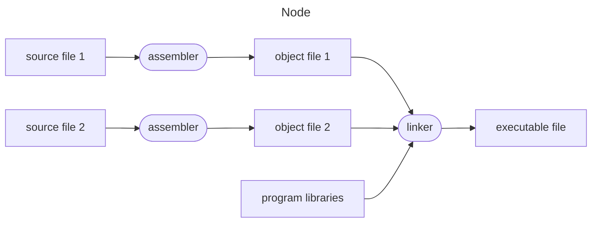

<!-- References: -->
<!-- C++ Primer -->
<!-- The C++ Programming Language -->
<!-- Wikipedia -->

<!-- Necessary for proper formatting of tables where header is not required -->
<style>
th:empty {
  display: none;
}
</style>

<!-- omit in toc -->

## Table of content

- [Table of content](#table-of-content)
- [C++ language](#c-language)
  - [Introduction](#introduction)
  - [History](#history)
  - [Design principles](#design-principles)
  - [Implementation types](#implementation-types)
  - [Main function](#main-function)
    - [Introduction](#introduction-1)
    - [Arguments](#arguments)
    - [Special properties](#special-properties)
  - [Phases of translation](#phases-of-translation)
    - [Phase 1](#phase-1)
    - [Phase 2](#phase-2)
    - [Phase 3](#phase-3)
    - [Phase 4](#phase-4)
    - [Phase 5](#phase-5)
    - [Phase 6](#phase-6)
    - [Phase 7](#phase-7)
    - [Phase 8](#phase-8)
    - [Phase 9](#phase-9)
- [Syntax](#syntax)
  - [Comments](#comments)
    - [Introduction](#introduction-2)
    - [Syntax](#syntax-1)
    - [C-style comments](#c-style-comments)
    - [C++-style comments](#c-style-comments-1)
  - [Identifiers](#identifiers)
    - [Introduction](#introduction-3)
    - [Declarations](#declarations)
    - [Zombie identifiers](#zombie-identifiers)
- [Appendix](#appendix)
  - [ASCII table](#ascii-table)
  - [Punctuation](#punctuation)
  - [Zombie identifiers](#zombie-identifiers-1)

## C++ language

### Introduction

C++ (pronounced "C plus plus") is a high-level, general-purpose, multi-paradigm, statically typed, free-form, compiled programming language created by Danish computer scientist Bjarne Stroustrup as an extension of the C programming language, or "C with classes". The language has expanded significantly over time, and modern C++ now has object-oriented, generic, and functional features in addition to facilities for low-level memory manipulation.

C++ was designed with performance, efficiency, and flexibility in mind, because of which, it is used widely for the development of operating systems, browsers, video games, desktop applications, libraries, graphics, cloud systems, databases, servers, banking applications, embedded systems, telephone switches, compilers, and other performance-critical or resource-constrained applications.

|                       |                                                                                                                  |
| --------------------- | ---------------------------------------------------------------------------------------------------------------- |
| Logo                  |                                          |
| Paradigms             | Multi-paradigm: procedural, imperative, functional, object-oriented, generic, modular                            |
| Family                | C                                                                                                                |
| Designed by           | Bjarne Stroustrup                                                                                                |
| Developer             | ISO/IEC JTC 1 (Joint Technical Committee 1) / SC 22 (Subcommittee 22) / WG 21 (Working Group 21)                 |
| First appeared        | 1985                                                                                                             |
| Stable release        | C++20 (ISO/IEC 14882:2020) / 15 December 2020                                                                    |
| Preview release       | C++23 / 18 December 2022                                                                                         |
| Typing discipline     | Static, nominative, partially inferred                                                                           |
| OS                    | Cross-platform                                                                                                   |
| Filename extensions   | .C, .cc, .cpp, .cxx, .c++, .h, .H, .hh, .hpp, .hxx, .h++                                                         |
| Website               | [isocpp.org](isocpp.org)                                                                                         |
| Major implementations | GCC, LLVM, Clang, Microsoft Visual C++, Embarcadero C++ Builder, Intel C++ Compiler, IBM XL C++, EDG             |
| Influenced by         | Ada, ALGOL 68, BCPL, C, CLU, F#, ML, Mesa, Modula-2, Simula, Smalltalk                                           |
| Influenced            | Ada 95, C#, C99, Carbon, Chapel, Clojure, D, Java, JS++, Lua, Nim, Objective C++, Perl, PHP, Python, Rust, Seed7 |

### History

The C++ programming language was first standardized in 1998 as ISO/IEC 14882:1998. Before the initial standardization in 1998, C++ was developed by Stroustrup at Bell Labs since 1979 as an extension of the C programming language, as he wanted an efficient and flexible language similar to C that also provided high-level features for program organization. Since 2012, C++ has been on a three-year release schedule with C++23 as the next planned standard.

| Year | C++ standard       | Informal name |
| ---- | ------------------ | ------------- |
| 1998 | ISO/IEC 14882:1998 | C++98         |
| 2003 | ISO/IEC 14882:2003 | C++03         |
| 2011 | ISO/IEC 14882:2011 | C++11, C++0x  |
| 2014 | ISO/IEC 14882:2014 | C++14, C++1y  |
| 2017 | ISO/IEC 14882:2017 | C++17, C++1z  |
| 2020 | ISO/IEC 14882:2020 | C++20, C++2a  |
| 2023 | ISO/IEC 14882:2023 | C++23         |

### Design principles

The development and evolution of C++ has been guided by a set of principles:

- It must be driven by actual problems and its features should be immediately useful in real world programs.
- Every feature should be implementable with a reasonably obvious way.
- Programmers should be free to pick a programming style, and that style should be fully supported by C++.
- Allowing a useful feature is more important than preventing every possible misuse of C++.
- It should provide facilities for organizing programs into separate, well-defined parts, and provide facilities for combining separately developed parts.
- No implicit violations of the type system should be allowed (however explicit violations, that are explicitly requested by the programmer, are allowed).
- User-created types need to have the same support and performance as built-in types.
- Unused features should not negatively impact created executables by hurting performance.
- There should not language beneath C++ (except assembly language).
- C++ should work alongside other existing programming languages, rather than fostering its own separate and incompatible programming environment.
- If the programmer's intent is unknown, allow the programmer to specify it by providing manual control.

### Implementation types

A C++ implementation can either be hosted or freestanding. A hosting implementation includes all the standard library facilities. A freestanding implementation may provide fewer standard library facilities, as long as the following are provided:

| Header                                   | Description               |
| ---------------------------------------- | ------------------------- |
| `<cstddef>`                              | Types                     |
| `<cfloat>`, `<limits>`, `<climits>`      | Implementation properties |
| `<cstdint>`                              | Integer types             |
| `<cstdlib>`                              | Start and termination     |
| `<new>`                                  | Dynamic memory management |
| `<typeinfo>`                             | Type identification       |
| `<exception>`                            | Exception handling        |
| `<initializer_list>`                     | Initializer lists         |
| `<cstdalign>`, `<cstdarg>`, `<cstdbool>` | Other run-time support    |
| `<type_traits>`                          | Type traits               |
| `<atomic>`                               | Atomics                   |

### Main function

#### Introduction

The main function is a global function named `main`, called at program startup after initialization of the non-local objects with static storage duration. It is the designated entry point to a program that is executed in hosted environment (such as an operating system). The entry point to freestanding programs (such as boot loaders and OS kernels) are implementation-defined.

```cpp
/*
Form (1)
*/
int main() { /* body */ }
/*
Form (2)
*/
int main(int argc, char *argv[]) { /* body */ }
/*
Form (3)
*/
/* another implementation-defined form, with int as return type */
```

#### Arguments

`argc`
: Non-negative value representing the number of arguments passed to the program from the environment in which the program is run.

`argv`
: Pointer to the first element of an array of `argc + 1` pointers, of which the last one is null and the previous ones, if any, point to null-terminated multibyte strings that represent the arguments passed to the program from the execution environment. If `argv[0]` is not a null pointer (or, equivalently, if `argc > 0`), it points to a string that represents the name used to invoke the program, or to an empty string.

The names of `argc` and `argv` are arbitrary, as well as the representation of the types of the parameters. A very common implementation-defined form of `main()` has a third argument (in addition to `argc` and `argv`), of type `char**`, pointing to an array of pointers to the execution environment variables.

The parameters of the two-parameter form of the main function allow arbitrary multibyte strings to be passed from the execution environment (these are typically known as command line arguments), the pointers `argv[1]` through `argv[argc - 1]` point at the first characters in each of these strings. The pointer `argv[0]` (if not null) is the pointer to the first character of a null-terminated multibyte string that represents the name used to invoke the program itself (or an empty string `""` if this is not supported by the execution environment). The strings are modifiable, although these modifications do not propagate back to the execution environment. The size of the array pointed to by `argv` is at least `argc + 1`, and the last element, `argv[argc]`, is guaranteed to be a null pointer.

#### Special properties

The main function has several special properties:

- It can not be used anywhere in the program, in particular, it can not be called recursively, and its address can not be taken.
- It can not be predefined and can not be overloaded. Effectively, the name `main` in the global namespace is reserved for functions (although it can be used to name classes, namespaces, enumerations, and any entity in a non-global namespace, except that an entity named `main` can not be declared with C language linkage in any namespace).
- It can not be defined as deleted or declared with any language linkage, `constexpr`, `consteval`, `inline`, or `static`.
- The body of the main function does not need to contain the return statement. If control reaches the end of the main function without encountering a return statement, the effect is that of `return 0;`.
- Execution of the return (or the implicit return upon reaching the end of main) is equivalent to first leaving the function normally (which destroys the objects with automatic storage duration) and then calling `std::exit` with the same argument as the argument of the `return`. The `std::exit` then destroys static objects and terminates the program.
- The return type of the main function can not be deduced (therefore, `auto main()` is not valid).
- The main function can not be a coroutine.

!!! note

    If the main function is defined with a function-try-block, the exceptions thrown by the destructors of static objects (which are destroyed by the implied `std::exit`) are not caught by it.

### Phases of translation

A C++ program is a sequence of text files (typically headers and source files) that contain declarations. They undergo translation to become an executable program, which is executed when the C++ implementation calls its main function.



The C++ source file is processed by the compiler as if the following phases take places, in this exact order:

#### Phase 1

1. The individual bytes of the source code file are mapped (in implementation-defined manner) to the characters of the basic source code character set. In particular, OS-dependent end-of-line indicators are replaced by newline characters.
2. The set of source file characters accepted is implementation-defined. Any source file character that can not be mapped to a character in the basic source character set is replaced by universal character name (escaped with `\u` or `\U`) or by some implementation-defined form that is handled equivalently.
3. Trigraph sequences are replaced by corresponding single-character representations.

#### Phase 2

1. Whenever backslash appears at the end of a line (immediately followed by the newline character), these characters are deleted, combining two physical source lines into one logical source line. This is a single-pass operation; a line ending in two backslashes followed by an empty line does not combine three lines into one. If a universal character name is formed outside raw string literals in this phase, the behavior is undefined.
2. If a non-empty source file does not end with a newline character after this step (whether it had no newline originally, or it ended with a newline immediately preceded by a backslash), a terminating newline character is added.

#### Phase 3

1. The source file is decomposed into components, sequences of whitespace characters (space, horizontal tab, newline, vertical tab, and form feed), and preprocessing tokens, which are the following:
    1. header names such as `<iostream>` or `"myfile.h"`
    2. identifiers
    3. preprocessing numbers
    4. character and string literals, including user-defined literals
    5. operators and punctuations (including alternative tokens), such as `+`, `<<=`, `<%`, `##`, or `and`
    6. individual non-whitespace characters that do not fit into any other category
1. Any transformation performed during phase 1 and phase 2, between the initial and final double quote of any raw string literal are reverted.
2. Each component is replaced by one space character.

Newlines are kept, but it is unspecified whether non-newline whitespace sequences may be collapsed into single space characters. If the input has been parsed into preprocessing tokens up to a given character, the next preprocessing token is generally taken to be the longest sequence of characters that could constitute a preprocessing token, even if that would cause subsequent analysis to fail. This is commonly known as maximal munch. The sole exceptions to the maximal munch rule are:

- If the next character begins a sequence of characters that could be the prefix and initial double quote of a raw string literal, the next preprocessing token shall be a raw string literal. The literal consists of the shortest sequence of characters that matches the raw string pattern.
- If the next three characters are `<::` and the subsequent character is neither `:` nor `>`, the `<` is treated as a preprocessing token by itself (and not as the first character of the alternative token `<:`)
- Header name preprocessing tokens are only formed within a `#include` directive.

#### Phase 4

1. The preprocessor is executed. If a universal character name is formed by token concatenation, the behavior is undefined.
2. Each file introduced with the `#include` directive goes through phases 1 through 4, recursively.
3. At the end of this phase, all preprocessor directives are removed from the source.

#### Phase 5

1. All characters in character literals and string literals are converted from the source character set to the encoding (which may be a multibyte encoding such as UTF-8, as long as the 96 characters of the basic character set have single byte representations).
2. Escaped sequences and universal character names in character literals and non-raw string literals are expanded and converted to the literal encoding. If the character specified by a universal character name can not be encoded as a single code point in the corresponding literal encoding, the result is implementation-defined, but is guaranteed not to be a null (wide) character.

!!! note

    The conversion performed at this stage can be controlled by command line options in some implementations: gcc and clang use `-finput-charset` to specify the encoding of the source character set, `-fexec-charset` to specify the ordinary literal encoding, and `-fwide-exec-charset` to specify the wide literal encoding.

#### Phase 6

Adjacent string literals are concatenated.

#### Phase 7

Compilation takes place, where each preprocessing token is converted to a token. The tokens are syntactically and semantically analyzed and translated as a translation unit.

#### Phase 8

Each translation unit is examined to produce a list of required template instantiations, including the ones requested by explicit instantiations. The definitions of the templates are located, and the required instantiations are performed to produce instantiation units.

#### Phase 9

Translation units, instantiation units, and library components needed to satisfy external references are collected into a program image which contains information needed for execution in its execution environment.

## Syntax

### Comments

#### Introduction

Comments serve as in-code documentation or notes for readers. When inserted into a program, they are effectively ignored by the compiler. Although specific documentation is not part of the C++ standard, several utilities exist that parse comments with different documentation formats. All comments are removed from the program at translation phase 3 by replacing each comment with a single whitespace character.

!!! note

    Since comments are removed before the preprocessor stage, a macro can not be used to form a comment and an unterminated C-style comment does not spill over from a file included through the `#include` directive.

Besides commenting out, other mechanism used for source code exclusion are:

-   ```cpp
    #if 0
      std::cout << "This will not be executed or even compiled\n";
    #endif
    ```
-   ```cpp
    if(false) {
      std::cout << "This will not be executed\n";
    }
    ```

#### Syntax

| Style     | Alternative name    | Syntax          |
| --------- | ------------------- | --------------- |
| C-style   | Multi-line comment  | `/* comment */` |
| C++-style | Single line comment | `// comment`    |

#### C-style comments

C-style comments are usually used to comment large blocks of text, however, they can be used to comment single lines, or even individual keywords. Although it is not part of the C++ standard, `/**` and `*/` pair is often used to indicate documentation blocks; this is legal because the second asterisk is treated as part of the comment. C-style comments can not be nested, since any `*/` encountered after an initial `/*` closes the comment.

#### C++-style comments

C++-style comments are usually used to comment single lines, however, multiple C++-style comments can be placed consecutively to form multi-line comments. C++-style comments tell the compiler to ignore the content between `//` and the next encountered end-of-line character.

### Identifiers

#### Introduction

An identifier is an arbitrarily long sequence of digits, underscores, lowercase Latin letters, uppercase Latin letters, and most Unicode characters. A valid identifier must begin with a non-digit character (Latin letter, underscore, or Unicode character of class *XID_Start*) and may contain non-digit characters, digits, and Unicode characters of class *XID_Continue* in non-initial positions. Identifiers are case-sensitive (lowercase and uppercase letters are distinct), and every character is significant. Every identifier must conform to *Normalization Form C*.

#### Declarations

An identifier can be used to name objects, references, functions, enumerations, types, class members, namespaces, templates, template specializations, parameter packs, goto labels, and other entities, with the following exceptions:

- The identifiers that are keywords can not be used for other purposes, except when used in an attribute token (such as `[[private]]`).
- The identifiers that are alternative representations for certain operators and punctuators can not be used for other purposes.
- The identifiers with special meaning (`final`, `import`, `module`, and `override`) are used explicitly in a certain context rather being regular identifiers. Unless otherwise specified, any ambiguity as to whether a given identifier has a special meaning is resolved to interpret the token as a regular identifier.
- The identifiers with a double underscore anywhere are reserved.
- The identifiers that begin with an underscore followed by an uppercase letter are reserved.
- The identifiers that begin with an underscore are reserved in the global namespace.

*Reserved* here means that the standard library headers define (`#define`) or declare such identifiers for their internal needs, the compiler may predefine non-standard identifiers of that kind, and that name mangling algorithm may assume that some of these identifiers are not in use. If the programmer uses such identifiers, the behavior is undefined. In addition, it is undefined behavior to define (`#define`) or undefine (`#undef`) certain names in a translation unit.

#### Zombie identifiers

As of C++14, some identifiers are removed from the C++ standard library. However, these identifiers are still reserved for previous standardization in a certain context. Removed member function names may not be used as a name for function-like macros, and other removed member names may not be used as a name for object-like macros in portable code.

## Appendix

### ASCII table

The following table lists all 128 ASCII characters with their decimal (**dec**), octal (**oct**), and hexadecimal (**hex**) codes. The printable ASCII characters starts from the decimal code *32* and ends at decimal code *126*. In Unicode, the ASCII character block is known as *CO Control and Basic Latin*. This block starts from code point *U+0000* and ends at code point *U+007F*.

| Dec | Oct | Hex | Character                           | Dec | Oct | Hex | Character        |
| --- | --- | --- | ----------------------------------- | --- | --- | --- | ---------------- |
| 0   | 0   | 00  | **NUL** (null)                      | 64  | 100 | 40  | **@**            |
| 1   | 1   | 01  | **SOH** (start of header)           | 65  | 101 | 41  | **A**            |
| 2   | 2   | 02  | **STX** (start of text)             | 66  | 102 | 42  | **B**            |
| 3   | 3   | 03  | **ETX** (end of text)               | 67  | 103 | 43  | **C**            |
| 4   | 4   | 04  | **EOT** (end of transmission)       | 68  | 104 | 44  | **D**            |
| 5   | 5   | 05  | **ENQ** (enquiry)                   | 69  | 105 | 45  | **E**            |
| 6   | 6   | 06  | **ACK** (acknowledge)               | 70  | 106 | 46  | **F**            |
| 7   | 7   | 07  | **BEL** (bell)                      | 71  | 107 | 47  | **G**            |
| 8   | 10  | 08  | **BS** (backspace)                  | 72  | 110 | 48  | **H**            |
| 9   | 11  | 09  | **HT** (horizontal tab)             | 73  | 111 | 49  | **I**            |
| 10  | 12  | 0a  | **LF** (line feed - new line)       | 74  | 112 | 4a  | **J**            |
| 11  | 13  | 0b  | **VT** (vertical tab)               | 75  | 113 | 4b  | **K**            |
| 12  | 14  | 0c  | **FF** (form feed - new page)       | 76  | 114 | 4c  | **L**            |
| 13  | 15  | 0d  | **CR** (carriage return)            | 77  | 115 | 4d  | **M**            |
| 14  | 16  | 0e  | **SO** (shift out)                  | 78  | 116 | 4e  | **N**            |
| 15  | 17  | 0f  | **SI** (shift in)                   | 79  | 117 | 4f  | **O**            |
| 16  | 20  | 10  | **DLE** (data link escape)          | 80  | 120 | 50  | **P**            |
| 17  | 21  | 11  | **DC1** (device control 1)          | 81  | 121 | 51  | **Q**            |
| 18  | 22  | 12  | **DC2** (device control 2)          | 82  | 122 | 52  | **R**            |
| 19  | 23  | 13  | **DC3** (device control 3)          | 83  | 123 | 53  | **S**            |
| 20  | 24  | 14  | **DC4** (device control 4)          | 84  | 124 | 54  | **T**            |
| 21  | 25  | 15  | **NAK** (negative acknowledge)      | 85  | 125 | 55  | **U**            |
| 22  | 26  | 16  | **SYN** (synchronous idle)          | 86  | 126 | 56  | **V**            |
| 23  | 27  | 17  | **ETB** (end of transmission block) | 87  | 127 | 57  | **W**            |
| 24  | 30  | 18  | **CAN** (cancel)                    | 88  | 130 | 58  | **X**            |
| 25  | 31  | 19  | **EM** (end of medium)              | 89  | 131 | 59  | **Y**            |
| 26  | 32  | 1a  | **SUB** (substitute)                | 90  | 132 | 5a  | **Z**            |
| 27  | 33  | 1b  | **ESC** (escape)                    | 91  | 133 | 5b  | **[**            |
| 28  | 34  | 1c  | **FS** (file separator)             | 92  | 134 | 5c  | **\\**           |
| 29  | 35  | 1d  | **GS** (group separator)            | 93  | 135 | 5d  | **]**            |
| 30  | 36  | 1e  | **RS** (record separator)           | 94  | 136 | 5e  | **^**            |
| 31  | 37  | 1f  | **US** (unit separator)             | 95  | 137 | 5f  | **_**            |
| 32  | 40  | 20  | **SP** (space)                      | 96  | 140 | 60  | **\`**           |
| 33  | 41  | 21  | **!**                               | 97  | 141 | 61  | **a**            |
| 34  | 42  | 22  | **"**                               | 98  | 142 | 62  | **b**            |
| 35  | 43  | 23  | **#**                               | 99  | 143 | 63  | **c**            |
| 36  | 44  | 24  | **$**                               | 100 | 144 | 64  | **d**            |
| 37  | 45  | 25  | **%**                               | 101 | 145 | 65  | **e**            |
| 38  | 46  | 26  | **&**                               | 102 | 146 | 66  | **f**            |
| 39  | 47  | 27  | **'**                               | 103 | 147 | 67  | **g**            |
| 40  | 50  | 28  | **(**                               | 104 | 150 | 68  | **h**            |
| 41  | 51  | 29  | **)**                               | 105 | 151 | 69  | **i**            |
| 42  | 52  | 2a  | **\***                              | 106 | 152 | 6a  | **j**            |
| 43  | 53  | 2b  | **+**                               | 107 | 153 | 6b  | **k**            |
| 44  | 54  | 2c  | **,**                               | 108 | 154 | 6c  | **l**            |
| 45  | 55  | 2d  | **-**                               | 109 | 155 | 6d  | **m**            |
| 46  | 56  | 2e  | **.**                               | 110 | 156 | 6e  | **n**            |
| 47  | 57  | 2f  | **/**                               | 111 | 157 | 6f  | **o**            |
| 48  | 60  | 30  | **0**                               | 112 | 160 | 70  | **p**            |
| 49  | 61  | 31  | **1**                               | 113 | 161 | 71  | **q**            |
| 50  | 62  | 32  | **2**                               | 114 | 162 | 72  | **r**            |
| 51  | 63  | 33  | **3**                               | 115 | 163 | 73  | **s**            |
| 52  | 64  | 34  | **4**                               | 116 | 164 | 74  | **t**            |
| 53  | 65  | 35  | **5**                               | 117 | 165 | 75  | **u**            |
| 54  | 66  | 36  | **6**                               | 118 | 166 | 76  | **v**            |
| 55  | 67  | 37  | **7**                               | 119 | 167 | 77  | **w**            |
| 56  | 70  | 38  | **8**                               | 120 | 170 | 78  | **x**            |
| 57  | 71  | 39  | **9**                               | 121 | 171 | 79  | **y**            |
| 58  | 72  | 3a  | **:**                               | 122 | 172 | 7a  | **z**            |
| 59  | 73  | 3b  | **;**                               | 123 | 173 | 7b  | **{**            |
| 60  | 74  | 3c  | **<**                               | 124 | 174 | 7c  | **\|**           |
| 61  | 75  | 3d  | **=**                               | 125 | 175 | 7d  | **}**            |
| 62  | 76  | 3e  | **>**                               | 126 | 176 | 7e  | **~**            |
| 63  | 77  | 3f  | **?**                               | 127 | 177 | 7f  | **DEL** (delete) |

### Punctuation

`{ }`
: - In a `class`/`struct`/`union` definition, delimit the member specification.
  - In an `enum` definition, delimit the member specification.
  - Delimit a compound statement. The compound statement may be part of:
      - a function definition.
      - a `try` block or `catch` clause.
      - a function-try-block.
      - a lambda expression.
  - In initialization, delimit the initializers. This kind of initialization is called list initialization.
  - In a namespace definition, delimit the namespace body.
  - In a language linkage specification, delimit the declarations.
  - In a `requires` expression, delimit the requirements.
  - In a compound requirement, delimit the expression.
  - In an export declaration, delimit the declarations.

`[ ]`
: - Subscript operator which is part of `operator[]` in operator overloading.
  - Part of array declarator in a declaration or type-id (such as in a `new` expression).
  - Part of `new[]` operator in operator overloading (allocation function).
  - Part of `delete[]` operator in `delete` expression and operator overloading (deallocation function).
  - In a lambda expression, delimit the captures.
  - In an attribute specifier, delimit the attributes.
  - In a structured binding declaration, delimit the identifier list.

`#`
: - Introduce a preprocessing directive.
  - The preprocessing operator for stringification.

`##`
: - The preprocessing operator for token pasting.

`( )`
: - In an expression, indicate grouping.
  - Function call operator which is part of `operator()` in operator overloading.
  - In a function-style type cast, delimit the expression/initializers.
  - In a `static_cast`, `const_cast`, `reinterpret_cast`, or `dynamic_cast`, delimit the expression.
  - In a `typeid`, `sizeof`, `sizeof...`, `alignof`, or `noexcept` expression, delimit the operand.
  - In a placement `new` expression, delimit the placement arguments.
  - In a `new` expression, optionally delimit the type-id.
  - In a `new` expression, delimit the initializers.
  - In a C-style cast, delimit the type-id.
  - In a declaration or a type-id, indicate grouping.
  - Delimit the parameter list in:
      - a function declarator (in a declaration or a type-id).
      - a lambda expression.
      - a user-defined deduction guide.
      - a `requires` expression.
  - In direct initialization, delimit the initializers.
  - In an `asm` declaration, delimit the string literal.
  - In a member initializer list, delimit the initializers to a base or member.
  - In an `if` (including `constexpr if`), `switch`, `while`, `do-while`, or `for` (including range-based `for`) statement, delimit the controlling clause.
  - In a `catch` clause, delimit the parameter declaration.
  - In a function-like macro definition, delimit the macro parameters.
  - Part of a `defined`, `__has_include`, `__has_cpp_attribute` preprocessing operator.
  - In a `static_assert` declaration, delimit the operands.
  - In a `decltype` specifier, `noexcept` specifier, `alignas` specifier, conditional `explicit` specifier, delimit the operand.
  - In an attribute, delimit the attribute arguments.
  - Part of `decltype(auto)` specifier.
  - Delimit a fold expression.
  - Part of `__VA_OPT__` replacement in a variadic macro definition.

`;`
: - Indicate the end of:
      - a statement (including the initialization statement of a `for` statement).
      - a declaration or member declaration.
      - a module declaration, import declaration, global module fragment introducer, or private module fragment introducer.
      - a requirement.
  - Separate the second and third clauses of a `for` statement.

`:`
: - Part of conditional operator.
  - Part of label declaration.
  - In the class head of a `class` definition, introduce the base clause.
  - Part of access specifier in member specification.
  - In a bit-field member declaration, introduce the width.
  - In a constructor definition, introduce the member initializer list.
  - In a range-based `for` statement, separate the range declaration and the range initializer.
  - Introduce an `enum` base, which specifies the underlying type of the `enum`.
  - In an attribute specifier, separate the attribute-using-prefix and the attribute list.
  - In a module declaration or import declaration of module partition, introduce the module partition name.
  - Part of a private module fragment introducer (`module :private;`).

`...`
: - In the parameter list of a function declarator or lambda expression or user-defined deduction guide, signify a variadic function.
  - In a `catch` clause, signify a catch-all handler.
  - In a macro definition, signify a variadic macro.
  - Indicate pack declaration and expansion.

`?`
: - Part of conditional operator.

`::`
: - Scope resolution operator in:
      - a qualified name.
      - a pointer-to-member declaration.
      - a `new` or `delete` expression, to indicate that only global allocation or deallocation functions are looked up.
  - In an attribute, indicate attribute scope.
  - Part of a nested namespace definition.

`.`
: - Member access operator.
  - In aggregate initialization, introduce a designator.
  - Part of module name or module partition name.

`.*`
: - Pointer-to-member access operator.

`->`
: - Member access operator which is part of `operator->` in operator overloading.
  - In a function declarator or lambda expression, introduce the trailing return type.
  - In a user-defined deduction guide, introduce the result type.
  - In a compound requirement, introduce the return type requirement.

`->*`
: - Pointer-to-member access operator which is part of `operator->*` in operator overloading.

`~`
: - Unary complement operator (bitwise not operator) which is part of `operator~` in operator overloading.
  - Part of an id-expression to name a destructor or pseudo-destructor.

`!`
: - Logical not operator which is part of `operator!` in operator overloading.

`+`
: - Unary plus operator which is part of `operator+` in operator overloading.
  - Binary plus operator which is part of `operator+` in operator overloading.

`-`
: - Unary minus operator which is part of `operator-` in operator overloading.
  - Binary minus operator which is part of `operator-` in operator overloading.

`*`
: - Indirection operator which is part of `operator*` in operator overloading.
  - Multiplication operator which is part of `operator*` in operator overloading.
  - Pointer operator or part of pointer-to-member operator in a declarator or in a type-id.
  - Part of `*this` in a lambda capture list, to capture the current object by copy.

`/`
: - Division operator which is part of `operator/` in operator overloading.

`%`
: - Modulo operator which is part of `operator%` in operator overloading.

`^`
: - Bitwise xor operator which is part of `operator^` in operator overloading.

`&`
: - Address-of operator which is part of `operator&` in operator overloading.
  - Bitwise and operator which is part of `operator&` in operator overloading.
  - Lvalue reference operator in a declarator or in a type-id.
  - In a lambda capture, indicate by-reference capture.
  - Ref-qualifier in member function declaration.

`|`
: - Bitwise or operator which is part of `operator|` in operator overloading.

`=`
: - Simple assignment operator which is part of `operator=` in operator overloading, which might be a special member function (copy assignment operator or move assignment operator).
  - In initialization, indicate copy initialization or copy list initialization.
  - In a function declaration, introduce a default argument.
  - In a template parameter list, introduce a default template argument.
  - In a namespace alias definition, separate the alias and the aliased namespace.
  - In an `enum` definition, introduce the value of enumerator.
  - Part of pure specifier in a pure virtual function declaration.
  - Capture default in lambda capture, to indicate by-copy capture.
  - Part of defaulted definition (`=default;`) or deleted definition (`=delete;`) in function definition.
  - In a type alias declaration, separate the alias and the aliased type.
  - In a concept definition, separate the concept name and the constraint expression.

`+=`
: - Compound assignment operator which is part of `operator+=` in operator overloading.

`-=`
: - Compound assignment operator which is part of `operator-=` in operator overloading.

`*=`
: - Compound assignment operator which is part of `operator*=` in operator overloading.

`/=`
: - Compound assignment operator which is part of `operator/=` in operator overloading.

`%=`
: - Compound assignment operator which is part of `operator%=` in operator overloading.

`^=`
: - Compound assignment operator which is part of `operator^=` in operator overloading.

`&=`
: - Compound assignment operator which is part of `operator&=` in operator overloading.

`|=`
: - Compound assignment operator which is part of `operator|=` in operator overloading.

`==`
: - Equality operator which is part of `operator==` in operator overloading.

`!=`
: - Inequality operator which is part of `operator!=` in operator overloading.

`<`
: - Less-than operator which is part of `operator<` in operator overloading.
  - In a `static_cast`, `const_cast`, `reinterpret_cast`, or `dynamic_cast`, introduce the type-id.
  - Introduce a template argument list.
  - Introduce a template parameter list in:
      - a `template` declaration.
      - a partial specialization.
      - a lambda expression.
  - Part of `template<>` in template specialization declaration.
  - Introduce a header name in:
      - a `#include` directive.
      - a `__has_include` preprocessing expression.
      - an `import` declaration.

`>`
: - Greater-than operator which is part of `operator>` in operator overloading.
  - In a `static_cast`, `const_cast`, `reinterpret_cast`, or `dynamic_cast`, indicate the end of type-id.
  - Indicate the end of a template argument list.
  - Indicate the end of a template parameter list in:
      - a `template` declaration.
      - a partial specialization.
      - a lambda expression.
  - Part of `template<>` in template specialization declaration.
  - Indicate the end of a header name in:
      - a `#include` directive.
      - a `__has_include` preprocessing expression.
      - an `import` declaration.

`<=`
: - Less-than-or-equal-to operator which is part of `operator<=` in operator overloading.

`>=`
: - Greater-than-or-equal-to operator which is part of `operator>=` in operator overloading.

`<=>`
: - Three-way comparison (spaceship) operator which is part of `operator<=>` in operator overloading.

`&&`
: - Logical and operator which is part of `operator&&` in operator overloading.
  - Rvalue reference operator in a declarator or in a type-id.
  - Ref-qualifier in member function declaration.

`||`
: - Logical or operator which is part of `operator||` in operator overloading.

`<<`
: - Bitwise shift operator which is part of `operator<<` in operator overloading (bitwise operator or stream insertion operator).

`>>`
: - Bitwise shift operator which is part of `operator>>` in operator overloading (bitwise operator or stream insertion operator).
  - Can be reparsed as two `>` in a `static_cast`, `const_cast`, `reinterpret_cast`, `dynamic_cast`, template argument list, or a template parameter list.

`<<=`
: - Compound assignment operator which is part of `operator<<=` in operator overloading.

`>>=`
: - Compound assignment operator which is part of `operator>>=` in operator overloading.

`++`
: - Increment operator which is part of `operator++` in operator overloading.

`--`
: - Decrement operator which is part of `operator--` in operator overloading.

`,`
: - Comma operator which is part of `operator,` in operator overloading.
  - List separator in: 
      - the declarator list in a declaration.
      - the initializer list in an initialization.
      - the placement argument list in a placement `new`.
      - the argument list in a function call expression.
      - the enumerator list in an `enum` declaration.
      - the base class list in a `class` declaration.
      - the member initializer list in a constructor definition.
      - a function parameter list.
      - a template parameter list.
      - a template argument list.
      - the macro parameter list in a function-like macro definition.
      - a lambda capture list.
      - an attribute list.
      - the declarator list in a `using` declaration.
      - the identifier list in a structured binding declaration.
  - In a `static_assert` declaration, separate the arguments.

### Zombie identifiers

This section tries to list all the symbols that were available from the standard library in the namespace `std` or in the scope of a scope enumeration or a class, but removed in following standards.

| Identifier                      | Depreciated | Removed |
| ------------------------------- | ----------- | ------- |
| `gets()`                        | C++11       | C++14   |
| `auto_ptr<>`                    | C++11       | C++17   |
| `binary_function<>`             | C++11       | C++17   |
| `bind1st<>()`                   | C++11       | C++17   |
| `bind2nd<>()`                   | C++11       | C++17   |
| `binder1st<>`                   | C++11       | C++17   |
| `binder2nd<>`                   | C++11       | C++17   |
| `const_mem_fun_ref_t<>`         | C++11       | C++17   |
| `const_mem_fun_t<>`             | C++11       | C++17   |
| `const_mem_fun1_ref_t<>`        | C++11       | C++17   |
| `const_mem_fun1_t<>`            | C++11       | C++17   |
| `get_unexpected() (since C++11` | C++11       | C++17   |
| `mem_fun<>()`                   | C++11       | C++17   |
| `mem_fun_ref<>()`               | C++11       | C++17   |
| `mem_fun_ref_t<>`               | C++11       | C++17   |
| `mem_fun_t<>`                   | C++11       | C++17   |
| `mem_fun1_ref_t<>`              | C++11       | C++17   |
| `mem_fun1_t<>`                  | C++11       | C++17   |
| `pointer_to_binary_function<>`  | C++11       | C++17   |
| `pointer_to_unary_function<>`   | C++11       | C++17   |
| `ptr_fun<>()`                   | C++11       | C++17   |
| `random_shuffle<>()`            |             | C++17   |
| `set_unexpected()`              | C++11       | C++17   |
| `unary_function<>`              | C++11       | C++17   |
| `unexpected_handler`            | C++11       | C++17   |
| `io_state`                      |             | C++17   |
| `open_mode`                     |             | C++17   |
| `seek_dir`                      |             | C++17   |
| `stossc()`                      |             | C++17   |
| `binary_negate<>`               |             | C++20   |
| `get_temporary_buffer<>()`      |             | C++20   |
| `is_literal_type<>`             | C++17       | C++20   |
| `is_literal_type_v<>`           | C++17       | C++20   |
| `not1<>()`                      |             | C++20   |
| `not2<>()`                      |             | C++20   |
| `raw_storage_iterator<>`        |             | C++20   |
| `result_of<>`                   | C++17       | C++20   |
| `result_of_t<>`                 | C++17       | C++20   |
| `return_temporary_buffer<>()`   |             | C++20   |
| `unary_negate<>`                |             | C++20   |
| `uncaught_exception()`          |             | C++20   |
| `argument_type`                 |             | C++20   |
| `first_argument_type`           |             | C++20   |
| `second_argument_type`          |             | C++20   |
| `declare_no_pointers()`         | C++11       | C++23   |
| `declare_reachable()`           | C++11       | C++23   |
| `get_pointer_safety()`          | C++11       | C++23   |
| `pointer_safety`                | C++11       | C++23   |
| `undeclare_no_pointers()`       | C++11       | C++23   |
| `undeclare_reachable<>()`       | C++11       | C++23   |
| `preferred` | | C++23 |
| `strict` | | C++23 |