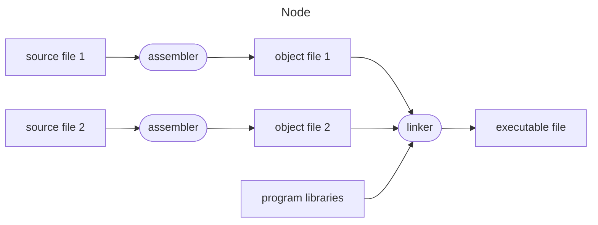

<!-- References: -->
<!-- C++ Primer -->
<!-- The C++ Programming Language -->
<!-- Wikipedia -->

<!-- Necessary for proper formatting of tables where header is not required -->
<style>
th:empty {
  display: none;
}
</style>

## C++ language

### Introduction

C++ (pronounced "C plus plus") is a high-level, general-purpose, multi-paradigm, statically typed, free-form, compiled programming language created by Danish computer scientist Bjarne Stroustrup as an extension of the C programming language, or "C with classes". The language has expanded significantly over time, and modern C++ now has object-oriented, generic, and functional features in addition to facilities for low-level memory manipulation.

C++ was designed with performance, efficiency, and flexibility in mind, because of which, it is used widely for the development of operating systems, browsers, video games, desktop applications, libraries, graphics, cloud systems, databases, servers, banking applications, embedded systems, telephone switches, compilers, and other performance-critical or resource-constrained applications.

|                       |                                                                                                                  |
| --------------------- | ---------------------------------------------------------------------------------------------------------------- |
| Logo                  |                                          |
| Paradigms             | Multi-paradigm: procedural, imperative, functional, object-oriented, generic, modular                            |
| Family                | C                                                                                                                |
| Designed by           | Bjarne Stroustrup                                                                                                |
| Developer             | ISO/IEC JTC 1 (Joint Technical Committee 1) / SC 22 (Subcommittee 22) / WG 21 (Working Group 21)                 |
| First appeared        | 1985                                                                                                             |
| Stable release        | C++20 (ISO/IEC 14882:2020) / 15 December 2020                                                                    |
| Preview release       | C++23 / 18 December 2022                                                                                         |
| Typing discipline     | Static, nominative, partially inferred                                                                           |
| OS                    | Cross-platform                                                                                                   |
| Filename extensions   | .C, .cc, .cpp, .cxx, .c++, .h, .H, .hh, .hpp, .hxx, .h++                                                         |
| Website               | [isocpp.org](isocpp.org)                                                                                         |
| Major implementations | GCC, LLVM, Clang, Microsoft Visual C++, Embarcadero C++ Builder, Intel C++ Compiler, IBM XL C++, EDG             |
| Influenced by         | Ada, ALGOL 68, BCPL, C, CLU, F#, ML, Mesa, Modula-2, Simula, Smalltalk                                           |
| Influenced            | Ada 95, C#, C99, Carbon, Chapel, Clojure, D, Java, JS++, Lua, Nim, Objective C++, Perl, PHP, Python, Rust, Seed7 |

### History

The C++ programming language was first standardized in 1998 as ISO/IEC 14882:1998. Before the initial standardization in 1998, C++ was developed by Stroustrup at Bell Labs since 1979 as an extension of the C programming language, as he wanted an efficient and flexible language similar to C that also provided high-level features for program organization. Since 2012, C++ has been on a three-year release schedule with C++23 as the next planned standard.

| Year | C++ standard       | Informal name |
| ---- | ------------------ | ------------- |
| 1998 | ISO/IEC 14882:1998 | C++98         |
| 2003 | ISO/IEC 14882:2003 | C++03         |
| 2011 | ISO/IEC 14882:2011 | C++11, C++0x  |
| 2014 | ISO/IEC 14882:2014 | C++14, C++1y  |
| 2017 | ISO/IEC 14882:2017 | C++17, C++1z  |
| 2020 | ISO/IEC 14882:2020 | C++20, C++2a  |
| 2023 | ISO/IEC 14882:2023 | C++23         |

### Design principles

The development and evolution of C++ has been guided by a set of principles:

- It must be driven by actual problems and its features should be immediately useful in real world programs.
- Every feature should be implementable with a reasonably obvious way.
- Programmers should be free to pick a programming style, and that style should be fully supported by C++.
- Allowing a useful feature is more important than preventing every possible misuse of C++.
- It should provide facilities for organizing programs into separate, well-defined parts, and provide facilities for combining separately developed parts.
- No implicit violations of the type system should be allowed (however explicit violations, that are explicitly requested by the programmer, are allowed).
- User-created types need to have the same support and performance as built-in types.
- Unused features should not negatively impact created executables by hurting performance.
- There should not language beneath C++ (except assembly language).
- C++ should work alongside other existing programming languages, rather than fostering its own separate and incompatible programming environment.
- If the programmer's intent is unknown, allow the programmer to specify it by providing manual control.

### Implementation types

A C++ implementation can either be hosted or freestanding. A hosting implementation includes all the standard library facilities. A freestanding implementation may provide fewer standard library facilities, as long as the following are provided:

| Header                                   | Description               |
| ---------------------------------------- | ------------------------- |
| `<cstddef>`                              | Types                     |
| `<cfloat>`, `<limits>`, `<climits>`      | Implementation properties |
| `<cstdint>`                              | Integer types             |
| `<cstdlib>`                              | Start and termination     |
| `<new>`                                  | Dynamic memory management |
| `<typeinfo>`                             | Type identification       |
| `<exception>`                            | Exception handling        |
| `<initializer_list>`                     | Initializer lists         |
| `<cstdalign>`, `<cstdarg>`, `<cstdbool>` | Other run-time support    |
| `<type_traits>`                          | Type traits               |
| `<atomic>`                               | Atomics                   |

### Main function

#### Introduction

The main function is a global function named `main`, called at program startup after initialization of the non-local objects with static storage duration. It is the designated entry point to a program that is executed in hosted environment (such as an operating system). The entry point to freestanding programs (such as boot loaders and OS kernels) are implementation-defined.

```cpp
/*
Form (1)
*/
int main() { /* body */ }
/*
Form (2)
*/
int main(int argc, char *argv[]) { /* body */ }
/*
Form (3)
*/
/* another implementation-defined form, with int as return type */
```

#### Arguments

`argc`
: Non-negative value representing the number of arguments passed to the program from the environment in which the program is run.

`argv`
: Pointer to the first element of an array of `argc + 1` pointers, of which the last one is null and the previous ones, if any, point to null-terminated multibyte strings that represent the arguments passed to the program from the execution environment. If `argv[0]` is not a null pointer (or, equivalently, if `argc > 0`), it points to a string that represents the name used to invoke the program, or to an empty string.

The names of `argc` and `argv` are arbitrary, as well as the representation of the types of the parameters. A very common implementation-defined form of `main()` has a third argument (in addition to `argc` and `argv`), of type `char**`, pointing to an array of pointers to the execution environment variables.

The parameters of the two-parameter form of the main function allow arbitrary multibyte strings to be passed from the execution environment (these are typically known as command line arguments), the pointers `argv[1]` through `argv[argc - 1]` point at the first characters in each of these strings. The pointer `argv[0]` (if not null) is the pointer to the first character of a null-terminated multibyte string that represents the name used to invoke the program itself (or an empty string `""` if this is not supported by the execution environment). The strings are modifiable, although these modifications do not propagate back to the execution environment. The size of the array pointed to by `argv` is at least `argc + 1`, and the last element, `argv[argc]`, is guaranteed to be a null pointer.

#### Special properties

The main function has several special properties:

- It can not be used anywhere in the program, in particular, it can not be called recursively, and its address can not be taken.
- It can not be predefined and can not be overloaded. Effectively, the name `main` in the global namespace is reserved for functions (although it can be used to name classes, namespaces, enumerations, and any entity in a non-global namespace, except that an entity named `main` can not be declared with C language linkage in any namespace).
- It can not be defined as deleted or declared with any language linkage, `constexpr`, `consteval`, `inline`, or `static`.
- The body of the main function does not need to contain the return statement. If control reaches the end of the main function without encountering a return statement, the effect is that of `return 0;`.
- Execution of the return (or the implicit return upon reaching the end of main) is equivalent to first leaving the function normally (which destroys the objects with automatic storage duration) and then calling `std::exit` with the same argument as the argument of the `return`. The `std::exit` then destroys static objects and terminates the program.
- The return type of the main function can not be deduced (therefore, `auto main()` is not valid).
- The main function can not be a coroutine.

!!! note

    If the main function is defined with a function-try-block, the exceptions thrown by the destructors of static objects (which are destroyed by the implied `std::exit`) are not caught by it.

### Phases of translation

A C++ program is a sequence of text files (typically headers and source files) that contain declarations. They undergo translation to become an executable program, which is executed when the C++ implementation calls its main function.



The C++ source file is processed by the compiler as if the following phases take places, in this exact order:

#### Phase 1

1. The individual bytes of the source code file are mapped (in implementation-defined manner) to the characters of the basic source code character set. In particular, OS-dependent end-of-line indicators are replaced by newline characters.
2. The set of source file characters accepted is implementation-defined. Any source file character that can not be mapped to a character in the basic source character set is replaced by universal character name (escaped with `\u` or `\U`) or by some implementation-defined form that is handled equivalently.
3. Trigraph sequences are replaced by corresponding single-character representations.

#### Phase 2

1. Whenever backslash appears at the end of a line (immediately followed by the newline character), these characters are deleted, combining two physical source lines into one logical source line. This is a single-pass operation; a line ending in two backslashes followed by an empty line does not combine three lines into one. If a universal character name is formed outside raw string literals in this phase, the behavior is undefined.
2. If a non-empty source file does not end with a newline character after this step (whether it had no newline originally, or it ended with a newline immediately preceded by a backslash), a terminating newline character is added.

#### Phase 3

1. The source file is decomposed into components, sequences of whitespace characters (space, horizontal tab, newline, vertical tab, and form feed), and preprocessing tokens, which are the following:
    1. header names such as `<iostream>` or `"myfile.h"`
    2. identifiers
    3. preprocessing numbers
    4. character and string literals, including user-defined literals
    5. operators and punctuations (including alternative tokens), such as `+`, `<<=`, `<%`, `##`, or `and`
    6. individual non-whitespace characters that do not fit into any other category
1. Any transformation performed during phase 1 and phase 2, between the initial and final double quote of any raw string literal are reverted.
2. Each component is replaced by one space character.

Newlines are kept, but it is unspecified whether non-newline whitespace sequences may be collapsed into single space characters. If the input has been parsed into preprocessing tokens up to a given character, the next preprocessing token is generally taken to be the longest sequence of characters that could constitute a preprocessing token, even if that would cause subsequent analysis to fail. This is commonly known as maximal munch. The sole exceptions to the maximal munch rule are:

- If the next character begins a sequence of characters that could be the prefix and initial double quote of a raw string literal, the next preprocessing token shall be a raw string literal. The literal consists of the shortest sequence of characters that matches the raw string pattern.
- If the next three characters are `<::` and the subsequent character is neither `:` nor `>`, the `<` is treated as a preprocessing token by itself (and not as the first character of the alternative token `<:`)
- Header name preprocessing tokens are only formed within a `#include` directive.

#### Phase 4

1. The preprocessor is executed. If a universal character name is formed by token concatenation, the behavior is undefined.
2. Each file introduced with the `#include` directive goes through phases 1 through 4, recursively.
3. At the end of this phase, all preprocessor directives are removed from the source.

#### Phase 5

1. All characters in character literals and string literals are converted from the source character set to the encoding (which may be a multibyte encoding such as UTF-8, as long as the 96 characters of the basic character set have single byte representations).
2. Escaped sequences and universal character names in character literals and non-raw string literals are expanded and converted to the literal encoding. If the character specified by a universal character name can not be encoded as a single code point in the corresponding literal encoding, the result is implementation-defined, but is guaranteed not to be a null (wide) character.

!!! note

    The conversion performed at this stage can be controlled by command line options in some implementations: gcc and clang use `-finput-charset` to specify the encoding of the source character set, `-fexec-charset` to specify the ordinary literal encoding, and `-fwide-exec-charset` to specify the wide literal encoding.

#### Phase 6

Adjacent string literals are concatenated.

#### Phase 7

Compilation takes place, where each preprocessing token is converted to a token. The tokens are syntactically and semantically analyzed and translated as a translation unit.

#### Phase 8

Each translation unit is examined to produce a list of required template instantiations, including the ones requested by explicit instantiations. The definitions of the templates are located, and the required instantiations are performed to produce instantiation units.

#### Phase 9

Translation units, instantiation units, and library components needed to satisfy external references are collected into a program image which contains information needed for execution in its execution environment.

## Syntax

### Comments

Comments serve as a sort of in-code documentation. When inserted into a program, they are effectively ignored by the compiler; they are solely intended to be used as notes by the humans that read source code. Although specific documentation is not part of the C++ standard, several utilities exist that parse comments with different documentation formats.

## Types

### Data types

A data type (or simple *type*) is a description of a set of values that dictates the set of allowed operations on those values and how those operations are interpreted. There are two kinds of types: fundamental types and compound types. Types describe objects, references, or functions.

### Fundamental types

C++ has a set of fundamental types corresponding to the most common basic storage units of a computer  