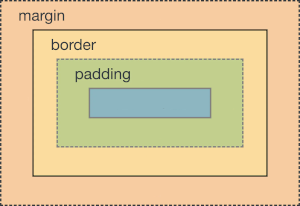

# Cascading style sheets

<!-- omit in toc -->
## Table of contents

- [Introduction](#introduction)
  - [Processing model](#processing-model)
  - [Application](#application)
  - [Browser support](#browser-support)
  - [Debugging CSS](#debugging-css)
  - [Organizing CSS](#organizing-css)
- [Syntax](#syntax)
  - [Rulesets](#rulesets)
  - [At-rules](#at-rules)
  - [Values](#values)
  - [Shorthands](#shorthands)
  - [Comments](#comments)
  - [Whitespace](#whitespace)
- [Selectors](#selectors)
  - [Basic selectors](#basic-selectors)
  - [Combinators](#combinators)
  - [Attribute selectors](#attribute-selectors)
  - [Pseudo-elements](#pseudo-elements)
  - [Pseudo-classes](#pseudo-classes)
- [Cascade](#cascade)
  - [Origin](#origin)
  - [Importance](#importance)
  - [Specificity](#specificity)
  - [Inheritance](#inheritance)
- [Box model](#box-model)
  - [Display](#display)
  - [Margin collapsing](#margin-collapsing)
  - [Formatting context](#formatting-context)
  - [Positioning](#positioning)
  - [Flow layout](#flow-layout)
  - [Flex layout](#flex-layout)
  - [Grid layout](#grid-layout)
  - [Table layout](#table-layout)
  - [Backgrounds and borders](#backgrounds-and-borders)
  - [Overflowing content](#overflowing-content)
  - [Sizing items in CSS](#sizing-items-in-css)
- [Text styling](#text-styling)
  - [Handling different text directions](#handling-different-text-directions)
- [Images, media, and form elements](#images-media-and-form-elements)
- [Styling tables](#styling-tables)
- [Appendix](#appendix)
  - [Style guide](#style-guide)
  - [Reset style sheets](#reset-style-sheets)
  - [Pseudo-elements](#pseudo-elements-1)
  - [Pseudo-classes](#pseudo-classes-1)
  - [At-rules](#at-rules-1)
  - [Glossary](#glossary)

---

## Introduction

Cascading Style Sheet (CSS) is a style sheet language used to describe the presentation of a document written in HTML or XML, including XML dialects such as SVG, MathML, or XHTML.

CSS Level 3 builds on CSS Level 2 Revision 1 module by module, using the CSS 2.1 specification as its core. Each module adds functionality and/or replaces part of the CSS 2.1 specification. From this level on modules are levelled independently. Modules with no CSS Level 2 equivalent start at Level 1 and modules that update features that existed in CSS Level 2 start at Level 3. CSS specification, itself, no longer has levels, therefore, "CSS Level 3" as a term is used only to differentiate it from the previous monolithic versions.

### Processing model

This section presents one possible model of how user agents that support CSS work. This is only a conceptual model and real implementations may vary. In this model, a user agent processes a source by going through the following steps:

1. Parse the source document and create a document tree.
2. Identify the target media type.
3. Retrieve all style sheets associated with the document that are specified for the target media type.
4. Annotate every element of the document tree by assigning a single value to every property based on cascading and inheritance.
5. From the annotated document tree, generate a formatting structure.
6. Transfer the formatting structure to the target medium for rendering. 

### Application

A style sheet is used to describe the presentation of a document written in a supported markup language. For the styling to take effect, the source document must either contain or link to the style sheet. In HTML, there are three methods to add a style sheet:

- **Inline styles:** Applied by using the `style` attribute of an HTML element.
- **Internal style sheet:** Applied by using the `<style>` element in the `<head>` element.
- **External style sheet:** Applied by using the `<link>` element to link to an external CSS file.

Inline styles are applied to a particular HTML element by providing a semicolon separated list of declarations inside its `style` attribute. Quotation marks can be used by escaping them as `&quot;`. However, avoid adding CSS through this method, unless the working environment is very restrictive. It is the least efficient method in terms of maintenance, and it mixes the presentation with the content.

```html
<!DOCTYPE html>
<html lang="en-us">
  <head>
    <meta charset="utf-8">
    <title>Inline Styles</title>
  </head>
    <body>
      <p style="
        color: red;
        font-weight: bold;
        font-size: 24px;
        font-family: &quot;Open Sans&quot;">PARAGRAPH TEXT</p>
    </body>
</html>
```

Internal style sheet resides within the source document, as content of the `<style>` element contained within the `<head>` of the document. The content of an internal style sheet is identical to an external style sheet. Internal style sheet, however, is an inefficient method for adding consistent styling to a website of more than one page.

```html
<!DOCTYPE html>
<html lang="en-us">
  <head>
    <meta charset="utf-8">
    <title>Internal Style Sheet</title>
    <style>
      p {
        color: red;
        font-weight: bold;
        font-size: 24px;
        font-family: "Open Sans";
      }
    </style>
  </head>
    <body>
      <p>PARAGRAPH TEXT</p>
    </body>
</html>
```

External style sheet is a file with a `.css` file extension, linked through the `<link>` element. The `href` attribute of the `<link>` element contains the path to the file, and the `ref` attribute must be provided the `stylesheet` value. The `type` attribute should not be provided if the style sheet has `text/css` type, because user agents already assume this as the default value. This is the recommended method of adding CSS to an HTML document, as a single style sheet can be referenced from multiple source documents, and the presentation is cleanly separated from the content.

```html
<!DOCTYPE html>
<html lang="en-us">
  <head>
    <meta charset="utf-8">
    <title>External Style Sheet</title>
    <link rel="stylesheet" href="style.css">
  </head>
    <body>
      <p>PARAGRAPH TEXT</p>
    </body>
</html>
```

```css
p {
  color: red;
  font-weight: bold;
  font-size: 24px;
  font-family: "Open Sans";
}
```

### Browser support
<!-- Add information about what happens when a CSS value is not supported by the browser -->
<!-- Add information about why not all browsers are equal and support all features at the same time -->
<!-- Give brief fallback mechanisms of CSS and introductions to how fallback can be provided -->
<!-- And similar information -->

### Debugging CSS

### Organizing CSS

---

## Syntax

<!-- 
- Syntax
- - Keywords
- - Characters
- - Statements
- - At-rules
- - Blocks
- - Rulesets
- - Declarations
- - Comments
- - Errors

- Values
- - Numbers
- - Lengths
- - Percentages
- - URI
- - Counters
- - Colors
- - Strings
- - Unsupported values
-->

The primary construct in a style sheet is a statement. A statement begins with any non-space character and ends at the first closing brace or semicolon that is encountered non-escaped, outside a string, and not nested into another brace pair. There are two categories of statements in style sheets:

- **Rulesets:** A structure that associates a selector list with a declaration block.
- **At-rules:** A structure that starts with an _at_ symbol, followed by an identifier, and continues up to the end of the statement.

Any statement which is not a ruleset or an at-rule is invalid and ignored. CSS is case-insensitive within the ASCII range, except for parts that are not under its control. In CSS, US English spelling is deemed correct where there is spelling variation.

### Rulesets

The ruleset (or rule) is a structure formed by adding a declarations list, enclosed within curly braces, after a selector list.

```css
style-rule ::=
  selectors-list {
    declarations-list
  }
```

The selector list is a comma-separated list of selectors, which selects nodes that matches with any single selector in the list. If any single selector in a selector list is invalid or unsupported, the entire selector list is considered invalid, and therefore the associated ruleset is ignored.

```css
selectors-list ::=
  selector[:pseudo-class] [::pseudo-element]
  [, selectors-list]
```

The declarations list is a semicolon-separated list of declarations - which are pairs of properties and values. The last declaration is not required to be terminated by a semicolon. If any invalid value is passed to a property, the entire declaration is ignored.

```css
declarations-list ::=
  [property: value]
  [; declarations-list]
```

### At-rules

An [at-rule](#at-rules-1) is a statement that controls the CSS engine behavior in specific conditions. An at-rule begins with an `@` symbol, followed by an identifier, and continues up to the next semicolon, or the next block, whichever comes first.

Besides the `@` symbol and the identifier, each at-rule has a different syntax. Nevertheless, several of them can be grouped as either *regular at-rules* or *conditional group rules*. The conditional group rules share a common syntax and optionally include nested statements.

```css
/* Regular at-rule */
@identifier (RULE);

/* Condition group rule */
@identifier (RULE) {
}
```

### Values


### Shorthands

Shorthand properties are CSS properties that allow setting values for multiple closely related CSS properties simultaneously. Values not specified in a shorthand property reset to their initial value. This means that an omission in a shorthand can override previously set values.

Shorthand properties does not force a specific order for the values of the properties they replace, provided these properties use values of different types. However, a specific order is required when several of these properties have identical value types, such as those describing the edges of a box.

| Syntax         | First value    | Second value     | Third value | Fourth value |
| -------------- | -------------- | ---------------- | ----------- | ------------ |
| 1-value syntax | All edges      |                  |             |              |
| 2-value syntax | Vertical edges | Horizontal edges |             |              |
| 3-value syntax | Top edge       | Horizontal edges | Bottom edge |              |
| 4-value syntax | Top edge       | Right edge       | Bottom edge | Left edge    |

CSS provides a universal shorthand property, `all`, which applies its value to every property of the selected element. Its purpose is to change the inheritance model of the element properties.

### Comments

A comment in CSS is used to add explanatory note to the code or prevent the browser from interpreting specific part of the style sheet. Comments can be placed wherever whitespace is allowed within a style sheet. Both single line and multiple lines comments are supported in CSS.

```css
/* Single line comment */

/* Multiple
   Lines
   Comment */
```

The `/*` and `*/` pair is used to delimit both single line and multiple lines comments. There is no other way to specify comments in external style sheets. Comments can not be nested, the first instance of `*/` that follows the `/*` closes the comment.

### Whitespace

Whitespace are characters that are used to indent the source code for readability. The characters considered as whitespace include **`U+0009 TAB`**, **`U+000A LF`**, **`U+000C FF`**, **`U+000D CR`**, and **`U+0020 SPACE`**. CSS largely ignores whitespaces between tokens, however, some instances require whitespace as syntax.

- No whitespace is allowed between the colon and pseudo-class, and between the base selector and colon.
- No whitespace is allowed between the two colons and pseudo-element, and between the base selector and two colons.
- A single whitespace character is required between values to separate them.
- Property names never contain whitespaces.
- Any amount of whitespace is allowed between each selector and comma in a selector list.

---

## Selectors

A selector defines a pattern to select a set of elements or a single element in the document tree. In rulesets, selectors are used for binding style declarations to elements in the source document. The elements selected by a selector are called the *subjects of the selector*. 

### Basic selectors

A basic selector matches elements based on their tag name, class name, or ID name. A universal selector exists that matches all elements. Optionally, the universal selector can be restricted to a specific namespace or to all namespaces.

| Name               | Syntax             | Target                                       |
| ------------------ | ------------------ | -------------------------------------------- |
| Type selector      | `tag`              | Elements with the specified tag name.        |
| Class selector     | `.class`           | Elements with the specified class attribute. |
| ID selector        | `#id`              | Elements with the specified id attribute.    |
| Universal selector | `*`, `ns|*`, `*|*` | All elements.                                |

### Combinators

A combinator matches elements based on their relationship with another selected element. There are no combinators to select parent elements, siblings of parents, or children of parent siblings.

| Name                        | Syntax  | Target                                               |
| --------------------------- | ------- | ---------------------------------------------------- |
| Descendant combinator       | `A B`   | Descendants of the first element.                    |
| Child combinator            | `A > B` | Direct children of the first element.                |
| General sibling combinator  | `A ~ B` | Following siblings of the first element.             |
| Adjacent sibling combinator | `A + B` | Immediately following siblings of the first element. |

### Attribute selectors

An attribute selector matches elements based on the presence of a specified attribute and conditions for its associated value. By default, the values are tested based on the case-sensitivity of the document language, however, the addition of the character `i` or `I` before the closing bracket causes the value to be tested case-insensitively.

| Name                           | Syntax            | Attribute value                                                               |
| ------------------------------ | ----------------- | ----------------------------------------------------------------------------- |
| General attribute selector     | `[attr]`          | Any value to the specified attribute.                                         |
| Exact attribute selector       | `[attr="value"]`  | Value exactly matches the specified string.                                   |
| List attribute selector        | `[attr~="value"]` | Value is a space-separated list, one of which matches the specified string.   |
| Starts-with attribute selector | `[attr^="value"]` | Value starts with the specified string.                                       |
| Ends-with attribute selector   | `[attr$="value"]` | Value ends with the specified string.                                         |
| Contains attribute selector    | `[attr*="value"]` | Value contains the specified string.                                          |
| Hyphenated attribute selector  | `[attr|="value"]` | Value either matches, or starts with and is immediately followed by a hyphen. |

### Pseudo-elements

A [pseudo-element](#pseudo-elements-1) is a keyword added to a selector that described a specific part of the selected element. A pseudo-element consists of double colons followed by the pseudo-element identifier. Although, most browsers also support the single colon syntax for pseudo-elements, it is recommended to use the double colons syntax for pseudo-elements, to distinguish them from pseudo-classes. A selector can contain at most one pseudo-element, and it must appear after any other syntax in the selector.

### Pseudo-classes

A [pseudo-class](#pseudo-classes-1) is a keyword added to a selector that describes a specific state of the selected element. A pseudo-class consists of a colon followed by the pseudo-class identifier. A functional pseudo-class is additionally followed by a pair of parenthesis which enclose the arguments. The element that a pseudo-class is attached to is called the *anchor element*.

The functional pseudo-classes (`:is()`, `:has()`, and `:where()`) accept a forgiving selector list, where incorrect or unsupported selectors are simply ignored, rather than invalidating the whole selector list. The selector list can not contain the functional pseudo-class itself and any pseudo-elements.

The functional pseudo-classes (`:nth-child()`, `:nth-last-child()`, `:nth-of-type()`, and `nth-last-of-type()`) take a single argument of the form `A * n + B`, where `A` is the integer step size, `B` is the integer offset, and `n` is the domain of all non-negative integers, starting from `0`. Two keywords exist as an argument, that are `odd` and `even`, which match elements at either odd positions or even positions. A single integer can be also be used as an argument, which selects only the element at that specified position.

Styles defined by a link-related pseudo-class are overridden by any subsequent link-related pseudo-class, that has at least equal specificity. To style links appropriately, follow the *LVHA-order*, which is `:link` then `:visited` then `:hover` and finally `:active`.

---

## Cascade

The cascade is an algorithm that determines how to find the value for each property of each document element. The following steps apply to the cascading algorithm:

1. **Relevance**: It first filters all the rules from the different sources to keep only the rules that apply to a given element. That means rules whose selector matches the given element, and which are part of an appropriate `media` at-rule.
2. **Origin and importance**: It then sorts these rules according to their origin and importance (presence of the `!important` flag).
3. **Specificity:** In the origin with precedence, if there are competing values for a property, the specificity of the selectors are compared, and the declaration with the highest specificity wins.
4. **Order of appearance**: In the origin with precedence, if there are competing values for a property, that are in rulesets with selectors that have the same specificity, the last declaration in the style order is applied.

Specificity only applies when the same element is targeted by multiple declarations of the same importance, in the origin with precedence. If matching selectors are in different origins, the cascade determines which declaration takes precedence.

When multiple selectors in the origin with precedence have the same specificity, the proximity rule is applied, whereby the declaration that appears last wins.

Directly targeted elements will always take precedence over rules which an element inherits from its ancestor, regardless of the specificity of the inherited rule. Proximity of elements in the document tree has no effect on the specificity.

Declarations are the only constructs in CSS that participate in the cascade, whether contained inside rulesets or at-rules. However note that the at-rule may make the entire selector irrelevant. For the most part, properties and descriptors within at-rules do not participate in the cascade, however, some at-rules, as a whole, participate in the cascade. Since, at-rules do not have specificity, they are compared using a stripped down version of the cascade algorithm.

| At-rule      | Description                                                                          |
| ------------ | ------------------------------------------------------------------------------------ |
| `@media`     | Enclosed declarations participate in the cascade.                                    |
| `@supports`  | Enclosed declarations participate in the cascade.                                    |
| `@font-face` | Entire at-rules, with the same `font-family` descriptor, participate in the cascade. |
| `@keyframes` | Entire keyframes participate in the cascade, but not individual declarations.        |
| `@import`    | Imported styles participate in the cascade, but not itself.                          |
| `@charset`   | Obeys other algorithms, and is not affected by the cascade.                          |

### Origin

The cascade algorithm defines how user agents combine property values originating from different origins. The cascade defines the origin and layer that takes precedence when declarations in more than one origin or cascade layer set a value for the same property on an element.

When a selector matches an element, the property value from the origin or layer with the highest precedence gets applied, even if the selector from a lower precedence origin or layer has greater specificity. The cascade order is based on origin type, which can be either user agent, author, or user.

| Order (low to high) | Origin          |
| ------------------- | --------------- |
| 1                   | User agent      |
| 2                   | User            |
| 3                   | Author          |
| 4                   | CSS animations  |
| 5                   | CSS transitions |

The cascade within each origin type is based on the declaration order of cascade layers within that type. For all origins, styles can be declared within or outside of named or anonymous layers. When declared using `layer`, `layer()` or `@layer`, styles are placed into the specified named layer, or into an anonymous layer if no name is provided. Styles declared outside of a layer are treated as being part of an anonymous last declared layer.

Normal layered styles take precedence over normal styles in prior layers. Normal unlayered styles take precedence over normal layered styles, regardless of specificity. Normal inline styles take precedence over normal author styles, unless the property is being altered by a CSS animation.

| Order (low to high) | Origin           |
| ------------------- | ---------------- |
| 1                   | First layer      |
| 2                   | Last layer       |
| 3                   | Unlayered styles |
| 4                   | Inline `style`   |
| 5                   | CSS animations   |
| 10                  | CSS Transitions  |

### Importance

The `!important` flag reverses the precedence order of origin types and cascade layers. Important styles declared outside of any cascade layer have lower precedence than those declared as part of a layer. Important values that come in early layers have precedence over important styles declared in subsequent cascade layers. Styles that are transitioning take precedence over all important styles, no matter who or how they are declared.

| Order (low to high) | Origin          | Layer        | Importance   |
| ------------------- | --------------- | ------------ | ------------ |
| 1                   | User agent      | First        | Normal       |
| 2                   | User agent      | Last         | Normal       |
| 3                   | User agent      | Unlayered    | Normal       |
| 4                   | User            | First        | Normal       |
| 5                   | User            | Last         | Normal       |
| 6                   | User            | Unlayered    | Normal       |
| 7                   | Author          | First        | Normal       |
| 8                   | Author          | Last         | Normal       |
| 9                   | Author          | Unlayered    | Normal       |
| 10                  | Author          | Inline style | Normal       |
| 11                  | CSS animations  | All layers   | Normal       |
| 12                  | Author          | Unlayered    | `!important` |
| 13                  | Author          | Last         | `!important` |
| 14                  | Author          | First        | `!important` |
| 15                  | Author          | Inline style | `!important` |
| 16                  | User            | Unlayered    | `!important` |
| 17                  | User            | Last         | `!important` |
| 18                  | User            | First        | `!important` |
| 19                  | User agent      | Unlayered    | `!important` |
| 20                  | User agent      | Last         | `!important` |
| 21                  | User agent      | First        | `!important` |
| 22                  | CSS transitions | All layers   | Normal       |

### Specificity

Specificity is the algorithm used by user agents to choose a declaration from competing declarations with the same cascade origin and importance. The specificity algorithm calculates a value based on three weight categories: *A*, *B*, and *C*. The specificity is calculated by counting the selector components in each weight category.

| Column | Selectors                                                | Weight |
| ------ | -------------------------------------------------------- | ------ |
| A      | ID selectors                                             | 1-0-0  |
| B      | Class selectors, attribute selectors, and pseudo-classes | 0-1-0  |
| C      | Type selectors and pseudo-elements                       | 0-0-1  |

The specificities are compared from left to right. The selector with a higher value in a left column wins regardless of the value in further columns. Further columns are only compared if the values in all left columns are equal. Some exceptions to the general specificity algorithm exist.

- The specificity of a selector list is replaced by the specificity of the most specific selector in the list.
- The specificity of an `:is()`, `:not()`, or `:has()` pseudo-class is replaced by the specificity of the most specific selector in its selector list argument.
- The specificity of an `:nth-child()` or `:nth-last-child()` selector is the specificity of the pseudo-class itself (counting as one pseudo-class selector) plus the specificity of the most specific selector in its selector list argument, if any.
- Combinators may make a selector more specific in what is selected but they do not add any value to the specificity weight.
- The specificity of a universal selector or `:where()` pseudo-class is replaced by zero.

### Inheritance

Inheritance controls what happens when no value is specified for a property on an element. However, inheritance only applies when no value for the property is specified by any style sheet from any origin type.

The root element of the document gets the initial value for properties that have no associated values. For all other elements, the treatment varies depending on whether the property is inherited or non-inherited.

| Property               | Value                         |
| ---------------------- | ----------------------------- |
| Inherited property     | Computed value of the parent  |
| Non-inherited property | Initial value of the property |

Inheritance can be explicitly controlled using special keywords that applies to all CSS properties. These keywords work on both inherited and non-inherited properties. Inheritance for all properties of an element can be controlled at once using the `all` shorthand property, which applies the associated value to all the properties of that element.

| Keyword   | Effect                                                                                                            |
| --------- | ----------------------------------------------------------------------------------------------------------------- |
| `inherit` | Explicitly sets the property to inherit the computed value of the parent element.                                 |
| `initial` | Explicitly sets the property to take the initial value.                                                           |
| `revert`  | Reverts the property value to the value that would have been if no changes were made by the current style origin. |
| `unset`   | Resets an inherited property to the inherited value and non-inherited property to the initial value.              |

---

## Box model

The CSS box model describes how each element and string of text in a source document is laid out by transforming the document tree into boxes, whose size, position, and stacking level on the canvas depend on the values of their CSS properties. Each box has a rectangular content area, which contains text, descendant boxes, or replaced elements, and optionally surrounding padding, border, and margin areas. The size of each area can be zero, or negative in the case of margins. The perimeter of each area is called an *edge*, and the four edges (top, right, bottom, left) of an area define its size.

<!-- Necessary to center align and add spacing above and below the image -->
<br><div align="center"></div><br>

| Area         | Edge         | Description                                                     |
| ------------ | ------------ | --------------------------------------------------------------- |
| Content area | Content edge | It contains the rendered content of the element.                |
| Padding area | Padding edge | It extends the content area to include the surrounding padding. |
| Border area  | Border edge  | It extends the padding area to include the surrounding border.  |
| Margin area  | Margin edge  | It extends the border area to include the box margin.           |

For block elements, the CSS properties (`width`, `min-width`, `max-width`, `height`, `min-height`, and `max-height`) explicitly controls the size of either content area or border area, based on whether the `box-sizing` property is set to `content-area` (default) or `border-box`. For non-replaced inline elements, the box height is defined by the `line-height` property, although the border and padding are still displayed. The thickness of padding, border, and margin can be explicitly controlled by `padding` and its longhand properties, `border` and its longhand properties, and `margin` and its longhand properties, respectively.

The background style of the content area, padding area, and border area can be defined by the `background` shorthand property of the generating element. However, margins are always transparent. Backgrounds specified on a box are, by default, painted within the padding edges, and additionally painted underneath the border. This behavior can be adjusted with the `background-origin` and `background-clip` properties. 

Adjoining margins in block layout can collapse to form a single [*collapsed margin*](#margin-collapsing). When margin collapsing occurs, the margin areas are not clearly defined since margins are shared between boxes.

### Display

CSS takes a source document organized as a tree of elements and text nodes, and generates an intermediary structure called *box tree*. For each element or text node, zero or more boxes are generated, as specified by the `display` property.

Typically, an element generates a single box, called *principal box*, however, some `display` values generate no box or more than than one box. An *anonymous box* is generated in certain circumstances to fix up the box tree. Anonymous boxes inherit from their direct parent and can not be targeted for styling.

Text runs have no display type. For elements, the `display` property defines its display type, which consists of the two basic qualities of how an element generates boxes:

- **Outer display type:** It defines how the principal box itself participates in flow layout.

  | Value    | Generated box    |
  | -------- | ---------------- |
  | `block`  | Block-level box  |
  | `inline` | Inline-level box |
  | `run-in` | Inline-level box |

- **Inner display type:** It defines the formatting context generated, dictating how its descendants are laid out.

  | Value       | Generated box       |
  | ----------- | ------------------- |
  | `flow`      | Any                 |
  | `flow-root` | Block container box |
  | `table`     | Table wrapper box   |
  | `flex`      | Flex container box  |
  | `grid`      | Grid container box  |
  | `ruby`      | Ruby container box  |

A box with an outer display type of `run-in` attempts to merge into a subsequent block container. In flex and grid formatting contexts, the `order` property can be used to rearrange the order of boxes within the container, by assigning them to ordinal groups. Items with the same ordinal group are laid out in the order they appear in the source document. The `visibility` property specifies whether the box is rendered. Invisible boxes still effect layout and occupy space. Some `display` values have additional side effects.

| Value       | Effect                                                  |
| ----------- | ------------------------------------------------------- |
| `none`      | The element and its descendants generate no boxes.      |
| `list-item` | The element also generates a `::marker` pseudo-element. |

### Margin collapsing

### Formatting context
- Block formatting context
- Inline formatting context
- etc

### Positioning
- Normal
- Absolute
- Static
- Relative
- etc

### Flow layout

### Flex layout

### Grid layout

### Table layout

### Backgrounds and borders

### Overflowing content

### Sizing items in CSS

---

## Text styling

### Handling different text directions

---

## Images, media, and form elements

---

## Styling tables

---

## Appendix

### Style guide

Add semicolon after the last declaration in a ruleset.
Each declaration should go on a separate line.
Each selector should go on a separate line.
The opening curly brace should be placed after the last selector with one space in between.
The closing curly brace should be placed on the next line after the last declaration.
Each ruleset should be separated from the other with one blank line.
There should be a blank line at the end of the document.
There should be no blank line at the start of the document.

### Reset style sheets

After your content has finished altering styles, it may find itself in a situation where it needs to restore them to a known state. This may happen in cases of animations, theme changes, and so forth. The CSS property `all` lets you quickly set (almost) everything in CSS back to a known state.

`all` lets you opt to immediately restore all properties to any of their initial (default) state, the state inherited from the previous level of the cascade, a specific origin (the user agent stylesheet, the author stylesheet, or the user stylesheet), or even to clear the values of the properties entirely.

Although some constraints on user agent stylesheets are set by the HTML specification, browsers have a lot of latitude: that means some differences exist between browsers. To simplify the development process, Web developers may use a CSS reset stylesheet, such as _normalize.css_, which sets common properties values to a known state for all browsers before beginning to make alterations to suit their specific needs.

### Pseudo-elements

`::after`
: It creates a pseudo-element that is the last child of the selected element and is inline by default. The pseudo-element created is contained by the formatting box of the selected element, and thus do not apply to replaced elements.

`::before`
: It creates a pseudo-element that is the first child of the selected element and is inline by default. The pseudo-element created is contained by the formatting box of the selected element, and thus do not apply to replaced elements.

`::first-letter`
: It selects the first letter of the first line of a block-level element, but only when it is not preceded by other content. Punctuation that precedes or immediately follows the first letter is included in the match. If generated content is injected with the `::before` pseudo-element, the `::first-letter` will match the first letter of this generated content.

`::first-line`
: It selects the first line of a block-level element. The `::first-line` has no effect when the first child of the element is an inline block-level element.

`::file-selector-button`
: It selects the button of an `<input>` element with `type="file"`. The `::file-selector-button` is a whole element, and hence, rather than inheriting, it matches rules from the user agent style sheet.

`::marker`
: It selects the marker box of a list item, which typically contains a bullet or number. It has effect on any element or pseudo-element with the declaration `display: list-item` set.

`::placeholder`
: It selects the placeholder text in an `<input>` or `<textarea>` element.

`::selection`
: It selects part of the selected element that has been highlighted by the user.

### Pseudo-classes

`:fullscreen`
: It matches an element, including its children, that is currently in fullscreen mode. An element matches `:fullscreen` when it enters fullscreen mode using the Fullscreen API, and not when the browser is switched to fullscreen mode.

`:modal`              
: It selects an element that is in a state where it excludes all interaction with elements outside it until the interaction has been dismissed. Multiple elements can be selected by the `:modal` pseudo-class, but only one of them will be interactive.

`:picture-in-picture` 
: It selects an element that is currently in picture-in-picture mode.

`:autofill`           
: It selects an `<input>` element that has its value autofilled by the browser. It stops selecting the element if the user edits the field.

`:enabled`            
: It selects an element that can be activated or accept focus, and has a disabled state where it can not be activated or accept focus.

`:disabled`           
: It selects an element that can not be activated or accept focus, and has an enabled state where it can be activated or accept focus.

`:read-only`          
: It selects an element that is not editable by the user.

`:read-write`         
: It selects an element that is editable by the user.

`:placeholder-shown`  
: It selects an `<input>` or `<textarea>` element that is currently displaying placeholder text.

`:default`
: It selects a form element that is the default in a group of related elements. It selects a `<button>` element, or `<input>` element with a type that submits form, if that is the default submission button of a `<form>`.

`:checked`            
: It selects an `<input type="radio">` element, `<input type="checkbox">` element, or `<option>` element that is checked.

`:indeterminate`
: It selects a form element that has an indeterminate state.

`:valid`
: It selects a form element whose contents validate successfully.

`:invalid`            
: It selects a form element whose contents do not validate successfully.

`:in-range`           
: It selects an `<input>` element whose current value is inside the range limit specified by the `min` and `max` attributes.

`:out-of-range`       
: It selects an `<input>` element whose current value is outside the range limit specified by the `min` and `max` attributes. An empty `<input>` element will not be selected using the `:out-of-range` pseudo-class selector.

`:required`           
: It selects an `<input>`, `<select>`, or `<textarea>` element that has the `required` attribute set on it.

`:optional`           
: It selects an `<input>`, `<select>`, or `<textarea>` element that does not have the `required` attribute set on it.

`:any-link`           
: It selects an element that acts as the source anchor of a hyperlink, regardless of whether it has been visited. It matches every `<a>` or `<area>` element that has an `href` attribute.

`:link`               
: It selects a link element that has not yet been visited. It matches every unvisited `<a>` or `<area>` element that has an `href` attribute.

`:visited`            
: It selects a link element that has already been visited. For privacy reasons, the styles that can be modified using this selector are very limited.

`:local-link`
: It selects a link element that points to the same document. Therefore, an element that is the source anchor of a hyperlink whose target's absolute URL matches the element's own document URL.

`:target`
: It selects a link element with an `id` attribute whose value matches the document's URL fragment.

`:playing`            
: It selects an audio, video, or other resource element that is capable of being played or paused, when the element is playing. A resource is playing even if in buffering state or paused for any reason other than a user interaction to caus it to be explicitly paused.

`:paused`             
: It selects an audio, video, or other resource element that is capable of being played or paused, when the element is paused. A resource is paused if the user explicitly paused it, or if it in a non-activated state.
                                    
`:hover`              
: It selects an element when the user interacts with it through a pointing device, but does not necessarily activate it. The `:hover` pseudo-class is problematic on touchscreens as it might match for incorrect period of time.

`:active`             
: It selects an element when the user activates it. This activation generally starts when the user presses down the primary mouse button, and continues until the primary mouse button is released.

`:focus`              
: It selects an element when it has received focus. This pseudo-class only applies to the focused element itself, and is not triggered when a contained element receives focus.

`:focus-within`       
: It selects an element when it has received focus or any of its descendants, including descendants in the shadow tree, have received focus.

`:focus-visible`      
: It selects an element that is matched by the `:focus` pseudo-class, and the user agent determines through heuristics that the focus should be made evident on the element.

`:root`               
: It selects the root element of a tree representing the document. In HTML, `:root` matches the `<html>` element, and is identical to the selector `html`, except that it has a higher specificity.

`:empty`              
: It selects an element that has no children. Children can be either element nodes or text, including whitespace. Comments, processing instructions, and CSS `content` do not affect whether an element is considered empty.

`:first-child`        
: It selects the first element among a group of sibling elements.

`:last-child`         
: It selects the last element among a group of sibling elements.

`:only-child`         
: It selects an element without any siblings. This behaves the same way as `:first-child:last-child` or `:nth-child(1):nth-last-child(1)`, but with lower specificity.

`:first-of-type`      
: It selects the first element of its type among a group of sibling elements.

`:last-of-type`       
: It selects the last element of its type among a group of sibling elements.

`:only-of-type`       
: It selects an element that has no siblings of the same type.

`:nth-child()`
: It selects elements based on their position among a group of siblings. The child count starts from `1`, and includes children of any element type, but it is only considered a match if the element at that child position is of the specified element type.

`:nth-last-child()`
: It selects elements based on their position among a group of siblings, counting from the end. The child count starts from `1` counting from the end, and includes children of any element type, but it is only considered a match if the element at that child position is of the specified element type.

`:nth-of-type()`
: It selects elements based on their position among a group of siblings with the same type. The child count starts from `1`, and excludes children of other element type.

`:nth-last-of-type()`
: It selects elements based on their position among a group of siblings with the same type, counting from the end. The child count starts from `1` counting from the end, and excludes children of other element type.

`:is()`
: It selects an element that can be selected by one of the selectors in its argument selector list.

`:not()`
: It selects elements that do not match any selector in its argument selector list. Since prevents specific items from being selected, it is called the *negation pseudo-class*. It does not accept a forgiving selector list.

`:where()`
: It select an element that can be selected by one of the selectors in its argument selector list. It is functionally similar to the `:is()` pseudo-class, but has no specificity.

`:has()`
: It selects an element if any of the relative selectors that are passed as an argument match at least one element when anchored against this element.

`:dir()`
: It selects an element based on the directionality of the text contained within that element. It uses only the semantic value of the directionality, which is defined by the document itself, and thus does not account for the directionality set by CSS properties.

`:lang()`
: It selects an element based on the language they are determined to be in. In HTML, the language is determined by a combination of the `lang` attribute, the `<meta>` element, and possibly by information from the HTTP headers.

### At-rules

`@charset`
: It specifies the character encoding used in a style sheet. It must be the first statement in the style sheet and must not be preceded by any other character.

```css
@charset "charset";
```

`@font-face`
: It specifies a custom font to be used for displaying text. The font can either be locally installed or loaded from a remote server.

```css
@font-face {
  font-family: "font-name";
  font-style: normal;
  font-weight: 100;
  src: local("font-name"), url("font-name.woff") format("woff");
}
```

`@import`
: It specifies an external style sheet to be imported, optionally into a layer, and optionally based on specific conditions. It must come before all other rules, except the `@charset` and `@layer` statements.

```css
@import url("file-name") layer(layer-name) supports(<supports-query>) <media-query>;
```

`@keyframes`
: It specifies the intermediate steps in an animation sequence by defining styles for keyframes. This gives more control over the intermediate steps than transitions.

```css
@keyframes identifier {
  from {
    <style-rules>;
  }

  to {
    <style-rules>;
  }
}
```

`@layer`
: It declares a cascade layer, optionally immediately followed by a declaration block. Style rules that are not declared in a layer are gathered together into a single anonymous layer.

```css
@layer layer-name {
  <style-rules>;
}
```

`@media`
: It specifies style rules that are applied based on specific media queries. These style rules are only applied when the media queries match the device on which the content is being used.

```css
@media <media-query> {
  <style-rules>;
}
```

`@supports`
: It specifies style rules that are applied based on the browser support for a specific CSS feature. It must be placed at the top level of code or nested inside an other conditional group rule.

```css
@supports (<supports-query>) {
  <style-rules>;
}
```

### Glossary

Ancestor
: An element A is called an ancestor of an element B, if and only if B is a descendant of A.

At-rule
: A structure that starts with an _at_ symbol, followed by an identifier, and continues up to the end of the statement.

Atomic inline
: An inline-level box that is replaced or that establishes a new formatting context, and cannot split across lines.

Attribute
: A value associated with an element, consisting of a name, and an associated textual value. 

Author
: An author is a person who writes documents and associated style sheets. An authoring tool is a user agent that generates style sheets.

Block box
: A block-level box that is also a block container. A block container does not necessarily have to be a block-level box, and a block-level box does not have to be a block container.

Block container
: A block container either contains only inline-level boxes participating in an inline formatting context, or contains only block-level boxes participating in a block formatting context, possibly generating anonymous block boxes to ensure this constraint.

Block formatting context root
: A block container that establishes a new block formatting context. 

Block layout
: The layout of block-level boxes, performed within a block formatting context. 

Block-level
: Content that participates in block layout, specifically, block-level boxes. 

Child
: An element A is called the child of element B if and only if B is the parent of A.

Containing block chain
: A sequence of successive containing blocks that form a chain of ancestors and descendants, through the containing block relation. 

Containing block
: A rectangle that forms the basis of sizing and positioning for the boxes associated with it. A containing block is a rectangle rather than a box, however it is often derived from the dimensions of a box. Each box is given a position with respect to its containing block, but it is not confined and can overflow.

Content
: The content associated with an element in the source document. Some elements have no content, in which case they are called empty. The content of an element may include text, and it may include a number of sub-elements, in which case the element is called the parent of those sub-elements. 

Declaration block
: A structure containing a list of declarations separated by semicolons and delimited by an opening brace and a closing brace.

Declaration
: A property and value pair separated by a colon, that together controls a presentational feature.

Descendant
: An element A is called a descendant of an element B, if either A is a child of B, or A is the child of some element C that is a descendant of B.

Document language
: The encoding language of the source document, such as HTML, XHTML, or SVG.

Document order
: The order in which boxes and content occurs in the document, which can be different from the order in which it appears for rendering. 

Document tree
: The tree of elements encoded in the source document. Each element in this tree has exactly one parent, with the exception of the root element, which has none.

Element
: The primary syntactic constructs of the document language.

Following element
: An element A is called a following element of an element B, if and only if B is a preceding element of A.

Formatting context
: A formatting context is the environment into which a set of related boxes are laid out.

In-flow
: A box is in-flow if it is not out-of-flow.

Independent formatting context
: An independent layout environment where the layout of its descendants is generally not affected by the rules and contents of the formatting context outside the box, except through the sizing of the box itself.

Initial containing block
: The containing block of the root element. The initial containing block establishes a block formatting context.

Inline box
: A non-replaced inline-level box whose inner display type is flow. The contents of an inline box participate in the same inline formatting context as the inline box itself. 

Inline-level
: Content that participates in inline layout, specifically, inline-level boxes and text runs. 

Intrinsic dimensions
: The width and height as defined by the element itself, not imposed by the surroundings.

Out-of-flow
: A box is out-of-flow if it is extracted from its expected position and laid out using a different paradigm outside the normal flow of content in its parent formatting context.

Preceding element
: An element A is called a preceding element of an element B, if and only if A is an ancestor of B or A is a preceding sibling of B.

Principal box
: When an element generates one or more boxes, one of them is the principal box, which contains its descendant boxes and generated content, and is also the box involved in any positioning scheme.

Property
: A human-readable identifier that defines a presentational feature to be considered.

Rendered content
: The content of an element after the rendering has been applied.

Replaced element
: An element whose content is outside the scope of the CSS formatting model, such as an image or embedded document. Replaced elements always establish an independent formatting context.

Root element
: The element at the root of the document tree. 

Ruleset
: A structure that associates a selector list with a declaration block.

Sibling
: An element A is called a sibling of an element B, if and only if B and A share the same parent element. Element A is a preceding sibling if it comes before B in the document tree. Element B is a following sibling if it comes after A in the document tree.

Source document
: The document to which one or more style sheets apply. This is encoded in some markup language that represents the document as a tree of elements.

Statement
: A structure that begins with any non-space character and ends at the first closing brace or semicolon.

User agent (UA)
: A user agent is any program that interprets a document written in the document language and applies associated style sheets. A user agent may display a document, read it aloud, cause it to be printed, or convert it to another format.

User
: A user is a person who interacts with a user agent to view, hear, or otherwise use a document and its associated style sheet. The user may provide a personal style sheet that encodes personal preferences.

Value
: An expression that describes how the presentational feature, defined by the associated property, must be handled.

Viewport
: A viewport is the viewing area on which the user agent displays the rendered document.

Visual formatting model
: The visual formatting model describes how user agents process the document tree and display it for visual media.