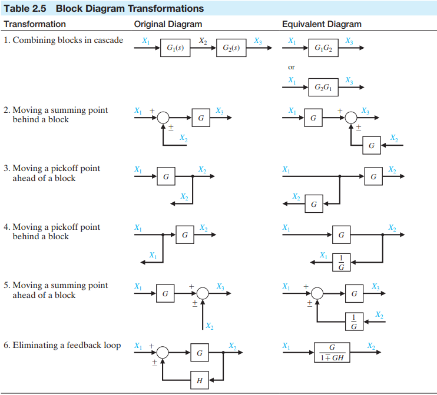

# System representation

## Block diagram

The dynamic system that comprises feedback control systems are typically represented mathematically by a set of simultaneous differential equations. As we have noted in previous sessions, the Laplace transformation reduces the problem to the solution of a set of linear algebraic equations. Since control systems are concerned with the control of specific variables, the controlled variables must relate to the controlling variables. This relationship is typically represented by the transfer function of the subsystem relating the input and output variables. Therefore, one can correctly assume that the transfer function is an important relation for control engineering.

The importance of this cause-and-effect relationship is evidenced by the facility to represent the relationship of system variables graphically using block diagrams. Block diagrams consist of uni-direction, operational blocks that represent the transfer function of the system of interest.

To represent a system with several variables under control, an interconnection of blocks is utilized. The block diagram representation of a given system can be often reduced to a simplified block diagram with fewer blocks than the original diagram.

## Signal flow graph models

Block diagrams are adequate for the representation of the interrelationships of controlled and input variables. An alternative method for determining the relationship between system variables has been developed by Mason and is based on a representation of the system by line segments. The advantage of the line path method, called the signal-flow graph method, is the availability of a flow graph formula, which provides the relation between system variables without requiring any reduction procedure or manipulation of the flow graph.

A signal-flow graph is a diagram consisting of nodes that are connected by several directed branches and is a graphical representation of a set of linear relations. Signal-flow graphs are particularly useful for feedback control systems because feedback theory is primarily concerned with the flow and processing of signals in systems. The basic element of a signal-flow graph is a unidirectional path segment called a branch, which relates the dependency of an input and an output variable in a manner equivalent to a block of a block diagram. The input and output points or junctions are called nodes. The relation between each variable is written next to the directional arrow. All branches leaving a node will pass the nodal signal to the output node of each branch (uni-directionally). The summation of all signals entering a node is equal to the node variable. A path is a branch or a continuous sequence of branches that can be traversed from one signal (node) to another signal (node). A loop is closed path that originates and terminates on the same node, with no node being met twice along the path. Two loops are said to be non-touching if they do not have a common node. Two touching loops share one or more common nodes.

In general, the linear dependence $T_{ij}(s)$ between the independent variable $x_i$ (often called the input variable) and a dependent variable $x_j$ is given by Mason's signal-flow graph formula:

$$
\begin{aligned}
T_{ij}(s)       &= \frac{\sum_k P_{ijk}(s)\Delta_{ijk}(s)}{\Delta(s)} \\
P_{ijk}(s)      &= \text{gain of $k$th path from variable $x_i$ to variable $x_j$} \\
\Delta(s)       &= \text{determinant of the graph} \\
\Delta_{ijk}(s) &= \text{cofactor of the path $P_{ijk}(s)$}
\end{aligned}
$$

And the summation is taken over all possible $k$ paths from $x_i$ to $x_j$. The path gain or transmittance $P_{ijk}(s)$ is defined as the product of the gains of the branches of the path, traversed in the direction of the arrows with no node encountered more than once. The cofactor $\Delta_{ijk}(s)$ is the determinant with the loops touching the $k$th path removed. The determinant $\Delta_{ijk}(s)$ is:

$$
\Delta(s) = 1 - \sum^N_{n = 1} L_n(s) + \sum_{\underset{\text{non-touching}}{n,m}} L_n(s) L_m(s) - \sum_{\underset{\text{non-touching}}{n,m,p}} L_n(s) L_m(s) L_p(s) + \cdots
$$

where $L_q(s)$ equals the value of the $q$th loop transmittance. Therefore the rule for evaluating $\Delta(s)$ in terms of loops $L_1(s), L_2(s), L_3(s), \dots, L_n(s)$ is:

$$
\begin{aligned}
\Delta = 1 -& (\text{sum of all different loop gains}) \\
           +& (\text{sum of the gain products of all combinations of two non-touching loops}) \\
           -& (\text{sum of the gain products of all combinations of three non-touching loops}) \\
           +& \cdots
\end{aligned}
$$

The gain formula is often used to relate the output variable $Y(s)$ to the input variable $R(s)$ and is given in somewhat simpler form as:

$$
T(s) = \frac{\sum_k P_k(s) \Delta_k(s)}{\Delta(s)}
$$

where $T(s) = Y(s) / R(s)$.