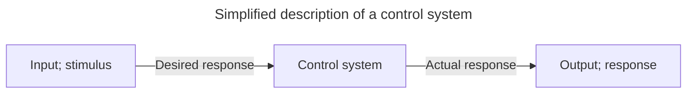

# Control systems

<!-- omit in toc -->
## Table of contents
- [Introduction](#introduction)
  - [Introduction](#introduction-1)
    - [Control system definition](#control-system-definition)
    - [Advantages of control systems](#advantages-of-control-systems)
  - [System configurations](#system-configurations)
    - [Open loop systems](#open-loop-systems)
    - [Closed loop systems](#closed-loop-systems)
- [Linearity](#linearity)

## Introduction

### Introduction

#### Control system definition

A *control system* consists of *subsystems* and *processes* (or *plants*) assembled for the purpose of obtaining a *desired output* with *desired performance*, given a *specified input*.

#### Advantages of control systems

We build control systems for four primary reasons:

- Power amplification
- Remote control
- Convenience of input form
- Compensation for disturbances

### System configurations

There are two major configurations of control systems: *open loop* and *closed loop*.

#### Open loop systems

The generic architecture of an open loop system is shown in the figure below. It starts with a subsystem called an *input transducer*, which converts the form of input to that used by the *controller*. The controller drives a *process* or *plant*. The input is sometimes called the *reference*, while the output can be called the *controller variable*. Other signals, such as *disturbances*, are shown added to the controller and process outputs via *summing junctions*, which yield the algebraic sum of their input signals using associated signs.

The distinguishing characteristic of an open loop system is that it can not compensate for any disturbances that add to the controller's driving signal (Disturbance 1 in the figure). The output of an open loop system is corrupted not only by signals that add to the controller's commands but also by disturbances at the output ("Disturbance 2 in the figure). The system can not correct these disturbances either.

#### Closed loop systems

The generic architecture of a closed loop system in shown in the figure below. The input transducer converts the form of input to the form used by the controller. An *output transducer*, or *sensor*, measures the output response and converts it into the form used by the controller.

The first summing junction algebraically adds the signal from the input to the signal from the output, which arrives via the *feedback path*, the return path from the output to the summing junction. The result is generally called the *actuating signal*. However, in systems where both the input and output transducers have *unity gain* (that is, the transducer amplifies the input by 1), the actuating signal's value is equal to the actual difference between the input and the output. Under this condition, the actuating signal is called the *error*.

The closed loop system compensates for disturbances by measuring the output response, feeding that measurement back through a feedback path, and comparing that response to the input at the summing junction.

------------

## Linearity

**Linearity** means the property of a function of being compatible with *addition* and *scaling*, also called the superposition principle. Thereby, if input $x_1$ produces response $y_1$ and input $x_2$ produces response $y_2$, then the weighted sum of the inputs must produce the weighted sum of the responses.

In the equation below, the weights $k_1$ and $k_2$ are real constants, and the inputs and outputs are functions of time.

$$
\begin{equation}
\tag{Linearity}
k_1 y_1(t) + k_2 y_2(t) = k_1 x_1(t) + k_2 x_2(t)
\end{equation}
$$

The *superposition principle* states that, for all linear systems, the net response caused by two or more stimuli is the sum of the responses that would have been caused by each stimuli individually. A function $F(x)$ that satisfies the superposition principle is called a *linear function*. Superposition can be defined by two simpler properties:

$$
\begin{equation}
\tag{Additivity}
F(x_1 + x_2) = F(x_1) + F(x_2)
\end{equation}
$$

$$
\begin{equation}
\tag{Homogeneity}
F(\alpha x) = \alpha F(x)
\end{equation}
$$

Generally, any system described by a differential equation of the following form is linear, with $n \geq m$.

$$
a_n \frac {d^n}{dt^n} y(t) + a_{n - 1} \frac {d^{n - 1}}{dt^{n - 1}} y(t) + \ldots + a_0 y(t) = b_n \frac {d^m}{dt^m} x(t) + b_{m - 1} \frac {d^{m - 1}}{dt^{m - 1}} x(t) + \ldots + b_0 x(t)
$$

continue
