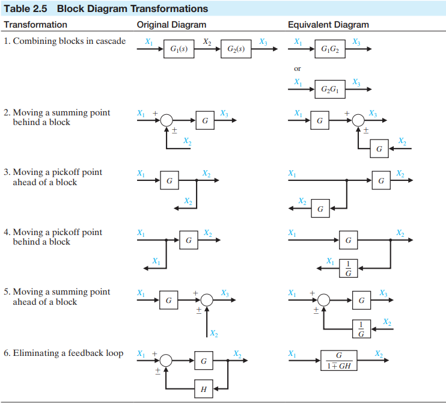

# Control system

<!-- omit in toc -->
## Table of contents

- [Chapter 2: Mathematical Models of Systems](#chapter-2-mathematical-models-of-systems)
  - [Preview](#preview)
  - [Introduction](#introduction)
  - [Linear approximations of physical systems](#linear-approximations-of-physical-systems)
  - [Notes](#notes)

## Chapter 2: Mathematical Models of Systems

### Preview

Mathematical models of physical systems are key elements in the design and analysis of control systems. The dynamic behavior is generally described by ordinary differential equations. Since most physical systems are nonlinear, linear approximations are used which allows to use Laplace transform methods. Then input-output relationship can be obtained in the form of transfer functions. The transfer functions can be organized into block diagrams or signal-flow graphs to graphically depict the interconnections. Block diagrams and signal-flow graphs are very convenient and natural tools for designing and analyzing complicated control systems.

### Introduction

The approach to dynamic system modelling can be listed as follows:

1. Define the system and its components.
2. Formulate the mathematical model and express necessary assumptions.
3. Obtain the differential equations representing the mathematical model.
4. Solve the equations for the desired output variables.
5. Examine the solutions and the assumptions.
6. If necessary, reanalyze or redesign the system.

<!-- Section 2.2: Differential equations of physical systems -->
<!-- Skipped due to being too lengthy and physics-intensive -->

### Linear approximations of physical systems

Most physical systems are linear withing some range of the variables, however, they ultimately become nonlinear as the variables are increased without limit. Therefore, the range of linearity must be considered for each system.

A system represented by the relation $y(t) = m x(t) + b$ is not linear, because it does not satisfy the homogeneity property. However, this system may be considered linear about an operating point $x_0, y_0$ for small changes $\Delta x$ and $\Delta y$, since $\Delta y(t) = m \Delta x(t)$, which satisfies the necessary conditions. When $x(t) = x_0 + \Delta x(t)$ and $y(t) = x_0 + \Delta y(t)$:

$$
\begin{aligned}
y(t) &= m x(t) + b \\
y_0 + \Delta y(t) &= m x_0 + m \Delta x(t) + b \\
\Delta y(t) &= m \Delta x(t)
\end{aligned}
$$

The linearity of many mechanical and electrical elements can be assumed over a reasonably large range of the variables. This is not usually the case for thermal and fluid elements, which are more frequently nonlinear in character. However, nonlinear elements can often be linearized assuming small-signal conditions. This is the normal approach used to obtain a linear equivalent circuit for electronic circuits and transistors. Consider a general element with an excitation (through-) variable $x(t)$ and a response (across-) variable $y(t)$.

### Notes

In a control system, the portion of system to be controlled is known as plant of the process. Plant is often described by a transfer function, which gives the relationship between the input excitation and the output response of the system without any feedback. A plant can have multiple input and output signals.

A stimulus or condition is anything that acts as an input signal. The sensors are used to measure the output of the plant while actuators drive the input of the plant. A process is a natural progressive operation, such as a chemical reaction. A plant can be referred to as the combination of the process and actuator.

The type of signals which affects the output of a control system are known as disturbances. Disturbances can be internal (such as friction, stray, and iron losses), which can not be controlled, or external (such as voltage spikes and humidity), which can be reduced or rejected.

A control system is an interconnection of physical components to provide the desired function with some controlling action. A system is an interconnection of different elements to perform a task. It has some input and some output. A system which controls other systems to perform a desired task is called a control system.

A variable being controlled is called a controlled variable. In close loop system, the output is the controlled variable. Reference input is also known as set point. On contrary, an actual response of the applied input signal will be the output response.

A controller is a device or algorithm that receives the difference between the set point and measured output, and generates a control action to reduce this error. The quantity varied by the controller to influence the controlled variable is called the manipulated variable.

The feedback mechanism tends to reduce the difference between the desired output and the actual output response. Feedback mechanism can be either positive feedback (in which case, the effective input is the sum of the reference input and feedback signal) or negative feedback (in which case, the effective input is the sum of the reference input and feedback signal). The positive feedback mechanism is used to amplify the input signal, whereas the negative feedback mechanism is used to decrease the amplitude of the error signal.

A control system without feedback is called an open loop control system. Whereas, a control system with a feedback mechanism is called a closed loop control system.

The denominator of a transfer function when set equal to zero is called the characteristic equation. The roots of the numerator equation are called zeroes, and the roots of the characteristic equation are called poles. Zeroes makes the transfer function zero, whereas a pole makes the transfer function undefined.

A system in which the time function settles down after some time, $f(t) \rArr 0$ as $t \rArr \infty$, is called a stable system. In a stable system, all the poles lie in the left-half plane of the pz-map. A system in which the time function rises indefinitely, $f(t) \rArr \infty$ as $t \rArr \infty$, is called an unstable system. While, a system that neithers settles down nor rises indefinitely, but instead either continues to oscillate or remains at a fixed non-zero amplitude, $f(t) \not \rArr 0, f(t) \not \rArr \infty$ as $t \rArr \infty$, is called a marginally stable system.

For a system described by the time-domain function $f(t) = e^{-\alpha t}$, which has a transfer function $G(s) = \frac{1}{s + \alpha}$, if $\alpha > 0$, the system is stable since $f(t)$ is exponentially decaying with time. If $\alpha < 0$, the system is unstable since $f(t)$ is exponentially rising with time. And if $\alpha = 0$, the system is marginally stable since $f(t)$ remains at a fixed amplitude indefinitely. This conclusion can also be reached by finding the poles of the transfer function $G(s)$, which is at $s = - \alpha$. For the system to be stable, this pole must lie in the left-half plane, so $\alpha$ has to be less than zero.

When the poles are imaginary, the time-domain function will always be sinusoidal increasing or decreasing. In a marginally stable system, the poles should be non-repeating and imaginary.

A system which follows BIBO (Bounded Input Bounded Output) is a stable system. For a bounded system, the amplitude should be finite. Asymptotically stable. A bounded stable system has $f(t) \rArr 0$ as $t \rArr \infty$, while an unbounded unstable system has $f(t) \rArr \infty$ as $t \rArr \infty$.

The Eigen values of the state space matrix $A$ represent the poles of the system. Since Eigen values depend on the order of the matrix, the number of poles can be determined directly by the order of the matrix; if the order is $n$, there will be $n$ poles. Eigen values $\lambda$ are calculated by solving the equation $| \lambda I A | = 0$.

For negative feedback, the overall transfer function is of the following form:

$$
\frac{C(s)}{R(s)} = \frac{G(s)}{1 + G(s)H(s)}
$$

Whereas for positive feedback, the overall transfer function is the following form:

$$
\frac{C(s)}{R(s)} = \frac{G(s)}{1 - G(s)H(s)}
$$

For more complicated systems, the overall transfer function is of the following form:

$$
\frac{C(s)}{R(s)} = \frac{\text{Gain of the system}}{1 + G(s)H(s)}
$$

Such as when the controller is described by $G_c(s)$, the plant by $G_a(s)$, the process by $G_p(s)$, and the sensor by $H(s)$:

$$
\frac{C(s)}{R(s)} = \frac{G_p G_a G_c}{1 + G_p G_a G_c H}
$$

If the poles are away from the origin, the time domain function settles down more rapidly. Thus, the further away the poles from the origin, the more stable the system. Therefore, rate of decay is dependent on the location of the poles. If there are only imaginary repeating poles, and the real part is not on the left side, then the system is unstable.

The transfer function from the SFG (Signal Flow Graph) and block diagram must be the same. In a signal flow graph, a node is any point that represents a signal. A line joining two nodes is called a branch, and the arrow on the branch indicates the direction of the signal flow. Transmittance is the gain acquired by a signal as it travels from one node to another; it could be real or complex.

An input node has only outgoing branches, whereas an output node has only incoming branches. A node that has both incoming and outgoing branches is called a mixed node. A traversal of connected branches in the direction of the arrows is called a path. A path should not cross the same node more than once.

If the system transfer function is available, the time response of any dynamic system can be studied, given a unit impulse, unit ramp, unit step, or unit sinusoidal inputs. To achieve this, the input signal $R(s)$ of the transfer function equation needs to be replaced with the appropriate frequency domain function; for unit step input, it is $\frac{1}{s}$, for unit impulse, it is $1$, and for unit ramp, it is $\frac{1}{s^2}$. Finally, using inverse Laplace transformation, the time domain output response can be obtained.

For example, consider the following system with the given transfer function. To study the time response of this system for a unit step input ($R(s) = \frac{1}{s}$):

$$
\frac{C(s)}{R(s)} = \frac{1}{s + 5} \\ [8 pt]
C(s) = R(s) \times \frac{1}{s + 5} \\ [8 pt]
C(s) = \frac{1}{s} \times \frac{1}{s + 5} \\ [8 pt]
C(s) = \frac{1}{s} \times \frac{1}{s + 5} \\ [8 pt]
C(t) = \frac{1}{2} e^{-5t}
$$

Mason's Gain Formula is used to obtain the transfer function from a SFG. *Details of this formula needs to be taken from the internet.*

$$
G(s) = \sum_{k = 1} \frac{P_k \Delta k}{\Delta}
$$

An open path starts at one node and ends at another node. Whereas, a closed path starts and ends at the same node. A feedback path is a path from one node to another node in the reverse direction. The gain associated with the feedback path is called the loop gain. Two loops are non-touching if they do not have any common node. Two loops are touching if they have at least one common node.

First order control system is a control system, in which the input-output relationship (transfer function) is a first order differential equation. First order systems are characterized by transfer functions of the following form, where $k$ is the DC gain and $\tau$ is the time constant:

$$
\frac{C(s)}{R(s)} = \frac{k}{1 + \tau s}
$$

The DC gain is the between the steady state value of the output response to the steady state value of the input signal.

Poles due to the input are called input signal poles, whereas poles due to the system are called system poles. For example, consider a generic first order system with unit step input:

$$
\frac{C(s)}{R(s)} = \frac{k}{1 + \tau s} \\ [8 pt]
C(s) = \frac{1}{s} \times \frac{k}{1 + \tau s} \\ [8 pt]
C(s) = \frac{k}{s(1 + \tau s)}
$$

Here, the pole $s = 0$ is caused by the input, so it is a signal pole, whereas the pole $s = -\frac{1}{\tau}$ is caused by the system, so it is a system pole.

The time constant $\tau$ describes how quickly the system responds to an input. A first order system reaches $63\%$ of its steady state value at $t = \tau$. This can be proved for a generic first order system with unit step input:

$$
C(s) = \frac{k}{s(1 + \tau s)} \\ [8 pt]
\because \frac{k}{s(1 + \tau s)} = \frac{A}{s} + \frac{B}{1 + \tau s} \\ [8 pt]
\therefore k = A(1 + \tau s)+ B s \\
s = 0 \rArr A = k \\
s = - \frac{1}{\tau} \rArr B = -k \tau \\
C(s) = \frac{k}{s} - \frac{k \tau}{1 + \tau s} \\ [8 pt]
C(t) = \mathcal{L}^{-1}\left(\frac{k}{s} - \frac{k \tau}{1 + \tau s}\right) \\ [8 pt]
C(t) = k(1 - e^{-t / \tau}) \\
t = \tau \rArr C(t) = k(1 - e^{-\tau / \tau}) \\
C(t) = k(1 - e^{-1}) \\
C(t) \approx 0.63 k
$$

A first order system will nearly settle after $t = 4 \tau$.

$$
C(t) = k(1 - e^{-t / \tau}) \\
t = 4 \tau \rArr C(t) = k(1 - e^{-4 \tau / \tau}) \\
C(t) = k(1 - e^{-4}) \\
C(t) \approx 0.9817 k
$$

A smaller value of the time constant therefore results in a faster system response. For example, if $\tau = 1$, the pole will be further away from the imaginary axis and the system response will be faster, compared to when $\tau = 2$, the pole will be closer to the imaginary axis and the system response will be slower.

To calculate the time constant, reduce the transfer function fraction so that it matches the generic first order form:

$$
G(s) = \frac{2}{2 + 4s} \\ [8 pt]
G(s) = \frac{1}{1 + 2s} \\ [8 pt]
\tau = 2
$$

To calculate the gain, substitute $s = 0$ into the transfer function. For example:

$$
G(s) = \frac{8}{2 + 4s} \\ [8 pt]
s = 0 \rArr \text{gain} = \frac{8}{2 + 4(0)} = 4
$$

In the time domain response polynomial, the terms that are decaying with time are called the transient term, and characterize the transient response of the system.

Angular frequency of transient term:

$$
\omega_d = \omega_n - \sqrt{1 - \zeta^2}
$$

The two poles of a second order system:

$$
s^2 + 2 \zeta \omega_n s + \omega_n^2 = 0 \\ [8 pt]
s = \frac{-2 \zeta \omega_n \plusmn \sqrt{4 \zeta^2 \omega_n^2 - 4 \omega_n^2}}{2} \\ [8 pt]
s = \frac{-2 \zeta \omega_n \plusmn 2 \omega_n \sqrt{\zeta^2 - 1}}{2} \\ [8 pt]
s = -\zeta \omega_n \plusmn \omega_n \sqrt{\zeta^2 - 1} \\ [8 pt]
$$

The steady state value of the response can be attained from the DC gain and the magnitude of the input step signal:

steady state value = DC gain $\times$ step signal magnitude

A first order system with a zero, at $s = -\frac{1}{\alpha}$:

$$
\frac{C(s)}{R(s)} = \frac{k(1 + \alpha s)}{1 + \tau s}
$$

By taking the inverse Laplace of this transfer function, the following time domain function is obtained:

$$
C(t) = k(1 + (\frac{\alpha - \tau}{\tau}) e^{-t / \tau})
$$

When $\alpha = 0$:

$$
C(t) = k(1 - e^{-t / \tau})
$$

When $\alpha = \tau$:

$$
C(t) = k
$$

Therefore, as the pole and the zero get closer together, when $\alpha \approx \tau$, the transient term reduces in size. Since the transient term is characterized by the time constant, which in term is characterized by the pole, effectively, the closer the zero is to the pole, the lesser are the effects of the pole on the response.

A second order is characterized by the following transfer function, where $k$ is the DC gain, $\zeta$ is the damping ratio, and $\omega_n$ is the undamped natural frequency:

$$
G(s) = \frac{k \omega_n^2}{s^2 + 2 \zeta \omega_n s + \omega_n^2}
$$

The damping ratio $\zeta$ is the ratio of the damping coefficient and the critical damping. The critical damping is the minimum value of the damping ratio that would prevent any oscillation.

If $\zeta = 0$, the poles will lie on the imaginary axis:

$$
s = \plusmn \omega_n j
$$

If $0 < \zeta < 1$, the poles will be complex with both a real and imaginary part:

$$
s = -\zeta \omega_n \plusmn \omega_n \sqrt{\zeta^2 - 1}
$$

If $\zeta = 1$, both the poles will be repeatedly equal:

$$
s = - \omega_n
$$

Damping ratio is the measure of the rapidity with which a second order system responds to step.

If $\zeta < 0$, the system will be unstable. If $\zeta = 0$, the system will be undamped. If $ 0 < \zeta < 1$, the system will be underdamped; the poles will be complex and the system will overshoot its final value. If $\zeta = 1$, the system will be critically damped; both poles will be repeatedly equal; the system will be quick enough but will not overshoot. If $\zeta > 1$, the system will be overdamped; the poles will be real, negative, and unequal; the system will be slow to respond.

A mass-spring-damped system is a second order system. In the following comparison, the DC gain (usually denoted by $k$) is instead represented by $g$ due to confusion with the spring constant $k$. DC gain for mass-spring-damper system will be inverse of stiffness.

$$
\frac{Y(s)}{U(s)} = \frac{1}{m s^2 + b s + k} \\ [8 pt]
\frac{Y(s)}{U(s)} = \frac{\frac{1}{m}}{s^2 + \frac{b}{m}s + \frac{k}{m}} \\ [8 pt]
G(s) = \frac{k \omega_n^2}{s^2 + 2 \zeta \omega_n s + \omega_n^2} \\ [8 pt]
\omega_n = \sqrt{\frac{k}{m}} \\ [8 pt]
g = \frac{1}{k} \\ [8 pt]
\zeta = \frac{b}{2 \sqrt{m k}}
$$

The damped frequency $\omega_d$ is given as:

$$
\omega_d = \omega_n \sqrt{1 - \zeta^2}
$$

In a second order system, DC gain will be equal to the steady state value only if step input is applied. If a signal other than step is provided, the relationship: steady state value = DC gain $\times$ input magnitude, holds.

A very similar analysis can be done on RLC circuits with the mass $m$ being replaced by the inductance $L$, the damping constant $b$ being replaced by the resistance $R$, and the spring constant $k$ being replaced by the capacitance $C$.

The time domain response of an overdamped second order system, the terms $B'$ and $C'$ are used for convenience:

$$
C(t) = k + (-\frac{1}{2} - \frac{\zeta}{2 \sqrt{\zeta^2 - 1}}) k e^{p_1 t} + (-\frac{1}{2} + \frac{\zeta}{2 \sqrt{\zeta^2 - 1}}) k e^{p_2 t} \\ [8 pt]
C(t) = k(1 + B' e^{p_1 t} + C' e^{p_2 t}) \\
p_1 = -\zeta \omega_n + \omega_n \sqrt{\zeta^2 - 1} \\
p_2 = -\zeta \omega_n - \omega_n \sqrt{\zeta^2 - 1}
$$

Since $B'$ is negative, the $kB'$ will be negative as well. And since $C'$ is positive, $kC'$ will be positive as well. The actual response is the sum of these terms.

For a critically damped second order system, the time domain response to a step input:

$$
s = - \omega_n
$$

The poles will be real, negative, and repeated.

$$
C(t) = k(1 - (1 + \omega_n t) e^{-\omega_n t})
$$

The main feature of this response is the exponentially decaying transient term. The response will be quick since the transient term has the natural exponent, that decays exponentially with time. Also, the step response of an overdamped second order system does not overshoot its final value.

For overdamped systems, there will always be two poles. The settling time for over-, under-, and critically-damped systems will be different. The poles nearer to the imaginary axis will be dominant. The inverse of the dominant poles will be the time constant.

Phase shift, $\phi$, is the angle under the line connecting the complex pole to the origin. Since, in the case of an underdamped system, the imaginary part is the damped natural frequency: 

$$
\zeta = \cos{\phi}
$$

Also, the graph of an overdamped second order system is a trapped sinusoidal, because of the following term:

$$
\frac{e^{-\zeta \omega_n t}}{\sqrt{1 - \zeta^2}}
$$

For an overdamped system, by comparing the term $e^{-\zeta \omega_n t}$ with the generic expression $e^{-t/\tau}$:

$$
\tau = \frac{1}{\zeta \omega_n}
$$

For a critically damped system:

$$
\tau = \frac{1}{\omega_n}
$$

For an underdamped system, the poles will be a complex conjugate pair. The reason there is overshoot in an underdamped system is because it is a sinusoidal decaying function.

Time domain aspects of second order system:

Rise time, $t_r$, is the time required for response to match, in case of underdamped systems, $0\%$ to $100\%$, in case of overdamped systems, $10\%$ to $90\%$, and in case of critically damped systems, $5\%$ to $95\%$ of steady state value.

$$
t_r = \frac{\pi - \tan^{-1}(\frac{\sqrt{1 - \zeta^2}}{\zeta})}{\omega_n \sqrt{1 - \zeta^2}}
$$

Peak time, $t_p$, is the time required for the response to reach the max or peak value:

$$
t_p = \frac{\pi}{\omega_n \sqrt{1 - \zeta^2}} \\ [8 pt]
t_p = \frac{\pi}{\omega_d}
$$

Percentage overshoot:

$$
M_p = 100 e^{-\zeta \pi / \sqrt{1 - \zeta^2}}
$$

Settling time, $t_s$, is the time required for the transient's damped oscillations to reach and stay within $2\%$ of the steady state value. The settling time in the case of underdamped system is $4 \tau$. This is because, by this time, the value will be 98% within the steady state value; exactly what is required.

$$
t_s = 4 \tau \\ [8 pt]
t_s = \frac{4}{\zeta \omega_n}
$$

Influence of zeroes:

Interpretation 1: Zeroes may influence the contribution of each pole (in terms of coefficient).

Consider the following system:

$$
\frac{Y(s)}{U(s)} = \frac{10}{s^2 + 5 s +6} \\ [8 pt]
\frac{Y(s)}{U(s)} = \frac{10}{s + 2} - \frac{10}{s + 3} \\ [8 pt]
\mathcal{L}^{-1} = 10 e^{-2t} - 10 e^{-3t}
$$

After adding a zero, $s = -10$, the zero is added on the left side plane; it can be observed that the response would reach the steady state value quicker:

$$
\frac{Y(s)}{U(s)} = \frac{s + 10}{s^2 + 5 s +6} \\ [8 pt]
\frac{Y(s)}{U(s)} = \frac{8}{s + 2} - \frac{7}{s + 3} \\ [8 pt]
\mathcal{L}^{-1} = 8 e^{-2t} - 7 e^{-3t}
$$

After adding a zero, $s = 10$, the zero is added on the right side plane; it can be observed that the response would reach the steady state value slower:

$$
\frac{Y(s)}{U(s)} = \frac{s - 10}{s^2 + 5 s +6} \\ [8 pt]
\frac{Y(s)}{U(s)} = -\frac{12}{s + 2} + \frac{13}{s + 3} \\ [8 pt]
\mathcal{L}^{-1} = -12 e^{-2t} + 13 e^{-3t}
$$

If a steady straight line response is needed, a zero equal to the pole can be added. Consider the following system:

$$
\frac{Y(s)}{U(s)} = \frac{1}{(s + 2)(s + 3)}
$$

To cancel the effect of the pole at $s = -2$, a zero can be added at $s = -3$:

$$
\frac{Y(s)}{U(s)} = \frac{s + 2}{(s + 2)(s + 3)} = \frac{1}{s + 3}
$$

Therefore, the closer the zero to the pole, the lesser the influence of the pole on the response.

Interpretation 2: The response of the system with zeroes could be the sum or difference of the responses of canonical system and non-canonical system.

$$
\text{system} = \text{non-canonical with zeroes} + \text{canonical without zeroes} \\
\frac{s + 1}{s^2 + s + 1} = \frac{s}{s^2 + s + 1} + \frac{1}{s^2 + s + 1}
$$

Interpretation 3: If zeroes lie on the right half plane, then the response will initially move in the reverse direction; and is called non-minimum phase condition.

If zero is included in the left plane, percentage overshoot will increase and the response will be quicker; and the rise time will decrease. As the percentage overshoot is increased, the settling time will increase. If response to a unit change in the test signal is quicker, the system response will be quick. If zero = pole (negative real pole), then the graph will be a straight line.

Transfer function can be understood directly from the response graph, given the input step signal magnitude:

1# DC gain can be found, since the magnitude of the test signal is provided, and the steady state value can be analyzed from the graph.

$$
\text{DC gain} \times \text{magnitude} = \text{steady state value}
$$

2# Rise time $t_r$ can be analyzed by measuring the time required between the $10\%$ to $90\%$ of the steady state value.

3# Natural undamped frequency, $\omega_n$, can be calculated using the following formula:

$$
t_r = \frac{1.8}{\omega_n}
$$

4# Percentage overshoot, $M_p$, can be calculated using the following formula, where $y(t)$ represents the amplitude of the graph at that time:

$$
M_p = \frac{y(t_p) - y(t_\infty)}{y(t_\infty)}
$$

5# Damping coefficient, $\zeta$, can be calculated using the following formula:

$$
M_p = 100 e^{-\zeta \pi / \sqrt{1 - \zeta^2}}
$$

For higher order systems, there are four possibilities; the first two practically do not exist:

1. All poles lie on the left side plane and are coincident.
2. All poles are very close together.
3. All poles are at different positions.
4. One pole is on the axis, while the other two poles are complex conjugate.

For the first case, the following generic transfer function holds:

$$
G(s) = \frac{k}{(1 + \tau_1 s)(1 + \tau_2 s)(1 + \tau_3 s)}
$$

If a step input is applied:

$$
G(s) = \frac{1}{s} \frac{k}{(1 + \tau_1 s)(1 + \tau_2 s)(1 + \tau_3 s)} \\ [8 pt]
= \frac{k / \tau_1 \tau_2 \tau_3}{s(s + 1 / \tau_1)(s + 1 / \tau_2)(s + 1 / \tau_3)} \\ [8 pt]
\mathcal{L}^{-1} = \frac{A}{s} + \frac{B}{s + 1 / \tau_1} + \frac{C}{s + 1 / \tau_2} + \frac{D}{s + 1 / \tau_3} \\ [8 pt]
= A + B e^{-t/\tau_1} + C e^{-t/\tau_2} + D e^{-t/\tau_3}
$$

Therefore, the step response contains a steady state term, $A$, due to the signal pole at origin, and three transient terms. Such a system can be related as a combination of three first order systems, for example:

$$
G(s) = \frac{10}{(1 + s)(1 + 2s)(1 + 3s)}
$$

In this, the pole at $s = -1/3$ will be closest to the imaginary axis, and hence is the most dominant pole. The steady state term is $A = 10$.

A third order system with one real and two complex poles is an underdamped system. It will be a combination of a first order and an underdamped second order system.

The greater the magnitude of complex poles, the greater the frequency of the response (decaying sinusoidal). The further the pole move away from the origin, the quicker will be the response.

- Open loop and closed loop systems
- Block diagram representation of dynamic systems
- First and second order systems
- Block diagram reduction rules and Mason's rule
- Stability using Ruth Hurwitz
- Root locus, Nuquist, and Nicholas
- PID controller

Definitions of parts of a control system: plant, process, controller, actuators, sensor, disturbances, stimulus, reference input, controlled variable, manipulated variable.
Feedback mechanism: positive feedback and negative feedback
Types of control systems: open loop and closed loop
Transfer function, characteristic equation, poles and zeroes
Stable, unstable, and marginally stable system
