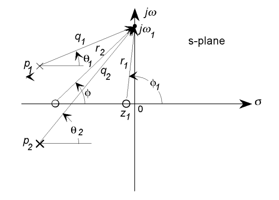

# Understanding poles and zeroes

<!-- omit in toc -->
## Table of contents

- [System poles and zeroes](#system-poles-and-zeroes)
  - [The pole-zero plot](#the-pole-zero-plot)
  - [System poles and the homogeneous response](#system-poles-and-the-homogeneous-response)
  - [System stability](#system-stability)
- [Geometric evaluation of the transfer function](#geometric-evaluation-of-the-transfer-function)
- [Frequency response and the pole-zero plot](#frequency-response-and-the-pole-zero-plot)
  - [A simple method for constructing the magnitude Bode plot directly from the pole-zero plot](#a-simple-method-for-constructing-the-magnitude-bode-plot-directly-from-the-pole-zero-plot)

## System poles and zeroes

The transfer function provides a basis for determining important system response characteristics without solving the complete differential equation. As defined, the transfer function is a rational function in the complex variable $s = \sigma + j \omega$, that is:

$$
H(s) = \frac{b_m s^m + b_{m - 1} s^{m - 1} + \cdots + b_1 s + b_0}{a_n s^n + a_{n - 1} s^{n - 1} + \cdots + a_1 s + a_0}
$$

It is often convenient to factor the polynomials in the numerator and denominator, and to write the transfer function in terms of those factors:

$$
H(s) = \frac{N(s)}{D(s)} = K \frac{(s - z_1)(s - z_2) \cdots (s - z_{m - 1})(s - z_m)}{(s - p_1)(s - p_2) \cdots (s - p_{n - 1})(s - p_n)}
$$

where the numerator and denominator polynomials, $N(s)$ and $D(s)$, have real coefficients defined by the system's differential equation and $K = b_m / a_n$. The roots $z_i$ of the equation $N(s) = 0$ are defined to be the system zeroes, and the roots $p_i$ of the equation $D(s) = 0$ are defined to be the system poles.

When $s = z_i$, the numerator $N(s) = 0$ and the transfer function vanishes, that is:

$$
\lim_{s \to z_i} H(s) = 0
$$

and similarly when $s = p_i$ the denominator polynomial $D(s) = 0$ and the value of the transfer function becomes unbounded:

$$
\lim_{s \to p_i} H(s) = \infty
$$

All coefficients of the polynomials $N(s)$ and $D(s)$ are real, therefore the poles and zeroes must be either purely real, or appear in complex conjugate pairs. In general for the poles, either $p_i = \sigma_i$, or else $p_i, p_{i + 1} = \sigma_i \plusmn j \omega_i$. The existence of a single complex pole without a corresponding conjugate pole would generate complex coefficients in the polynomial $D(s)$. Similarly, the system zeroes are either real or appear in complex conjugate pairs.

The poles and zeroes are properties of the transfer function, and therefore of the differential equation describing the input-output system dynamics. Together with the gain constant $K$, they completely characterize the differential equation, and provide a complete description of the system.

### The pole-zero plot

A system is characterized by its poles and zeroes in the sense that they allow reconstruction of the input/output differential equation. In general, the poles and zeroes of a transfer function may be complex, and the system dynamics may be represented graphically by plotting their locations on the complex $s$-plane, whose axes represent the real and imaginary parts of the complex variable $s$. Such plots are known as pole-zero plots. It is convention to mark a zero location by a circle ($\circ$) and a pole location by a cross ($\times$). The location of the poles and zeroes provide qualitative insights into the response characteristics of a system.

### System poles and the homogeneous response

Because the transfer function completely represents a system differential equation, its poles and zeroes effectively determine the system response. In particular, the system poles directly define the components in the homogeneous response. The unforced response of a linear SISO system to a set of initial conditions is:

$$
y_{h(t)} = \sum^{n}_{i = 1}{C_i e^{\lambda_i t}}
$$

where the constants $C_i$ are determined from the given set of initial conditions and the exponents $\lambda_i$ are the roots of the characteristic equation or the system eigenvalues. The characteristic equation is $D(s) = 0$ and its roots are the system poles, that is $\lambda_i = p_i$, leading to the following important relationship:

The transfer function poles are the roots of the characteristic equation, and also the eigenvalues of the system $\bold{A}$ matrix.

The homogeneous response may therefore be written as:

$$
y_{h(t)} = \sum^{n}_{i = 1}{C_i e^{p_i t}}
$$

The location of the poles in the $s$-plane therefore define the $n$ components in the homogeneous response as described below:

- A real pole $p_i = -\sigma$ in the left-half of the $s$-plane defines an exponentially decaying component, $C e^{-\sigma t}$, in the homogeneous response. The rate of the decay is determined by the pole location; poles far from the origin in the left-half plane correspond to components that decay rapidly, while poles near the origin correspond to slowly decaying components.
- A pole at the origin $p_i = 0$ defines a component that is constant in amplitude and defined by the initial conditions.
- A real pole in the right-half plane corresponds to an exponentially increasing component $C e^{\sigma t}$ in the homogeneous response; thus defining the system to be unstable.
- A complex conjugate pole pair $\sigma \plusmn j \omega$ in the left-half of the $s$-plane combine to generate a response component that is a decaying sinusoidal of the form $A e^{-\sigma t} \sin(\omega t + \phi)$ where $A$ and $\phi$ are determined by the initial conditions. The rate of decay is specified by $\sigma$ while the frequency of oscillation is determined by $\omega$.
- An imaginary pole pair, that is a pole pair lying on the imaginary axis, $\plusmn j \omega$ generates an oscillatory component with a constant amplitude determined by the initial conditions.
- A complex pole pair in the right-half plane generates an exponentially increasing component.

> Note: The time constant $\tau$ is found by comparing the term $e^{-p_i t}$ with $e^{-t/\tau}$. If the value of $p_i$ is small, the time constant will be large; which in turn means that the effect of that term will last for a large time, $4 \tau$. Therefore, terms with poles closer to the origin are the dominant long term response component.

The pole locations of the classical second-order homogeneous system:

$$
\frac{d^2 y}{d t^2} + 2 \zeta \omega_n \frac{d y}{d t} + \omega_n^2 y = 0
$$

are given by:

$$
p_1, p_2 = - \zeta \omega_n \plusmn \omega_n \sqrt{\zeta^2 - 1}
$$

If $\zeta \geq 1$, corresponding to an overdamped system, the two poles are real and lie in the left-half plane. For an underdamped system, $0 \leq \zeta \leq 1$, the poles form a complex conjugate pair:

$$
p_1, p_2 = - \zeta \omega_n \plusmn j \omega_n \sqrt{1 - \zeta^2}
$$

and are located in the left-half plane. These poles lie at a distance $\omega_n$ from the origin, and at an angle $\plusmn \cos^{-1}(\zeta)$ from the negative real axis. The poles for an underdamped second-order system therefore lie on a semi-circle with a radius defined by $\omega_n$, and at an angle defined by the value of the damping ratio $\zeta$.

### System stability

The stability of a linear system may be determined directly from its transfer function. An $n$th order linear system is asymptotically stable only if all of the components in the homogeneous response from a finite set of initial conditions decay to zero as time increases, or

$$
\lim_{t \to \infty} \sum^n_{i = 1} C_i e^{p_i t} = 0
$$

where the $p_i$ are the system poles. In a stable system, all components of the homogeneous response must decay to zero as time increases. If any pole has a positive real part, there is a component in the output that increases without bound, causing the system to be unstable.

In order for a linear system to be stable, all of its poles must have negative real parts, that is they must all lie within the left-half of the $s$-plane. An "unstable" pole, lying in the right-half of the $s$-plane, generates a component in the system homogeneous response that increases without bound from any finite initial conditions. A system that has one or more poles lying on the imaginary axis of the $s$-plane has non-decaying oscillatory components in its homogeneous response, and is defined to be marginally stable.

## Geometric evaluation of the transfer function

The transfer function may be evaluated for any value of $s = \sigma + j \omega$, and in general, when $s$ is complex, the function $H(s)$ itself is complex. It is common to express the complex value of the transfer function in polar form as a magnitude and an angle:

$$
H(s) = | H(s) | e^{j \phi(s)}
$$

with a magnitude $| H(s) |$ and an angle $\phi(s)$ given by:

$$
| H(s) | = \sqrt{\Re\{H(s)\}^2 + \Im\{H(s)\}^2} \\ [8pt]
\phi(s) = \tan^{-1} \left( \frac{\Im\{H(s)\}}{\Re\{H(s)\}} \right)
$$

where $\Re\{\}$ is the real operator and $\Im\{\}$ is the imaginary operator. If the numerator and denominator polynomials are factored into terms $(s - p_i)$ and $(s - z_i)$,

$$
H(s) = K \frac{(s - z_1)(s - z_2) \cdots (s - z_{m - 1})(s - z_m)}{(s - p_1)(s - p_2) \cdots (s - p_{n - 1})(s - p_n)}
$$

each of the factors in the numerator and denominator is a complex quantity, and may be interpreted as a vector in the $s$-plane, originating from the point $z_i$ or $p_i$ and directed to the point $s$ at which the function is to be evaluated. Each of these vectors may be written in polar form in terms of a magnitude and an angle, for example for a pole $p_i = \sigma_i + \omega_i$, the magnitude and angle of the vector to the point $s = \sigma + \omega$ are:

$$
| s - p_i | = \sqrt{(\sigma - \sigma_i)^2 + (\omega - \omega_i)^2} \\
\angle{(s - p_i)} = \tan^{-1} \left( \frac{\omega - \omega_i}{\sigma - \sigma_i}\right)
$$

Because the magnitude of the product of two complex quantities is the product of the individual magnitudes, and the angle of the product is the sum of the component angles, the magnitude and angle of the complete transfer function may be written as:

$$
| H(s) | = K \frac{\prod^m_{i = 1} | (s - z_i) |}{\prod^n_{i = 1} | (s - p_i) |} \\ [8pt]
\angle{H(s)} = \sum^m_{i = 1} \angle(s - z_i) - \sum^n_{i = 1} \angle(s - p_i)
$$

The magnitude of each of the component vectors in the numerator and denominator is the distance of the point $s$ from the pole or zero in the $s$-plane. Therefore, if the vector from the pole $p_i$ to the point $s$ on a pole-zero plot has length $q_i$ and an angle $\theta_i$ from the horizontal, and the vector from the zero $z_i$ to point $s$ has a length $r_i$ and an angle $\phi_i$, the value of the transfer function at the point $s$ is:

$$
| H(s) | = K \frac{r_1 \cdots r_m}{q_1 \cdots q_n} \\ [8pt]
\angle{H(s)} = (\phi_1 + \cdots + \phi_m) - (\theta_1 + \cdots + \theta_n)
$$

The transfer function at any value of $s$ may therefore be determined geometrically from the pole-zero plot, except for the overall "gain" factor $K$. The magnitude of the transfer function is proportional to the product of the geometric distances on the $s$-plane from each zero to the point $s$ divided by the product of the distances from each pole to the point. The angle of the transfer function is the sum of the angles of the vectors associated with the zeroes minus the sum of the angles of the vectors associated with the poles.

## Frequency response and the pole-zero plot

The frequency response may be written in terms of the system poles and zeroes by substituting $j \omega$ for $s$ directly into the factored form of the transfer function:

$$
H(j \omega) = K \frac{(j \omega - z_1)(j \omega - z_2) \cdots (j \omega - z_{m - 1})(j \omega - z_m)}{(j \omega - p_1)(j \omega - p_2) \cdots (j \omega - p_{n - 1})(j \omega - p_n)}
$$

Because the frequency response is the transfer function evaluated on the imaginary axis of the $s$-plane, that is when $s = j \omega$, the graphical method for evaluating the transfer function may be applied directly to the frequency response. Each of the vectors from the $n$ system poles to a test point $s = j \omega$ has a magnitude and an angle:

$$
| j \omega - p_i | = \sqrt{\sigma_i^2 + (\omega - \omega_i)^2} \\
\angle (j \omega - p_i) = \tan^{-1} \left( \frac{\omega - \omega_i}{-\sigma_i} \right)
$$

with similar expressions for the vectors from the $m$ zeroes. The magnitude and phase angle of the complete frequency response may then be written in terms of the magnitudes and angles of these component vectors:

$$
| H(j \omega) | = K \frac{\prod^m_{i = 1} | (j \omega - z_i) |}{\prod^n_{i = 1} | (j \omega - p_i) |} \\ [8pt]
\angle{H(j \omega)} = \sum^m_{i = 1} \angle(j \omega - z_i) - \sum^n_{i = 1} \angle(j \omega - p_i)
$$

If the vector from the pole $p_i$ to the point $s = j \omega$ has length $q_i$ and an angle $\theta_i$ from the horizontal, and the vector from the zero $z_i$ to the point $j \omega$ has a length $r_i$ and an angle $\phi_i$, the value of the frequency response at the point $j \omega$ is:

$$
| H(j \omega) | = K \frac{r_1 \cdots r_m}{q_1 \cdots q_n} \\ [8pt]
\angle{H(j \omega)} = (\phi_1 + \cdots + \phi_m) - (\theta_1 + \cdots + \theta_n)
$$

The graphical method can be very useful for deriving a qualitative picture of a system frequency response. The following generalizations may be made about the sinusoidal frequency response of a linear system, based upon the geometric interpretation of the pole-zero plot:

- If the system has an excess of poles over the number of zeroes, the magnitude of the frequency response tends to zero as the frequency becomes large. Similarly, if a system has an excess of zeroes, the gain increases without bound as frequency of the input increases. This can not happen in physical energetic systems because it implies an infinite power gain through the system.
- If a system has a pair of complex conjugate poles close to the imaginary axis, the magnitude of the frequency response has a "peak" or resonance at frequencies in the proximity of the pole. If the pole pair lies directly upon the imaginary axis, the system exhibits an infinite gain at that frequency.
- If a system has a pair of complex conjugate zeroes close to the imaginary axis, the frequency response has a "dip" or "notch" in its magnitude function at frequencies in the vicinity of the zero. If the pair of zeroes lie directly upon the imaginary axis, the response is identically zero at the frequency of the zero, and the system does not respond at all to sinusoidal excitation at that frequency.
- A pole at the origin of the $s$-plane (corresponding to a pure integration term in the transfer function) implies an infinite gain at zero frequency.
- Similarly a zero at the origin of the $s$-plane (corresponding to a pure differentiation) implies a zero gain for the system at zero frequency.

### A simple method for constructing the magnitude Bode plot directly from the pole-zero plot

The pole-zero plot of a system contains sufficient information to define the frequency response except for an arbitrary gain constant. It is often sufficient to know the shape of the magnitude Bode plot without knowing the absolute gain. The method described here allows the magnitude plot to be sketched by inspection, without drawing the individual component curves. The method is based on the fact that the overall magnitude curve undergoes a change in slop at each break frequency.

The first step is to identify the break frequencies, either by factoring the transfer function or directly from the pole-zero plot. The break frequencies are all at a frequency equal to the radial distance of the poles or zeroes from the origin of the $s$-plane, that is $\omega_b = \sqrt{\sigma^2 + \omega^2}$. Therefore all break frequencies may be found by taking a compass and drawing an arc from each pole or zero to the positive imaginary axis. These break frequencies may be transferred directly to the logarithmic frequency axis of the Bode plot.

Because all low frequency asymptotes are horizontal lines with a gain of $0$ dB, a pole or zero does not contribute to the magnitude Bode plot below its break frequency. Each pole or zero contributes a change in the slop of the asymptotic plot of $\plusmn 20$ dB/decade above its break frequency. A complex conjugate pole or zero pair defines two coincident breaks of $\plusmn 20$ dB/decade (one from each member of the pair), giving a total change in the slope of $\plusmn 40$ dB/decade. Therefore, at any frequency $\omega$, the slope of the asymptotic magnitude function depends only on the number of break points at frequencies less than $\omega$, or to the left on the Bode plot. If there are $Z$ breakpoints due to zeroes to the left, and $P$ breakpoints due to poles, the slope of the curve at that frequency is $20 \times (Z - P)$ dB/decade.

Any poles or zeroes at the origin can not be plotted on the Bode plot, because they are effectively to the left of all finite break frequencies. However, they define the initial slope. If an arbitrary starting frequency and an assumed gain at that frequency are chosen, the shape of the magnitude plot may be easily constructed by noting the initial slope, and constructing the curve from straight line segments that change in slope by units of $\plusmn 20$ dB/decade at the breakpoints. The arbitrary choice of reference gain results in a vertical displacement of the curve.

The figure above shows the plot-zero plot of a linear system along with its straight line magnitude plot constructed using this method. A frequency range of $0.01$ to $100$ radians/sec was arbitrarily selected, and a gain of $0$ dB at $0.01$ radians/sec was assigned as the reference level. The break frequencies at $0$, $0.1$, $1.414$, and $5$ radians/sec were transferred to the frequency axis from the pole-zero plot. The value of $N$ at any frequency is $Z - P$, where $Z$ is the number of zeroes to the left, and $P$ is the number of poles to the left. The curve was simply drawn by assigning the value of the slope in each of the frequency intervals and drawing connected lines.