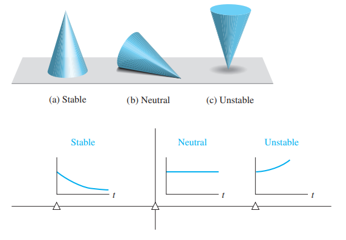

# The stability of linear feedback systems

<!-- omit in toc -->
## Table of contents

- [Preview](#preview)
- [The concept of stability](#the-concept-of-stability)
- [Routh-Hurwitz stability criteria](#routh-hurwitz-stability-criteria)

## Preview

Stability of closed-loop feedback systems is central to control system design. A stable system should exhibit a bounded output if the input is bounded. This is known as bounded-input, bounded-output (BIBO) stability. The stability of a feedback system is directly related to the location of the roots of the characteristics equation of the system transfer function and to the location of the eigenvalues of the system matrix for a system in state variable format. The Routh-Hurwitz method is introduced as a useful tool for accessing system stability. The technique allows us to compute the number of roots of the characteristic equation in the right half plane without actually computing the values of the roots. This gives us a design method for determining values of certain system parameters that will lead to closed-loop stability. For stable systems, we will introduce the notion of relative stability which allows us to characterize the degree of stability.

## The concept of stability

When considering the design and analysis of feedback control systems, stability is of the utmost importance. From a practical point of view, a closed-loop feedback system that is unstable is of minimal value. As with all such general statements, there are exceptions; but for our purposes, we will declare that all our control designs must result in a closed-loop stable system. Many physical systems are inherently open-loop unstable, and some systems are even designed to be open-loop unstable. Most modern fighter aircraft are open-loop unstable by design, and without active feedback control assisting the pilot, they can not fly. Active control is introduced by engineers to stabilize the unstable system so that other considerations, such as transient performance, can be addressed. Using feedback, we can stabilize unstable systems and then with a judicious selection of controller parameters, we can adjust the transient performance. For open-loop stable systems, we still use feedback to adjust the closed-loop performance to meet the design specifications. These specifications take the form of steady-state tracking errors, percent overshoot, settling time, time to peak, and other indices.

We can say that a closed-loop feedback system is either stable or it is not stable. This type of stable or not stable characterization is referred to as absolute stability. A system possessing absolute stability is called a stable system; the label of absolute is dropped. Given that a closed-loop system is stable, we can further characterize the degree of stability. This is referred to as relative stability. The pioneers of aircraft design were familiar with the notion of relative stability; the more stable an aircraft was, the more difficult it was to maneuver (that is, to turn). One outcome of the relative instability of modern acrobatic aircraft is high maneuverability. An acrobatic aircraft is less stable than a commercial transport; hence, it can maneuver more quickly. As we will discuss later in this section, we can determine that a system is stable (in the absolute sense) by determining that all transfer function poles lie in the left-half $s$-plane, or equivalently, that all the eigenvalues of the system matrix $\bold{A}$ lie in the left-half $s$-plane. Given that all the poles (or eigenvalues) are in the left-half $s$-plane, we investigate relative stability by examining the relative locations of the poles (or eigenvalues).

A stable system is defined as a system with a bounded (limited) system response. That is, if the system is subjected to a bounded input or disturbance, and the response is bounded in magnitude, the system is said to be stable. A stable system is a dynamic system with a bounded response to a bounded input.

The concept of stability can be illustrated by considering a right circular cone placed on a plane horizontal surface. If the cone is resting on its base and is tipped slightly, it returns to its original equilibrium position. This position and response are said to be stable. If the cone rests on its side and is displaced slightly, it rolls with no tendency to leave the position on its side. This position is designated as the neutral stability. On the other hand, if the cone is placed on its tip and released, it falls onto its side. This position is said to be unstable.

The stability of a dynamic system is defined in a similar manner. The response to a displacement, or initial condition, will result in either a decreasing, neutral, or increasing response. Specifically, it follows from the definition of stability, that a linear system is stable if and and only if the absolute value of its impulse response $g(t)$, integrated over an infinite range, is finite. That is, in terms of the convolution integral, for a bounded input, $\int_0^\infty | g(t) | dt$ must be finite.

The location in the $s$-plane of the poles of a system indicates the resulting transient response. The poles in the left-half $s$-plane result in a decreasing response for disturbance inputs. Similarly, poles on the $j \omega$-axis  result in a neutral response; while poles in the right-half $s$-plane result in an increasing response, for a disturbance input. Clearly, the poles of a desirable dynamic system must lie in the left-half $s$-plane.

A common example of the potential destabilizing effect of feedback is that of feedback in audio amplifier and speaker systems used for public address in auditoriums. In this case, a loudspeaker produces an audio signal that is an amplified version of the sound picked up by the microphone. In addition to other audio inputs, the sound coming from the speaker itself may be sensed by the microphone. The strength of this particular signal depends upon the distance between the loudspeaker and the microphone. Because of the attenuating properties of air, a larger distance will cause a weaker signal to reach the microphone. Due to the finite propagation speed of sound waves, there will also be a time delay between the signal produced by the loudspeaker and the signal sensed by the microphone. In this case, the output from the feedback path is added to the external input. This is an example of positive feedback.

As the distance between the loudspeaker and the microphone decreases, we find that if the microphone is placed too close to the speaker, then the system will be unstable. The result of this instability is an excessive amplification and distortion of audio signals and an oscillatory squeal.

In terms of linear systems, we recognize that the stability requirement may be defined in terms of the location of the poles of the closed-loop transfer function. A closed-loop system transfer function can be written as:

$$
T(s) = \frac{p(s)}{q(s)} = \frac{K \prod^M_{i = 1}(s + z_i)}{s^N \prod^Q_{k = 1}(s + \sigma_k) \prod^R_{m = 1}[s^2 + 2 \alpha_m s + (a_m^2 + \omega_m^2)]}
$$

where $q(s) = \Delta(s) = 0$ is the characteristic equation whose roots are the poles of the closed-loop system. The output response for an impulse function input (when $N = 0$) is then:

$$
y(t) = \sum^Q_{k = 1} A_k e^{-\sigma_k t} + \sum^R_{m = 1} B_m \left(\frac{1}{\omega_m}\right)e^{-\alpha_m t}\sin(\omega_m t + \theta_m)
$$

where $A_k$ and $B_m$ are constants that depend on $\sigma_k, z_i, \alpha_m, K, \text{ and }\omega_m$. To obtain a bounded response, the poles of the closed-loop system must be in the left-half $s$-plane. Thus, a necessary and sufficient condition for a feedback system to be stable is that all the poles of the system transfer function have negative real parts. A system is stable if all the poles of the transfer function are in the left-half $s$-plane. A system is not stable if not all the roots are in the left-half $s$-plane. If the characteristic equation has simple roots on the imaginary axis ($j \omega$-axis) with all other roots in the left-half $s$-plane, the steady-state output will be sustained oscillations for a bounded input; unless the input is a sinusoidal (which is bounded) whose frequency is equal to the magnitude of the $j \omega$-axis roots, the output becomes unbounded. Such a system is called marginally stable, since only certain bounded inputs (sinusoids of the frequency of the poles) will cause the output to become unbounded. For an unstable system, the characteristic equation has at least one root in the right-half $s$-plane or repeated $j \omega$-roots; for this case, the output will become unbounded for any input.

To investigate the stability of a feedback control system, we could determine the roots of the characteristic polynomial $q(s)$. However, we are first interested in determining the answer to the question: Is the system stable? If we calculate the roots of the characteristic equation in order to answer this question, we have determined much more information than is necessary. Therefore, several methods have been developed that provide the required yes or no answer to the stability question. The three approaches to the stability question are:

- the $s$-plane approach
- the frequency ($j \omega$) approach
- the time-domain approach

## Routh-Hurwitz stability criteria

The discussion and determination of stability has occupied the interest of many engineers. Maxwell and Vyshnegradskii first considered the question of stability of dynamic systems. In the late 1800s, A. Hurwitz and E.J. Routh independently published a method of investigating the stability of a linear system. The Routh-Hurwitz stability method provides an answer to the question of stability by considering the characteristic equation of the system. The characteristic equation is written as:

$$
\Delta(s) = q(s) = a_n s^n + a_{n-1} s^{n-1} + \cdots + a_1 s + a_0 = 0 
$$

To ascertain the stability of the system, it is necessary to determine whether any one of the roots of $q(s)$ lies in the right-half $s$-plane. If the characteristic equation can be written as:

$$
a_n (s - r_1)(s - r_2)\cdots(s - r_n) = 0
$$

where $r_i$ is the $i$th root of the characteristic equation. Multiplying the factors together, we find that:

$$
q(s) = a_n s^n - a_n (r_1 + r_2 + \cdots + r_n) s^{n-1} \\
+ a_n(r_1 r_2 + r_2 r_3 + r_1 r+3 + \cdots) s^{n-2} \\
- a_n(r_1 r_2 r_3 + r_1 r_2 r_4 + \cdots) s^{n-3} \\
+ a_n (-1)^n r_1 r_2 r_3 \cdots r_n = 0
$$

In other words, for an $n$th degree equation, we obtain:

$$
q(s) = a_n s^n - a_n (\text{sum of all the roots}) s^{n-1} \\
+ a_n(\text{sum of the product of the roots taken 2 at a time}) s^{n-2} \\
- a_n(\text{sum of the product of the roots taken 3 at a time}) s^{n-3} \\
+ a_n (-1)^n (\text{product of all the roots}) = 0
$$

We note that all the coefficients of the polynomial will have the same sign if all the roots are in the left-half $s$-plane. Also, it is necessary that all the coefficients for a stable system be nonzero. These requirements are necessary but not sufficient. That is, we immediately know the system is unstable if they are not satisfied; yet if they are satisfied, we must proceed further to ascertain the stability of the system.

The Routh-Hurwitz criterion is a necessary and sufficient criterion for the stability of linear systems. The method was originally developed in terms of determinants, but we shall use the more convenient array formulation. The Routh-Hurwitz criterion is based on ordering the coefficients of the characteristic equation:

$$
a_n s^n + a_{n-1} s^{n-1} + a_{n-2} s^{n-2} + \cdots + a_1 s + a_0 = 0 
$$

into an array as follows:

$$
\begin{array}{ccccc}
{s^n}     & {a_n}     & {a_{n-2}} & {a_{n-4}} & \cdots \\
{s^{n-1}} & {a_{n-1}} & {a_{n-3}} & {a_{n-5}} & \cdots \\
{s^{n-2}} & {b_{n-1}} & {b_{n-3}} & {b_{n-5}} & \cdots \\
{s^{n-3}} & {c_{n-1}} & {c_{n-3}} & {c_{n-5}} & \cdots \\
\vdots    & \vdots    & \vdots    & \vdots \\
{s^0}     & {h_{n-1}} \\
\end{array}
$$

where:

$$
b_{n-1} = \frac{a_{n-1} a_{n-2} - a_{n-3} a_n}{a_{n-1}}, \\[8pts]
b_{n-3} = \frac{a_{n-1} a_{n-4} - a_{n-5} a_n}{a_{n-1}}, \\[8pts]
c_{n-1} = \frac{b_{n-1} a_{n-3} - b_{n-3} a_{n-1}}{b_{n-1}}, \cdots
$$

The Routh-Hurwitz criterion states that the number of roots of $q(s)$ with positive real parts is equal to the number of changes in sign of the first column of the Routh array. This criterion requires that there be no changes in sign in the first column for a stable system. This requirement is both necessary and sufficient.

Four distinct cases or configurations of the first column in the array must be considered, and each must be treated separately and requires suitable modifications of the array calculation procedure:

- No element in the first column is zero
- There is a zero in the first column, but some other elements of the row containing the zero are nonzero
- There is a zero in the first column, and the other elements of the row containing the zero are also zero
- As in the third case, but with repeated roots on the $j \omega$-axis.

### Case 1: No element in the first column is zero

The characteristic polynomial of a third-order system is:

$$
q(s) = a_3 s^3 + a_2 s^2 + a_1 s + a_0
$$

The Routh array is:

$$
\begin{array}{ccccc}
s^3 & a_3 & a_1 \\
s^2 & a_2 & a_0 \\
s^1 & b_1 & 0 \\
s^0 & c_1 & 0 \\
\end{array}
$$

where:

$$
b_1 = \frac{a_2 a_1 - a_3 a_0}{a_2} \\[8pts]
c_1 = \frac{b_1 a_0 - 0}{b_1} = a_0
$$

For the third order system to be stable, it is necessary and sufficient that the coefficients are positive and $a_2 a_1 \gt a_3 a_0$. The condition when $a_2 a_1 = a_3 a_0$ results in a marginally stable case, and one pair of roots lies on the imaginary axis in the $s$-plane. This marginally stable case is recognized as Case 3 because there is a zero in the first column when $a_2 a_1 = a_3 a_0$.

### Case 2: There is a zero in the first column, but some other elements of the row containing the zero are nonzero

If only one element in the array is zero, it may be replaced with a small positive number, $\epsilon$, that is allowed to approach zero after completing the array. For example, consider the following characteristic polynomial:

$$
q(s) = s^5 + 2 s^4 + 2 s^3 + 4 s^2 + 11s + 10
$$

The Routh array is then:

$$
\begin{array}{cccc}
s^5 & 1 & 2 & 11\\
s^4 & 2 & 4 & 10\\
s^3 & \epsilon & 6 & 0\\
s^2 & c_1 & 10 & 0\\
s^1 & d_1 & 0 & 0\\
s^0 & 10 & 0 & 0\\
\end{array}
$$

where:

$$
c_1 = \frac{4 \epsilon - 12}{\epsilon} \\[8pts]
d_1 = \frac{6 c_1 - 10 \epsilon}{c_1}
$$

When $0 \lt \epsilon \ll 1$, we find that $c_1 \lt 0$ and $d_1 \gt 0$. Therefore, there are two sign changes in the first column; hence the system is unstable with two roots in the right-half plane.

### Case 3: There is a zero in the first column, and the other elements of the row containing the row are also zero.

Case 3 occurs when all the elements in one row are zero or when the row consists of a single element that is zero. This condition occurs when the polynomial contains singularities that are symmetrically located about the origin of the $s$-plane. Therefore, Case 3 occurs when factors such as $(s - \sigma)(s + \sigma)$ or $(s + j \omega)(s - j \omega)$ occur. This problem is circumvented by utilizing the auxiliary polynomial $U(s)$, which immediately proceeds the zero entry in the Routh array. The order of the auxiliary polynomial is always even and indicates the number of symmetrical root pairs.

To illustrate this approach, let us consider a third-order system with the characteristic polynomial:

$$
q(s) = s^3 + 2 s^2 + 4 s + K
$$

where $K$ is an adjustable loop gain. The Routh array is then:

$$
\begin{array}{cccc}
s^3 & 1 & 4\\
s^2 & 2 & K\\
s^1 & \frac{8 - K}{2} & 0\\
s^0 & K & 0\\
\end{array}
$$

For a stable system, we require that:

$$
0 \lt K \lt 8
$$

When $K = 8$, we have two roots on the $j \omega$-axis and a marginal stability case. Note that we obtain a row of zeroes when $K = 8$. The auxiliary polynomial, $U(s)$, is the equation of the rows preceding the row of zeroes. The equation of the rows preceding the row of zeroes is, in this case, obtained from the $s^2$-row. We recall that this row contains the coefficients of the even powers of $s$, and therefore we have:

$$
U(s) = 2 s^2 + K s^0  = 2 s^2 + 8 \\
= 2(s^2 + 4) = 2(s + j2)(s - j2)
$$

When $K = 8$, the factors of the characteristic polynomial are:

$$
q(s) = (s + 2)(s + j2)(s - j2)
$$

### Case 4: Repeated roots of the characteristic equation on the $j \omega$-axis

If the $j \omega$ roots of the characteristic equation are simple, the system is neither stable nor unstable; it is instead called marginally stable, since it has an undamped sinusoidal mode. If the $j \omega$-axis roots are repeated, the system response will be unstable with a form $t\sin(\omega t + \phi)$. The Routh-Hurwitz criteria will not reveal this form of instability.

Consider the system with a characteristic polynomial:

$$
q(s) = (s+1)(s+j)(s-j)(s+j)(s-j) = s^5 + s^4 + 2 s^3 + 2 s^2 + s + 1
$$

The Routh array is:

$$
\begin{array}{ccccc}
s^5 & 1 & 2 & 1\\
s^4 & 1 & 2 & 1\\
s^3 & \epsilon & \epsilon & 0\\
s^2 & 1 & 1\\
s^1 & \epsilon & 0\\
s^0 & 1 \\
\end{array}
$$

When $0 \lt \epsilon \ll 1$, we note the absence of sign changes in the first column. However, as $\epsilon \to 0$, we obtain a row of zeroes at $s^3$ row and a row of zeroes at $s^1$ row. The auxiliary polynomial at the $s^2$ line is $s^2 + 1$, and the auxiliary polynomial at the $s^4$ line is $s^4 + 2 s^2 + 1 = (s^2 + 1)^2$, indicating the repeated roots on the $j \omega$-axis. Hence, the system is unstable.

Suppose we write the characteristic equation of an $n$th order system as:

$$
s^n + a_{n-1}s^{n-1} + a_{n-2}s^{n-2} + \cdots + a_1 s + \omega_n^n = 0
$$

We divide through by $\omega_n^n$ and use $\hat{s} = s / \omega_n$ to obtain the normalized form of the characteristic equation:

$$
\hat{s}^n + b \hat{s}^{n - 1} + c \hat{s}^{n - 2} + \cdots + 1 = 0
$$

Using this normalized form of the characteristic equation, we summarize the stability criterion for up to a sixth-order characteristic equation in the table below.

| $n$ | Characteristic equation | Criterion |
| - | - | - |
| 2 | $s^2 + bs + 1 = 0$ | $b \gt 0$ |
| 3 | $s^3 + bs^2 + cs + 1$ | $bc - 1 \gt 0$ |
| 4 | $s^4 + bs^3 + cs^2 + ds + 1$ | $bcd - d^2 - b^2 \gt 0$ |
| 5 | $s^5 + bs^4 + cs^3 + ds^2 + es + 1$ | $bcd + b - d^2 - b^2 e \gt 0$ |
| 6 | $s^6 + bs^5 + cs^4 + ds^3 + es^2 + fs + 1$ | $(bcd + bf - d^2 - b^2e)e + b^2c - bd - bc^2f - f^2 + bfe + cdf \gt 0$ |