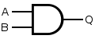
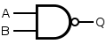
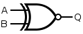

# Introduction

<!-- omit in toc -->
## Table of contents

- [Electric circuits](#electric-circuits)
  - [Current](#current)
  - [Potential difference](#potential-difference)
  - [Resistance](#resistance)
  - [Ohm's law](#ohms-law)
  - [Power](#power)
  - [Kirchhoff's current law](#kirchhoffs-current-law)
  - [Kirchhoff's voltage law](#kirchhoffs-voltage-law)
  - [Series resistance](#series-resistance)
  - [Parallel resistance](#parallel-resistance)
  - [Voltage divider rule](#voltage-divider-rule)
  - [Current divider rule](#current-divider-rule)
- [Logic gates](#logic-gates)
  - [Negation](#negation)
  - [Conjunction and disjunction](#conjunction-and-disjunction)
  - [Alternative denial and joint denial](#alternative-denial-and-joint-denial)
  - [Exclusion and biconditional](#exclusion-and-biconditional)
- [Digital logic](#digital-logic)
  - [Transistors](#transistors)
  - [Binary bits](#binary-bits)
  - [Bitwise operation](#bitwise-operation)
  - [Logical operation](#logical-operation)
  - [Boolean algebra](#boolean-algebra)
  - [De Morgan's laws](#de-morgans-laws)
  - [Order of precedence](#order-of-precedence)
- [Memory](#memory)
  - [SR latch](#sr-latch)
  - [Gated D latch](#gated-d-latch)
  - [D flip-flop](#d-flip-flop)
  - [Tri-state driver](#tri-state-driver)
  - [Open collector NOT gate](#open-collector-not-gate)
- [Number system](#number-system)
  - [Bases](#bases)
  - [Signed representation](#signed-representation)
  - [IEC prefixes](#iec-prefixes)
- [Computer architecture](#computer-architecture)

## Electric circuits

### Current

Current is the net rate of flow of charge carriers through an electrical conductor. Current is measured in Amperes (1 Ampere = 1 Coulomb / second).

### Potential difference

Potential difference is the work needed per unit of charge to move a test charge between two points. Potential difference is measured in Volts (1 Volt = 1 Joule / Coulomb).

### Resistance

Resistance is the ratio of the potential difference to the electric current. Resistance is measured in Ohms (1 Ohm = 1 Volt / Ampere).

### Ohm's law

Ohm's law states that the current through a conductor is directly proportional to the potential difference across it, with the resistance being the constant of proportionality.

$$
\begin{equation}
\tag{Ohms's law}
R = \frac{V}{I}
\end{equation}
$$

### Power

Power is the rate of energy dissipation in an electric circuit. Power is measured in Watts (1 Watt = 1 Joule / second).

$$
\begin{equation}
\tag{Power}
P = VI = \frac{V^2}{R} = I^2 R
\end{equation}
$$

### Kirchhoff's current law

The algebraic sum of electric currents meeting at a point is zero. In other words, the sum of electric current entering a node is equal to the sum of electric current leaving the node.

$$
\begin{equation}
\tag{Kirchhoff's current law}
\sum^{n}_{k=1}{I_{k}} = 0
\end{equation}
$$

### Kirchhoff's voltage law

The algebraic sum of the potential differences around a closed loop is zero.

$$
\begin{equation}
\tag{Kirchhoff's voltage law}
\sum^{n}_{k=1}{V_{k}} = 0
\end{equation}
$$

### Series resistance

When resistors are connected in series, the total resistance $R_s$ is the sum of the individual resistances.

$$
\begin{equation}
\tag{Series resistance}
R_s = \sum^{n}_{k=1}{R_k}
\end{equation}
$$

### Parallel resistance

When resistors are connected in parallel, the reciprocal of the total resistance $R_p$ is the sum of the reciprocals of the individual resistances.

$$
\begin{equation}
\tag{Parallel resistance}
\frac{1}{R_p} = \sum^{n}_{k=1}{\frac{1}{R_k}}
\end{equation}
$$

### Voltage divider rule

Voltage divider rule states that the total potential difference across a series connection of multiple resistors is divided among the resistors proportional to their resistance.

$$
\begin{equation}
\tag{Voltage divider rule}
V_1 = \frac{R_1}{R_1 + R_2} V_t
\end{equation}
$$

### Current divider rule

Current divider rule states that the division of current in the branches of a parallel circuit is inversely proportional to their resistance.

$$
\begin{equation}
\tag{Current divider rule}
I_1 = \frac{R_2}{R_1 + R_2} I_t
\end{equation}
$$

## Logic gates

Digital logic is built upon logic gates, which are semiconductor devices that perform Boolean functions.

### Negation

The NOT gate implements logical negation, that outputs *true* if the operand is *false*.

| Name | Function           | Symbol                     |
| ---- | ------------------ | -------------------------- |
| NOT  | $Q = \overline{A}$ |  |

### Conjunction and disjunction

The AND gate implements logical conjunction, that outputs *true* if all of the operands are *true*. Whereas, the OR gate implements logical disjunction, that outputs *true* if at least one of the operands is *true*.

| Name | Function        | Symbol                     |
| ---- | --------------- | -------------------------- |
| AND  | $Q = A \cdot B$ |  |
| OR   | $Q = A + B$     |   |

### Alternative denial and joint denial

The NAND gate implements logical alternative denial, that outputs *true* if at least one of the operands is *false*. Whereas, the NOR gate implements logical joint denial, that outputs *true* if all of the operands are *false*.

| Name | Function                   | Symbol                      |
| ---- | -------------------------- | --------------------------- |
| NAND | $Q = \overline{A \cdot B}$ |  |
| NOR  | $Q = \overline{A + B}$     |   |

### Exclusion and biconditional

The XOR gate implements logical exclusion, that outputs *true* if only one of the operands is *true*. Whereas, the XNOR gate implements logical biconditional, that outputs *true* if all of the operands are *false* or all of the operands are *true*.

| Name | Function                       | Symbol                      |
| ---- | ------------------------------ | --------------------------- |
| XOR  | $Q = A \bigoplus B$            |   |
| XNOR | $Q = \overline{A \bigoplus B}$ |  |

## Digital logic

### Transistors

A transistor is a semiconductor device used to amplify or switch electrical signals. There are two types of transistors:

Bipolar junction transistors (BJT)
: A bipolar junction transistor has three terminals labelled *base*, *collector*, and *emitter*. A small current at the base can control the flow of a much larger current between the collector and emitter.

Field effect transistors (FET)
: A field effect transistor has three terminals labelled *gate*, *source*, and *drain*. A voltage at the gain can control the current flow between the source and drain.

The integrated circuits of Cortex-M microcontrollers are constructed using *complementary metal oxide semiconductor* (CMOS) technology, which are a type of *metal oxide semiconductor field effect transistors* (MOSFET).

### Binary bits

On Cortex-M microcontrollers, powered by 3.3 V, the binary bits exist in one of two possible states depending on the voltage.

| State      | Voltage     |
| ---------- | ----------- |
| High state | 2 V - 5 V   |
| Low state  | 0 V - 1.3 V |

The 0.7 V gap between the two states allows the digital logic to operate reliably at very high speeds.

### Bitwise operation

In a bitwise operation, the corresponding bits of the operands are independently compared using the logical function.

### Logical operation

In a logical operation, the operands are first converted to a Boolean value, and then compared as a whole using the logical function. In C, only `0` and `nullptr` becomes `false`, all other values become `true`.

### Boolean algebra

Boolean algebra satisfies some fundamental laws, where logical OR is equivalent to addition and logical AND to multiplication.

| Law            | Addition form                             | Multiplication form                           |
| -------------- | ----------------------------------------- | --------------------------------------------- |
| Identity       | $X + 0 = X$                               | $X \cdot 1 = X$                               |
| Annihilator    | $X + 1 = 1$                               | $X \cdot 0 = 0$                               |
| Idempotence    | $X + X = X$                               | $X \cdot X = X$                               |
| Commutativity  | $X + Y = Y + X$                           | $X \cdot Y = Y \cdot X$                       |
| Associativity  | $X + (Y + Z) = (X + Y) + Z$               | $X \cdot (Y \cdot Z) = (X \cdot Y) \cdot Z$   |
| Distributivity | $X + (Y \cdot Z) = (X + Y) \cdot (X + Z)$ | $X \cdot (Y + Z) = (X \cdot Y) + (X \cdot Z)$ |
| Absorption     | $X + (X \cdot Y) = X$                     | $X \cdot (X + Y) = X$                         |

### De Morgan's laws

De Morgan's laws allow the expression of conjunctions and disjunctions purely in terms of each other through negation. The rules can be expressed as:

- The negation of a disjunction is the conjunction of the negations.
- The negation of a conjunction is the disjunction of the negations.

$$
\begin{equation}
\tag{De Morgan's laws}
\begin{aligned}
\overline{X + Y} &= \overline{X} \cdot \overline{Y} \\
\overline{X \cdot Y} &= \overline{X} + \overline{Y}
\end{aligned}
\end{equation}
$$

### Order of precedence

In Boolean algebra, the parenthesis have the highest precedence, therefore, the order of operations is usually dictated by the use of parenthesis. However, the general order of precedence for the fundamental Boolean functions (from highest to lowest) is: *NOT*, then *AND*, and finally *OR*.

## Memory

Flip-flops and latches are circuits that have two stable states, and are used to store a single bit of data.

### SR latch

Set-reset latch (SR latch) is the most fundamental latch, constructed from a pair from cross-coupled NOR or NAND gates. The stored bit is present on the output marked $Q$.

### Gated D latch

### D flip-flop

### Tri-state driver

### Open collector NOT gate

## Number system

### Bases

binary, octal, decimal, hexadecimal

### Signed representation

One's complement, two's complement

### IEC prefixes

1 KiB = 2^10 bytes = 1024 bytes != 1000 bytes

## Computer architecture

