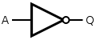
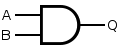
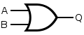
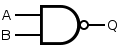
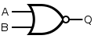
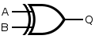
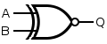

# Introduction

<!-- omit in toc -->
## Table of contents

- [Electric circuits](#electric-circuits)
  - [Current](#current)
  - [Potential difference](#potential-difference)
  - [Resistance](#resistance)
  - [Power](#power)
  - [Series circuits](#series-circuits)
  - [Parallel circuits](#parallel-circuits)
  - [Ohm's law](#ohms-law)
  - [Kirchhoff's current law](#kirchhoffs-current-law)
  - [Kirchhoff's voltage law](#kirchhoffs-voltage-law)
- [Digital logic](#digital-logic)
  - [Transistors](#transistors)
  - [Binary bits](#binary-bits)
  - [Logic gates](#logic-gates)
  - [Boolean algebra](#boolean-algebra)
  - [De Morgan's laws](#de-morgans-laws)
- [Memory](#memory)
  - [SR latch](#sr-latch)
  - [Gated D latch](#gated-d-latch)
  - [D flip-flop](#d-flip-flop)
  - [Tri-state driver](#tri-state-driver)
  - [Open collector NOT gate](#open-collector-not-gate)
- [Number system](#number-system)
  - [Bases](#bases)
  - [Signed representation](#signed-representation)
  - [IEC prefixes](#iec-prefixes)
- [Computer architecture](#computer-architecture)
  - [Computer system](#computer-system)
  - [Microprocessor](#microprocessor)
  - [Memory](#memory-1)
  - [Flash memory](#flash-memory)
  - [Port](#port)
  - [Bus](#bus)
  - [Computer program](#computer-program)
  - [von Neumann architecture](#von-neumann-architecture)
  - [Harvard architecture](#harvard-architecture)

## Electric circuits

### Current

Current is the net rate of flow of charge carriers through an electrical conductor. Current is measured in Amperes (1 A = 1 Coulomb / second).

$$
\begin{equation}
\tag{Current}
I = \frac{Q}{t}
\end{equation}
$$

### Potential difference

Potential difference is the work needed per unit of charge to move a test charge between two points. Potential difference is measured in Volts (1 Volt = 1 Joule / Coulomb).

$$
\begin{equation}
\tag{Potential difference}
V = \frac{W}{Q}
\end{equation}
$$

### Resistance

Resistance is the ratio of the potential difference to the electric current. Resistance is measured in Ohms (1 Ohm = 1 Volt / Ampere). If $\rho$ is the resistivity, $l$ is the length, and $A$ is the cross-sectional area, the resistance is defined as:

$$
\begin{equation}
\tag{Resistance}
R = \frac{\rho L}{A}
\end{equation}
$$

### Power

Power is the rate of energy dissipation in an electric circuit. Power is measured in Watts (1 Watt = 1 Joule / second).

$$
\begin{equation}
\tag{Power}
P = V I = \frac{V^2}{R} = I^2 R
\end{equation}
$$

### Series circuits

The current in a series circuit goes through every component in the circuit, therefore all of the components in a series connection carry the same current.

$$
I = I_1 = I_2 = \dots = I_n
$$

The **voltage divider rule** states that the total potential difference across a series connection of multiple resistors is divided among the resistors proportional to their resistances.

$$
\begin{equation}
\tag{Voltage divider rule}
V_1 = \frac{R_1}{R_1 + R_2} V_t
\end{equation}
$$

When resistors are connected in series, the total resistance $R_s$ is the sum of the individual resistances.

$$
\begin{equation}
\tag{Series resistance}
R_s = \sum^{n}_{k=1}{R_k}
\end{equation}
$$

### Parallel circuits

The **current divider rule** states that the division of current in the branches of a parallel circuit is inversely proportional to their resistances.

$$
\begin{equation}
\tag{Current divider rule}
I_1 = \frac{R_2}{R_1 + R_2} I_t
\end{equation}
$$

The potential difference across the components in a parallel circuit are the same and have identical polarities, therefore the voltage is the same for all elements:

$$
V = V_1 = V_2 = \dots = V_n
$$

When resistors are connected in parallel, the reciprocal of the total resistance $R_p$ is the sum of the reciprocals of the individual resistances.

$$
\begin{equation}
\tag{Parallel resistance}
\frac{1}{R_p} = \sum^{n}_{k=1}{\frac{1}{R_k}}
\end{equation}
$$

### Ohm's law

Ohm's law states that the current through a conductor is directly proportional to the potential difference across it, with the resistance being the constant of proportionality.

$$
\begin{equation}
\tag{Ohms's law}
R = \frac{V}{I}
\end{equation}
$$

### Kirchhoff's current law

The algebraic sum of electric currents meeting at a point is zero. In other words, the sum of electric current entering a node is equal to the sum of electric current leaving the node.

$$
\begin{equation}
\tag{Kirchhoff's current law}
\sum^{n}_{k=1}{I_{k}} = 0
\end{equation}
$$

### Kirchhoff's voltage law
The algebraic sum of the potential differences around a closed loop is zero.

$$
\begin{equation}
\tag{Kirchhoff's voltage law}
\sum^{n}_{k=1}{V_{k}} = 0
\end{equation}
$$

## Digital logic

### Transistors

A transistor is a semiconductor device that is used to amplify or switch electrical signals. There are two types of transistors:

Bipolar junction transistors (BJT)
: A bipolar junction transistor has three terminals labelled *base*, *collector*, and *emitter*. A small current at the base can control the flow of a much larger current between the collector and emitter.

Field effect transistors (FET)
: A field effect transistor has three terminals labelled *gate*, *source*, and *drain*. A voltage at the gain can control the current flow between the source and drain.

The integrated circuits of Cortex-M microcontrollers are constructed using *complementary metal oxide semiconductor* (CMOS) technology, which are a type of *metal oxide semiconductor field effect transistors* (MOSFET).

### Binary bits

On Cortex-M microcontrollers, powered by 3.3V, the binary bits exist in one of two possible states depending on the voltage:

| State      | Voltage   |
| ---------- | --------- |
| High state | 2V - 5V   |
| Low state  | 0V - 1.3V |

The 0.7V gap between the two states allows the digital logic to operate reliably at very high speeds.

### Logic gates

Digital logic is built upon logic gates, which are semiconductor devices that perform logical operations.

| Logic gate | Operation          | Function                       | Description                                                                           | Symbol                      |
| ---------- | ------------------ | ------------------------------ | ------------------------------------------------------------------------------------- | --------------------------- |
| NOT        | Negation           | $Q = \overline{A}$             | Outputs **true** if the input is **false**                                            |   |
| AND        | Conjunction        | $Q = A \cdot B$                | Outputs **true** if all of the inputs are **true**                                    |   |
| OR         | Disjunction        | $Q = A + B$                    | Outputs **true** if at least one of the inputs is **true**                            |    |
| NAND       | Alternative denial | $Q = \overline{A \cdot B}$     | Outputs **true** if at least one of the inputs is **false**                           |  |
| NOR        | Joint denial       | $Q = \overline{A + B}$         | Outputs **true** if all of the operands are **false**                                 |   |
| XOR        | Exclusion          | $Q = A \bigoplus B$            | Outputs **true** if only one of the inputs is **true**                                |   |
| XNOR       | Biconditional      | $Q = \overline{A \bigoplus B}$ | Outputs **true** if all of the inputs are **false** or all of the inputs are **true** |  |

The logical functions can be performed on either the individual bits of a value or the value as a whole:

Bitwise operation
: In a bitwise operation, the corresponding bits of the operands are independently compared using the logical function.

Logical operation
: In a logical operation, the operands are first converted to a Boolean value, and then compared as a whole using the logical function. In the C programming language, only `0` and `nullptr` becomes `false`, all other values become `true`.

### Boolean algebra

Boolean algebra satisfies some fundamental laws, where logical OR is equivalent to addition and logical AND to multiplication.

| Law            | Addition form                             | Multiplication form                           |
| -------------- | ----------------------------------------- | --------------------------------------------- |
| Identity       | $X + 0 = X$                               | $X \cdot 1 = X$                               |
| Annihilator    | $X + 1 = 1$                               | $X \cdot 0 = 0$                               |
| Idempotence    | $X + X = X$                               | $X \cdot X = X$                               |
| Commutativity  | $X + Y = Y + X$                           | $X \cdot Y = Y \cdot X$                       |
| Associativity  | $X + (Y + Z) = (X + Y) + Z$               | $X \cdot (Y \cdot Z) = (X \cdot Y) \cdot Z$   |
| Distributivity | $X + (Y \cdot Z) = (X + Y) \cdot (X + Z)$ | $X \cdot (Y + Z) = (X \cdot Y) + (X \cdot Z)$ |
| Absorption     | $X + (X \cdot Y) = X$                     | $X \cdot (X + Y) = X$                         |

In Boolean algebra, the parenthesis have the highest precedence, therefore, the order of operations is usually dictated by the use of parenthesis. However, the general order of precedence for the fundamental logical functions (from highest to lowest) is: *NOT*, then *AND*, and finally *OR*.

### De Morgan's laws

De Morgan's laws allow the expression of conjunctions and disjunctions purely in terms of each other through negation. The rules can be expressed as:

- The negation of a disjunction is the conjunction of the negations.
- The negation of a conjunction is the disjunction of the negations.

$$
\begin{equation}
\tag{De Morgan's laws}
\begin{aligned}
\overline{X + Y} &= \overline{X} \cdot \overline{Y} \\
\overline{X \cdot Y} &= \overline{X} + \overline{Y}
\end{aligned}
\end{equation}
$$

## Memory

Flip-flops and latches are circuits that have two stable states, and are used to store a single bit of data.

### SR latch

Set-reset latch (SR latch) is the most fundamental latch, constructed from a pair from cross-coupled NOR or NAND gates. The stored bit is present on the output marked $Q$.

### Gated D latch

### D flip-flop

### Tri-state driver

### Open collector NOT gate

## Number system

### Bases

binary, octal, decimal, hexadecimal

### Signed representation

One's complement, two's complement

### IEC prefixes

1 KiB = 2^10 bytes = 1024 bytes != 1000 bytes

## Computer architecture

### Computer system

A computer system is a nominally complete computer that consists of three main parts:

- Central processing unit that processes data
- Memory that holds the instructions and data to be processed
- Input and output devices that act as peripherals to communicate with the outside world

### Microprocessor

A microprocessor is a computer processor where the core components of a central processing unit is integrated onto a single or a few integrated circuits using VLSI.

The microprocessor is a multipurpose, clock-driven, register-based, digital integrated circuit that accepts binary data as input, processes it according to instructions stored in its memory, and provides binary data as output.

### Memory

Memory is a device or system that is used to store information either permanently or for immediate use in a computer.

Modern memory is implemented as semiconductor memory, where data is stored within memory cells built from MOS transistors and other components on an integrated circuit. There are two kinds of semiconductor memory:

Volatile memory
: Volatile memory is a computer memory that requires power to maintain the stored information. Most modern volatile memory is either static RAM (SRAM) or dynamic memory (DRAM). DRAM is mostly used for desktop system memory, whereas, SRAM is mostly used for CPU cache and small embedded systems that require small amount of memory.

Non-volatile memory
: Non-volatile memory is a computer memory that can retain the stored information even when not powered. Non-volatile memory include read-only memory (ROM, PROM, EPROM, and EEPROM), flash memory, and most types of storage devices (hard disks, floppy disks, optical discs, and magnetic tape).

### Flash memory

Flash memory (or flash ROM) is an electronic non-volatile computer memory that can be electrically erased and reprogrammed. Flash memory is based on EEPROM (electrically erasable programmable read-only memory).

Flash ROM must be erased in large blocks. In TM4C123 series of microcontrollers, either the entire ROM or blocks of 1024 bytes can be erased.

Memory cells in a flash ROM are smaller compared to regular EEPROM, since it requires only two MOSFET transistors, whereas regular memory cells require six MOSFET transistors. Therefore, most microcontrollers have a large flash memory, that can be used to store program data.

<!-- note -->
We will store instructions and constants in flash ROM, and place variables and temporary data in SRAM.
<!-- end note -->

### Port

A port is a hardware interface between the system and external devices. Data enters into the system through the input ports and exits the system through the output ports.

An interface is a collection of I/O ports, external electronics, physical devices, and software, which together allows the computer to communicate with the external systems.

Ports can be divided into groups based on the nature of signal transfer:

Analog port
: An analog port transfers data as analog signal, which is a continuous signal that represents data as a period, frequency, pulse width, or phase shift.

Digital port
: A digital port transfers data as digital signal, which is a signal that represents data as a sequence of discrete values. Digital ports can be further categorized into parallel ports, which transfer multiple bits at the same time over a set of wires, and serial ports, which transfer one bit at a time over a single wire pair.

### Bus

A bus is a communication system that transfers data between components inside a computer system.

An address bus is a bus that is used to specify a physical address. When a processor needs to read or write to a memory location, it specifies the physical address of that memory location on the address bus. The data to be read or written is sent on the data bus.

The width of the address bus determines the amount of memory a system can access. For example, a system with a 32-bit address bus can address $2^{32}$ memory locations; if each memory location holds one byte, the addressable memory is 4 GiB.

### Computer program

A computer program is a sequence of instructions, written in a programming language, for a computer to execute. A set of related computer programs with its associated documentation and data forms a *computer software*.

### von Neumann architecture

The von Neumann architecture (or Princeton architecture) is a computer architecture for an electronic digital computer with these components:

- A processing unit with both an arithmetic logic unit and processor registers
- A control unit that includes an instruction register and a program counter
- Memory that stores data and instructions
- External mass storage
- Input and output mechanisms

The von Neumann architecture has evolved to refer to any stored-program computer in which an instruction fetch and a data operation can not occur at the same time, since they share a common bus. This is referred to as the *von Neumann bottleneck* as it limits the performance of the computer system.

### Harvard architecture

The Harvard architecture is a computer architecture with separate storage and signal pathways for instructions and data. It contrasts from the von Neumann architecture, where program instructions and data share the same memory and pathways.
