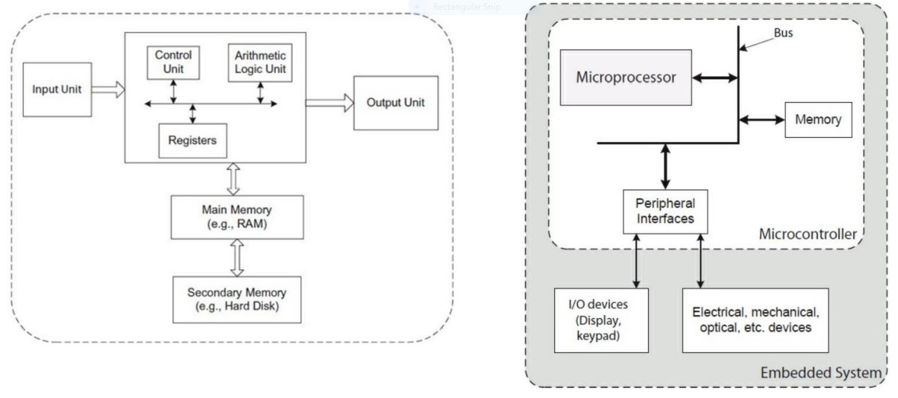
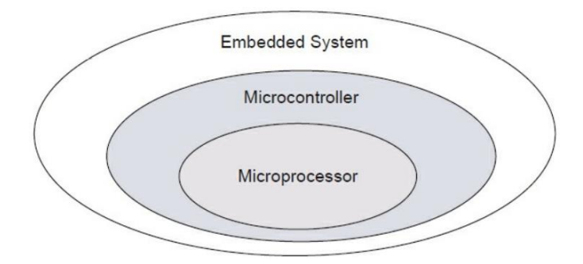

# Embedded Systems

## Lecture 1

### Embedded systems

An embedded system is a computer system that has a dedicated function within a larger mechanical or electronic system. An embedded system is any device that includes a programmable computer but is not itself a general purpose computer.

Since the system is usually dedicated to a specific task, design engineer can optimize:

- Performance
- Cost/size
- Real-time requirements
- Power consumption
- Reliability

The following figure shows the general architectures of a general purpose computer (left) and an embedded system (right):

### Microcontrollers

A microcontroller is a general purpose digital computer's central processing unit. To make a complete microcontroller, you add memory (ROM and RAM), memory decoders, oscillator, and several I/O devices. These processors has complex architectures with multiple stages of pipelining and parallel processing. The memory is divided into stages such as multi-level cache and RAM.

The design of a microcontroller is driven by the desire to make it as expandable and flexible as possible. Microcontollers usually have on-chip RAM and ROM (EPROM) in addition to on-chip I/O hardware to minimize chip count in single chip solutions. The prime use of a microcontroller is to control the operations of a machine using a fixed program that is stored in ROM and does not change over the lifetime of the system.

The advantages of a microcontroller compared to a general purpose computer are:

- Small size
- Low cost (but has a low processing power)
- Can be used in a group (network) for complex tasks
- Can communicate with a PC for tasks that require more processing (such as image processing)
- Low power consumption (can run on batteries for a long time without the need for charging)

### Applications of embedded systems

Communication
: Radios, telephones, cellular phones, answering machines, fax machines, wireless routers, internet, 3G/4G/5G, global positioning system (GPS), cordless phones.

Consumer electronics
: Washing machines, clocks, watches, arcade games, toys, remote control, audio/video electronics, microwave ovens, cameras.

Automobile systems
: Anti-lock braking system (ABS), electronic ignition, locks, power windows, power seats, collision avoidance, electronic stability control, hybrid vehicles, electric vehicles.

Commercial usage
: ATM machines, bar code readers, elevator controllers, printers, scanners, fax machines, CCTV systems, fingerprint identifier, disk drives, digital attendance system.

Medical equipment
: Cancer treatments, dialysis machines, blood pressure measuring equipment, electrocardiography (ECG), medical imaging, life support systems.

Industrial
: Process automation, oil refineries, flood processing plants, paper and board mills.

Military use
: Missile guidance systems, global positioning system (GPS), surveillance systems.

Safety critical
: Gas detection devices, multi-axis crane controllers, remotely controller trains

### Components of embedded systems

- Analog components
  - Sensors
  - Actuators
  - Controllers
- Digital components
  - Processors
  - Coprocessors
  - Memories
  - Controllers
  - Buses
  - Application-Specific Integrated Circuits (ASIC)
- Converters
  - A2D
  - D2A
- Software
  - Application programs
  - Exception handlers

A processor is the most important component in an embedded system. It exists in an integrated circuit along with memory and other peripherals. Processors are broadly classified into three major categories:

- General purpose microcontrollers
- Microcontrollers
- Digital Signal Processors (DSP)

A processor is capable of performing many functions, as specified by the software instructions. Examples include the 8086 processor, or the Intel series processors. External memory components, that are separately attached, are required to store the software instructions and information.

All the components, such as ALU, ROM, RAM, and peripherals, are on the same chip. Because of the limitations of the VLSI design, most of the input and output functions exist in a simplified manner.

CPU consists of the Instruction Decoder, Arithmetic Logic Unit, and Program Counter. The interrupt requests from peripherals (ADC, Timers, Serial, CCP) are handled by the Interrupt Control Unit.

The features of these processors are suitable for implementing signal processing algorithms.

Memory serves as a short term and long term data storage space for the processor. Both the program and the data are stored in the memory.

Read-Only Memory (ROM)
: Data can only be read during execution. Non-volatile in nature. Can be descriptively called program memory.

Random Access Memory (RAM)
: Data can be read or written during execution. Volatile in nature. Can be descriptively called data memory.

Input devices are usually sensors (that measure physical quantities) or other signal devices that tell the microcontroller what to do.

Output devices either perform some useful function or indicate a value (usually in visual, sonic, or haptic form).

For example, in a mobile handset, the I/O devices are keyboard, display screen, antenna, microphone, speaker, LED indicators.

Some input sensors of different categories are listed below:

- Light:
  - Photocells are special resistors whose resistances decrease when light is applied on them.
  - IR recievers are used for communication. They are often coupled with IR LEDs, and can do range finding.
  - PIR Motion sensing.
  - CCD cameras.
- Potentiometer:
  - Variable resistors. Resistance changes depending on the position of the control. Usually have a split design (3 pins). Resistance from pin 1 to pin 2 plus that from pin 2 to pin 3 is always the same, but power at pin 1 and pin 3, and voltage at pin 2 varies.
- Ultrasonic:
  - Ultrasonic range finders. Different sensitivities. Analog, serial, and pulse-width outputs. Used for measuring distance, speed, etc.
- Temperature:
  - Thermocouple. May require conditioning. Voltage corresponds to temperature. They are cheap and standardized, but are non-linear.
  - IC-based temperature sensor like LM35, are linear.
- Buttons/tactile:
  - Tact switches are cheap and standardized, but small and visually unappealing.
  - Keypads are visually appealing but wierd to interface with.
  - Video game controllers can wire directly to buttons, analog sticks. PS2 interface is known.
- Wii-mote:
  - Communications with Bluetooth: Computer drivers have been developed.
  - Nunchuck uses I2C. 3-axis accelerometer, analog stick, and two buttons. PCB interface is available.
- Accelerometers/gyroscopes:
  - MEM gyroscopes and accelerometers. Small in size, and can interface with electronics easily. Used together, accelerometers and gyroscopes provide data to do position tracking (IMU). However, there is some drift. Some serious number crunching needs to be done to track in real time.
- GPS:
  - Can relay the coordinates. They provide tons of useful data, but are harder to interface.

Below are some output devices:

- ON/OFF:
  - Simply turning things on and off can be an output.
  - TRIACs for controlling 120V AC. Working with 120V AC is much more dangerous; never work on live circuit without safety precautions.
  - Transistors for DC. NPN goes at low side, PNP goes are high side.
- LED and 7-segment displays:
  - LEDs are cheap, easy to use, but fragile if not connected or handled properly.
  - Electroluminescent wire. Requires a special driving inverter, but whole wire lights up.
  - 7-seg displays are commonly used, cheap. They are basically a group of LEDs. Driver ICs are available; put in a number, and it displays it.
- Character and graphic LCD:
  - Character LCDs are a little more complicated, but great for displaying information.
  - Graphic LCDs are abundant, because of cell phones. Much more complicated to work with, but can provide a lot more possibilities. Can be interfaced with microcontrollers to control basic 3D graphics.
- Vibrators and Hydraulic/pneumatics:
  - Vibration motors. DC motor with off-center weight on shaft.
  - Pneumatics and hydraulics. Electrically controlled valves.
- Regular DC motors:
  - Power corresponds to speed, with constant load. Electric power direction dictates the rotation direction. Geared DC motors are often desired; without gearing, the motors have high speed but very low torque. Setting direction electronically requires a circuit called an H-bridge.
- Servos and stepper motors:
  - Servo motors. Input corresponds to angle of rotation. Have less than 360 degree angle. Have 3 pins - power, ground, and analog voltage corresponding to angle (can use PWM).
  - Stepper motors. Input corresponds to position. Continuous rotation. More complicated to drive. Must step pins in a sequence. Separate driver ICs are available.

## Lab 5

### TM4C123G microcontroller GPIO

- TM4C123GH6PM has 64 pins, out of which 43 are GPIO pins. However, on the launchpad evaluation kit, only 35 port pins are available.
- These pins are grouped as ports, labeled PortA to PortF. PortA to PortD has 8 pins, PortE has 6 pins, and PortF has 5 pins.
- Some of the port pins also have special peripheral functionalities multiplexed.
- When configured as GPIO, these port pins have the following capabilities:
  - Internal weak pull-up or pull-down resistors.
  - Each port pin can be configured as open drain.
  - Slew rate control capability is provided for 8 mA output drive.
  - Some of the port pins are capable of tolerating 5V when configured as inputs.
  - Configurable current sourcing capability for levels of 2 mA, 4 mA, and 8 mA.
- ARM Cortex-M4 architecture uses memory-based peripherals.

### GPIO on the memory map

- There are two on-chip buses that connect the peripherals (including GPIO pins) to the processor:
  - Advanced Peripheral Bus (APB), which is a low speed legacy bus
  - Advanced High Performance Bus (AHB), which is a high speed bus
- GPIO module has connectivity on both of these buses.
- Each port is assigned memory address space from a starting address (or base address) to an end address, on each of the two buses.
- The address space allocated to GPIO is allocated to different configurations, control, status, and data registers.
- Each configuration register has unique offset for every GPIO port and can be accessed by adding this offset to base address.
- All registers associated with each GPIO port are accessible by both buses but with different addresses.

### Steps to configure microcontroller pins as GPIO

1. GPIO port bus selection
  - We need to select which pins on which port we are going to use.
  - Once the pins and the ports are finalized, we need to select the bus (APB or AHB) for each port.
  - We need to remember the base address of this port bus for later use.
  - So if we want to access PortF through APB, we select `0x4002 5000`.
2. Clock configuration
  - Clock is enabled on the entire port (not just one pin).
  - `RCGC_GPIO_R` at memory address `0x400F E608`.
  - Bits 0 to 5 are used to enable clock on PortA to PortF, respectively.
    - For example, `0010 0000` (`0x20`) written to `RCGC_GPIO_R` enables clock on PortF.
    - `0000 1001` (`0x9`) written to `RCGC_GPIO_R` enables clock on PortA and PortD.
  - After enabling the clock to a GPIO module, there must be 3 clock cycles delay before accessing the GPIO registers.
3. Mode control configuration
  - Each GPIO port pin can be configured for alternate functionalities, such as PWM, ADC, SPI etc.
  - However, when these alternate functionalities are used, port pins can not be used as GPIO.
  - `GPIO_AFSEL_R` at offset value `0x420` (GPIO Alternate Functionality Select Register).
  - Bit value `0` means disable alternate functionality and use as GPIO.
  - So to enable GPIO on all pins, we write `0x0` to `base_address + GPIO_AFSEL_R`.
  - To selectively enable GPIO on certain pins, we write bit 0 for those pins (LSB represents pin 0).
4. Pad control configuration
  - Multiple pad control registers are required to configure:
    - Digital enable: `GPIO_DEN_R` at offset value `0x51C`.
    - Pull up configuration: `GPIO_PU_R` at offset value `0x510`.
    - Pull down configuration: `GPIO_PD_R` at offset value `0x514`.
    - Slew rate configuration: `GPIO_SL_R` at offset value `0x518`.
  - Each GPIO pin can be individually configured using these pad control registers.
  - To digital enable a pin (use it as GPIO), we write `1` on the corresponding bit at the address + offset.
  - So to digital enable pin 3 and pin 4 of GPIO PortF (base address `0x4002 5000`):
    - address that we will write to: `0x4002 5000 + 0x51C = 0x4002551C`.
    - Value that we will write: `0001 1000 = 0x18`.
    - Code: `write 0x18 at 0x4002 551C`.
    - 
5. Data control configuration