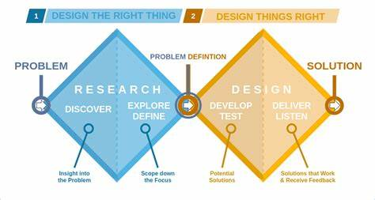
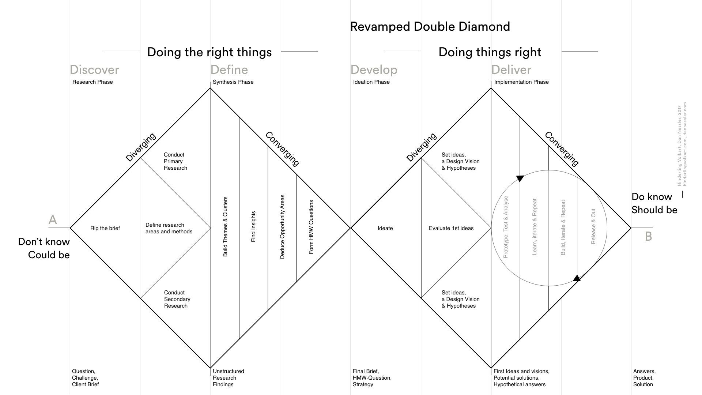

# Design Thinking Paradigm: Double Diamond

Double Diamond is the name of a design process model popularized by the British Design Council in 2005, and adapted from the divergence-convergence model proposed in 1996 by Hungarian-American linguist Bela H. Banathy. The Double Diamond structure is used to understand customers and their problems, and explore creative and innovative ways to solve their problems and deliver them. Using the double diamond, we approach problems and solutions using two different types of thinking:

- **Divergent thinking:** Think broadly, keep an open mind, consider anything and everything.
- **Convergent thinking:** Think narrowly, bring back focus, and identify one or key problems and solutions.

There are four phases to the double diamond approach:

- **Discover** customer problems.
- **Define** specific customer problems.
- **Develop** potential solutions to these customer problems.
- **Deliver** feasible and viable solutions to these customer problems.

## Discover

In the first step, we practice divergent thinking. This means we open our minds and consider everything about our customers, constrained by nothing. You need to get up from your desk and go talk to customers. Interview them, watch them use your products, listen to them, and learn everything you can about them. This work will help you build empathy.

Once you have met real users, document what you've learned by creating empathy maps and customer journeys.

Empathy Maps
: Empathy maps capture what our customers are saying, doing, thinking and feeling, hearing, and seeing. They should be based on what you have heard from your customers.

Customer Journeys
: Customer journey maps out the customer experience over time, identifying relevant touch points. This is a timeline of the activities customers undertake with your product. Note the places, tools, or people they interact with.

## Define

Now that we understand what the customers feel and what they do, we start to use convergent thinking. This means we begin to focus on key areas now, starting to converge on specific experiences within the customer journey. As a team, we consider the delight in their experiences, but also the pain points. We vote and agree on the key areas that need a solution.

Roses and Thorns
: In Roses and Thorns, we overlay some of the pleasure and pain points we learnt about on the customer journey. Use red post-it notes to mark the Roses (pleasures) and another color to represent Thorns (pain points).

How-Might-We (HMW)
: In HMW, take the pain points (thorns) and reframe them as questions for us to try and solve. Pick a few problems to solve and be ambitious in turning the problem into a delight. For example, instead of asking "how do we stop people using their mobile phones in the cinema?", we can turn it into an ambitious HMW by asking "how might we make people using mobile phones in the cinema provide a better experience for cinema goers?". Rather than stopping the use, could we solve the core problems (interruptions, distractions) in innovative ways.

## Develop

At this point, we are halfway through the double diamond, and have decided on the problems to try and solve. In this third step, develop, we practice divergent thinking again. This means we begin to open our minds and start ideating - generating a list of whacky, amazing, creative, and innovative ideas. As a team, we'll consider everything, and focus on generating as many ideas as possible. There are no bad ideas - quantity over quality.

Creative Matrix
: Take our HMWs, and use a Creative Matrix to brainstorm heaps of possible ideas - the aim is quantity. HMWs go along the top, and on the left are a few guiding considerations to direct you. It's important to have some broad themes like Technology or people. However, also use some narrower themes like social media or gaming, as this will force you to think outside the box. Don't forget to add a wildcard too, to catch all those stray ideas that don't fit anywhere else. Think outside the box on this one. When running this exercise, consider introducing rewards for the most ideas.

## Deliver

In this last step, we practice convergent thinking again, focusing on what we can actually deliver and which solutions will solve the user's needs. We vote and agree on the key areas that need a solution.

Visual Voting
: Converge by voting on some of the better or intriguing ideas, that we'd like to hear more about. Each person in the group votes for a maximum of 2 ideas each.

Yes and Improv
: A common way in Improv is never to say no. You keep the conversation going with "Yes and ..." - keep building. In your groups, take turns in explaining your ideas. Then respond, "Yes and ..." to add to the idea and improve it. Also no "but ...". There's always one person who tries to get around "yes and ..." by saying "but ...".

Impact vs Difficulty
: Now that we've explored Desirability in an unconstrained way, we're ready to start converging on the right solution. In your groups, plot your ideas on the impact/difficulty matrix and decide which ones you want to pursue. Very difficult and low impact problems aren't necessary a write off - these are luxuries that some users may be willing to pay for.

