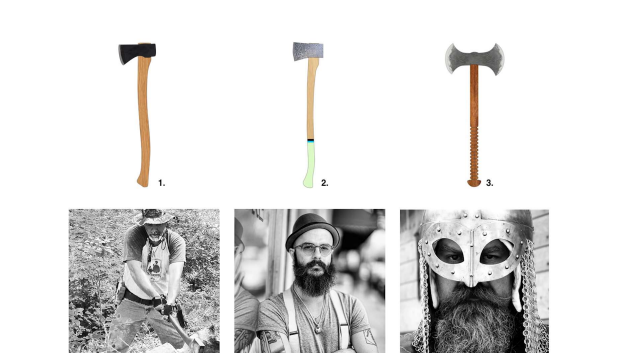
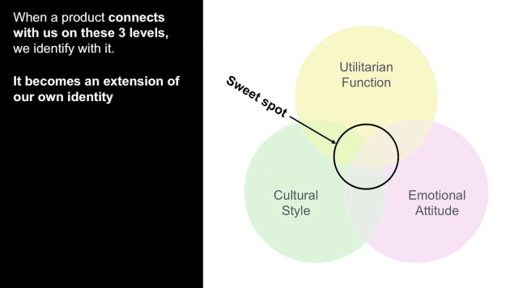
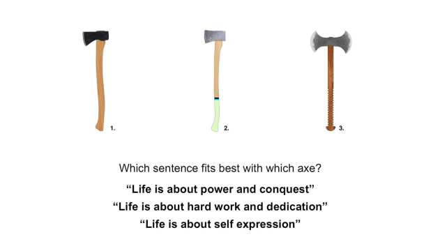
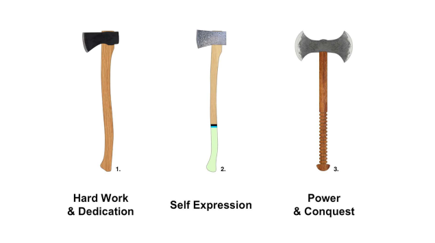

# TEDx Talk by Christian Maats: How product design can change the world

I belief life is connected, I believe people are connected to their social and physical environment, and I believe that mankind is connected to the plant. But our society has lost touch of this connection. We have built a society that thinks in straight lines: we buy things, we use things, and we throw them out, period. We have companies that try to achieve maximum growth, maximum profit, and maximum efficiency.

Nature works slightly differently. In nature, when you use something and you throw it out, it rots, and it becomes a source of new life. It's a cyclical process. In nature, there is a dynamic balance of species that are intricately connected to each other.

I believe our future is based on an integration of these two worlds: integrating that industrial society with its natural roots. So, after I graduated from university, I started making shoes, as you do. But they weren't just any shoes, they were the world's first biodegradable shoes that bloom. They were shoes that you could wear just like any other shoes, and once they were worn down, you could plant them in the ground, and the seeds that we put inside the tongue of the shoes could grow into a beautiful bouquet of wildflowers; and of course, the shoes would decompose into the earth.

It was based on a notion I had in university that products can be more than just perform a function and look a certain way. They can offer us a new perspective on how we see the world. They can connect us to a bigger reality. That goes into how we experience products.

And to explain a little bit about how that works, I'm going to do a little quiz with you. You do not have to raise your hands or call out any answers; just play along in your head, and we will see where we end up. I am going to show you three axes.

Which is the best axe for cutting wood when you look at these three? Chances are you probably took the first one.

This is how we experience the first dimension of product design: utilitarian function. What does the product do, how does it do it, how well does it do it, is it comfortable, and is it durable?

Second question: if you have to divide these three words between the axes, which one would you say is aggressive compared to the other ones; and which one is modest?

I'll give you a little bit of time to make up your mind here. If you are anything like my friends, you said something like this: first one's modest, second's elegant, and the third one looks a little aggressive.

This is how we experience the emotional attitude of a product. It's how a product strikes us when we see it. It can be supportive, it can even be arrogant, it can be tough, or it can be cute. That was the second dimension of product design.

Third question: imagine the person that would own this axe.

I can already see the images racing in your head, but I'm going to help you a little bit. Which one goes with which axe?

I put it down like this; is that what you had in mind more or less? I see a lot of people nodding, that was good.

First one: a regular axeman, cutting his wood; second person (or the creative type, let's say), and the third one might not have cutting wood in his mind at the moment.

This is the third dimension of product experience and it's the cultural style of a product. It's basically the style that we identify with. A British aristocrat will have a different style than a break dancer from New York.

So when products connect with us on all three levels, that's when it hits us in the sweet spot, and we identify with that product, and when we buy it. It becomes an extension of our identity to the world around us. But to say that the products are really meaningful - that they have a purpose. Now, you need something else.

I believe there's one more dimension of product experience we need to consider. And it is fundamental to creating those meaningful products with a purpose. It's based on the work of a psychologist in the 1960s, called Clare Graves, and in relation to product design, I call it the belief system of a product. To explain how that one works, let's go back to the axes.

Which sentence fits which axe the best? Which axe fits the idea that life is about power and conquest? Which axe is more about hard work and dedication? And finally, which maker of the axe, or the buyer of the axe, sees life as being about self-expression? I'm making this easy on you.

Anything like you thought? That's the way we see the world. The belief system is basically how you see the world, and that is the basis for the purpose of your actions. If you see life as a competition, and you want to win it, you're gonna spend a lot of your time doing things to try to beat the competition. So when we go to the axes, and we imagine the people making those axes, we can imagine what purpose they might have making these axes.

I ventured to guess and said, "If life is about power and conquest, chances are you're making that axe to help your tribe conquer some other tribe". If life is about hard work and dedication, maybe you're making this axe to sell it and provide for your family, send your kids to school. If life is about self-expression, maybe you're helping young artists to express themselves by having to make these axes.

Chances are that one or two of these belief systems are things that you might identify with; I doubt that identify with all three of them. Chances are, as well, that one or two of these purposes might be something that you can empathize with, and you might want to even support them. That's the key to making a product meaningful.

Meaningful products are based on a belief system that we can identify with, and they serve a purpose that we can empathize with.

If you look at our little circles of the product experience dimensions, I put in this fourth one. There's still the sweet spot in the middle, obviously, where, if a product aligns with our ideas of the function, the attitude, the style, and the belief system, we all want to have it. It becomes meaningful, and we want to support the people making this product. So the belief system is really the core behind all the activities and all the design decisions that you make as a product designer.

If we look at the dominant system in Western society as I've said in the beginning: we're all about maximizing growth, maximizing profit, and maximizing efficiency; and we can see that in the products that we find in the stores when we go to shop. Most products are cheaply made, they're not great quality, we don't use them very long, they're not easy to repair, so we throw them out, buy new stuff, that's usually made with toxic materials, unhealthy ingredients, by people that don't get paid what they should be paid, not in the circumstances that they need to survive well.

Is that a system that we can identify with? Is that a purpose that we believe in? No! We're already seeing a growing attention for sustainable products because subconsciously, we're already starting to make our choices based on this belief system, as well. I think by being aware, consciously, of how a belief system affects all the decisions that a company makes, it allows us to make these choices more consciously and show to these companies that it's worth their while to change their ways.

Sustainability implies a belief system that values a dynamic balance and a symbiotic relationship between people and their environment. That was the whole idea of these shoes I was making. By adding to the function based on the belief system, we added this function of biodegradability of these seeds that grow into flowers. And this way, we could connect people to their natural environment, make people part of the natural cycle of life. It added the bonus that natural materials turn out to be really nice to your feet; it's a great feeling.

It affected the style and the attitude because we were working with these natural materials; putting them into a very linear, geometric design created a unique attitude for an urban, creative lifestyle. But it affected our decisions in terms of supply chain and other things, as well. We chose to make them in Europe to keep the line short, to be able to secure that people got paid what they needed to be paid - the right circumstances - we sourced all of our materials in Europe. 

Even the people making the shoes said, "We really like you guys because otherwise, we make shoes with glues inside, and we're inhaling these vapors the whole day, we go home stoned". Our shoes are made without glue, so it's a much better experience for them. It's our choice what products we buy, and by making that choice, we force companies to make this change.

When companies are aware of how the belief system is at the core of all their activities, they can evaluate all those activities, they can look at who are the owners, and whether they are private or public. What are their purposes? What do they see as the goal of life? How do we treat our employees? It it a competitive system? A cooperative system? How do we award them? How do we approach our customers? How do we relate to them? How do we treat our partners in the supply chain? Finally, how do we treat the planet?

As a company, that's a daunting thing to do. If you have to shift gears like that, it's an enormous change to make, but you can do that one little step at a time. Once you make that commitment, and you communicate that to people, you create a purpose for your company, a purpose that customers like us can empathize with, a purpose that connects us to the shared environment that we have with the companies, and the purpose that we want to support so when we're going to come back and buy those products, we'll tell our friends more actively what we think of these products. That's, I think how we change this system. So, if we talk about sustainability, I think we have to start at the root, which is the belief system, and then, the first question to ask is, "What is life about for you?". Thank you!
