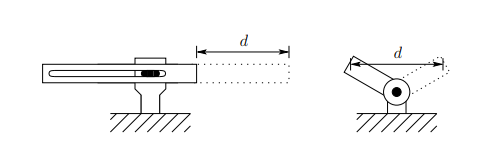
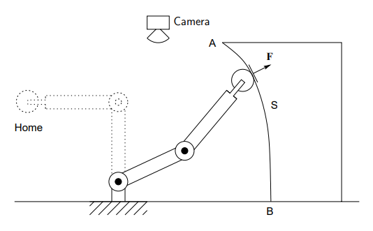
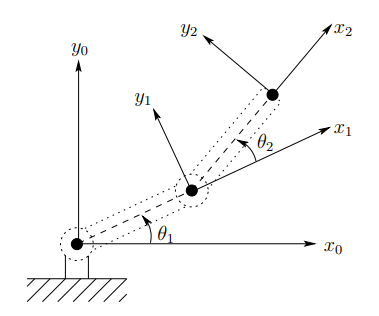
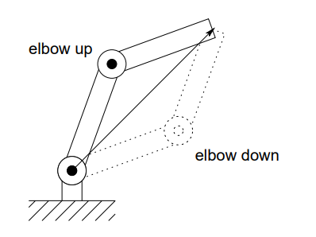
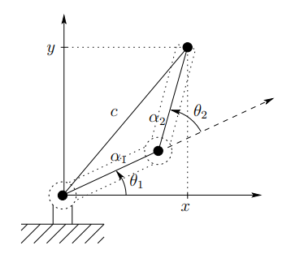
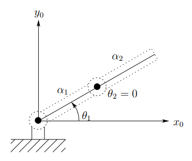
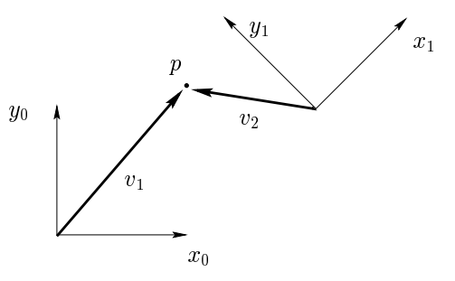
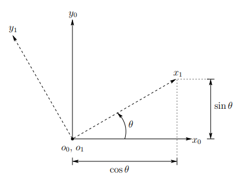

# Robotics Dynamics and Control

<!-- omit in toc -->
## Table of contents

- [Chapter 1: Introduction](#chapter-1-introduction)
  - [Components and Structure of Robots](#components-and-structure-of-robots)
    - [Accuracy and Repeatability](#accuracy-and-repeatability)
    - [Wrists and End-effectors](#wrists-and-end-effectors)
  - [Outline of the Text](#outline-of-the-text)
    - [Problem 1: Forward Kinematics](#problem-1-forward-kinematics)
    - [Problem 2: Inverse Kinematics](#problem-2-inverse-kinematics)
    - [Problem 3: Velocity kinematics](#problem-3-velocity-kinematics)
    - [Problem 4: Path Planning and Trajectory Generation](#problem-4-path-planning-and-trajectory-generation)
    - [Problem 5: Vision](#problem-5-vision)
    - [Problem 6: Dynamics](#problem-6-dynamics)
    - [Problem 7: Position Control](#problem-7-position-control)
    - [Problem 8: Force Control](#problem-8-force-control)
- [Chapter 2: Rigid Motions and Homogeneous Transformations](#chapter-2-rigid-motions-and-homogeneous-transformations)
  - [Representing Positions](#representing-positions)
  - [Representing Rotations](#representing-rotations)
    - [Rotation in the plane](#rotation-in-the-plane)
    - [Rotations in three dimensions](#rotations-in-three-dimensions)

## Chapter 1: Introduction

### Components and Structure of Robots

#### Accuracy and Repeatability

The accuracy of a manipulator is a measure of how close the manipulator can come to a given point within its workspace. Repeatability is a measure of how close a manipulator can return to a previously taught point. Most present day manipulators are highly repeatable but not very accurate. The primary method of sensing positional errors in most cases is with position encoders located at the joints, either on the shaft of the motor that actuates the joint or on the joint itself. There is typically no direct measurement of the end-effector position and orientation. End-effector position is inferred from the measured joint angles, by assuming the geometry of the manipulator and its rigidity. Accuracy is affected therefore by computational errors, machining accuracy in the construction of the manipulator, flexibility effects such as the bending of the links under gravitational and other loads, gear backlash, and a host of other static and dynamic effects. It is primarily for this reason that robots are designed with extremely high rigidity. Without high rigidity, accuracy can only be improved by some sort of direct sensing of the end-effector position, such as with vision.

However, if a point is taught to a manipulator, such as with a teach pendant, these effects are taken into account and the proper encoder values necessary to return to the given point are stored by the controlling computer. Repeatability therefore is affected primarily by the controller resolution. Controller resolution means the smallest increment of motion that the controller can see. The resolution is computed as the total distance traveled by the tip divided by $2^n$, where $n$ is the number of bits of encoder accuracy. In this context, prismatic joints typically have higher resolution than revolute joints, since the straight line distance traversed by the tip of a linear axis between two points is less than the corresponding arc length traced by the tip of a rotational link.

In addition, revolute joints usually result in a large amount of kinematic and dynamic coupling among the links with a resultant accumulation of errors and a more difficult control problem. However, manipulators with revolute joints have increased dexterity and compactness of revolute joint designs. For the same range of motion, a rotational link can be made much smaller than a link with linear motion. Thus manipulators made from revolute joints occupy a smaller working volume than manipulators with prismatic joints. This increases the ability of the manipulator to work in the same space with other robots, machines, and people. Moreover, revolute joint manipulators are better able to maneuver around obstacles and have a wider range of possible applications.

#### Wrists and End-effectors

The wrist of a manipulator refers to the joints in the kinematic chain between the arm and hand. The wrist joints are almost always all revolute. It is increasingly common to design manipulators with spherical wrists, which are wrists whose three joint axes intersect at a common point. The spherical wrist greatly simplifies the kinematic analysis, effectively allowing to decouple the positioning and orientation of an object to a large extent.

Therefore, typically the manipulator will possess three positional degrees-of-freedom, which are produced by three or more joints in the arm, and the number of orientational degrees-of-freedom will depend on the degrees-of-freedom of the wrist.

The arm and wrist assemblies of a robot are used primarily for positioning and orienting the end-effector and any tool it may carry. It is the end-effector or tool that actually performs the work. The simplest type of end-effectors are grippers, which usually are capable of only two actions, opening and closing. While this is adequate for material transfer, some parts handling, or gripping simple tools, it is not adequate for other tasks such as welding, assembly, or grinding.

### Outline of the Text

A typical application involving an industrial manipulator is shown in the figure below. The manipulator is shown with a grinding tool which it must use to remove a certain amount of metal from a surface.

In the present text, we are concerned with the following question: *What are the basic issues to be resolved and what must we learn in order to be able to program a robot to perform tasks such as the above?* The ability to answer this question for a full six degree-of-freedom manipulator represents the goal of this text. The answer itself is too complicated to be presented at this point. However, the simple two-link planar mechanism can be used to illustrate some of the major issues involved.

Suppose we wish to move the manipulator from its home position to position $A$, from which point the robot is to follow the contour of the surface $S$ to the point $B$, at constant velocity, while maintaining a prescribed force $F$ normal to the surface. In doing so, the robot will cut or grind the surface according to a predetermined specification.

#### Problem 1: Forward Kinematics

The first problem encountered is to describe both the position of the tool and the locations $A$ and $B$ (and most likely the entire surface $S$) with respect to a common coordinate system. Chapter 2 gives some background on representation of coordinate systems and transformations among various coordinate systems.

Typically, the manipulator will be able to sense its own position in some manner using internal sensors (position encoders) located at joints $1$ and $2$, which can measure directly the joint angles $\theta_1$ and $\theta_2$. Therefore, the positions $A$ and $B$ need to be expressed in terms of these joint angles. This leads to the forward kinematics problem studied in Chapter 3, which is to determine the position and orientation of the end-effector or tool in terms of the joint variables.

It is customary to establish a fixed coordinate system, called the world or base frame, to which all objects including the manipulator are referenced. In this case, the base coordinate frame $o_0 x_0 y_0$ is established at the base of the robot.

The coordinates $(x,y)$ of the tool are expressed in this coordinate frame as the following, in which $\alpha_1$ and $\alpha_2$ are the lengths of the two links, respectively:

$$
\begin{aligned}
x &= x_2 = \alpha_1 \cos(\theta_1) + \alpha_2 \cos(\theta_1 + \theta_2) \\
y &= y_2 = \alpha_1 \sin(\theta_1) + \alpha_2 \sin(\theta_1 + \theta_2)
\end{aligned}
$$

Also the orientation of the tool frame relative to the base frame is given by the direction cosines of the $x_2$ and $y_2$ axes relative to the $x_0$ and $y_0$ axes, that is:

$$
\begin{aligned}
x_2 \cdot x_0 &= \cos(\theta_1 + \theta_2); \;\;\;\;& x_2 \cdot y_0 = \sin(\theta_1 + \theta_2) \\
y_2 \cdot x_0 &= -\sin(\theta_1 + \theta_2); \;\;\;\;& y_2 \cdot y_0 = \cos(\theta_1 + \theta_2)
\end{aligned}
$$

This can be combined into an orientation matrix:

$$
\begin{bmatrix}
x_2 \cdot x_0 & y_2 \cdot x_0 \\
x_2 \cdot y_0 & y_2 \cdot y_0 \\
\end{bmatrix}
=
\begin{bmatrix}
\cos(\theta_1 + \theta_2) & -\sin(\theta_1 + \theta_2) \\
\sin(\theta_1 + \theta_2) & \cos(\theta_1 + \theta_2) \\
\end{bmatrix}
$$

These equations are called the forward kinematic equations. For a six degree-of-freedom robot these equations are quite complex and can not be written down as easily as for the two-link manipulator. The general procedure discussed in Chapter 3 establishes coordinate frames at each joint and allows to transform systematically among these frames using matrix transformation. The procedure that is used is referred to as the Denavit-Hartenberg convention. Then, the homogenous coordinates and homogenous transformations are used to simplify the transformation among coordinate frames.

#### Problem 2: Inverse Kinematics

Now, given the joint angles $\theta_1$ and $\theta_2$, the end-effector's coordinates $x$ and $y$ can be determined. In order to command the robot to move to location $B$, the inverse is needed; that is, the joint variables $\theta_1$ and $\theta_2$ in terms of the $x$ and $y$ coordinates of $B$. This is the problem of inverse kinematics. In other words, given $x$ and $y$ in the forward kinematic equations, the joint angles need to be calculated. Since the forward kinematic equations are nonlinear, solution may not be easy to find nor is there a unique solution in general. For example, in the case of a two-link planar mechanism, there may be no solution, if the given $(x,y)$ coordinates are out of reach of the manipulator. If the given $(x,y)$ coordinates are within the manipulator's reach, there may be two solutions called the elbow up and elbow down configurations, or there may be exactly one solution if the manipulator must be fully extended to reach the point. There may even be an infinite number of solutions in some cases.

Considering the diagram given below, the angle $\theta_2$ can be given using the law of cosines as:

$$
\cos(\theta_2) = \frac{x^2 + y^2 - \alpha_1^2 - \alpha_2^2}{2 \alpha_1 \alpha_2} \colonequals D$$

Although, a simple inverse cosine could retrieve the value of $\theta_2$, however, a better way to find $\theta_2$ is to notice that if $\cos(\theta_2)$ is given by the above equation as $D$, then $\sin{\theta_2}$ is given as:

$$
\sin(\theta_2) = \plusmn \sqrt{1 - D^2}
$$

And hence, $\theta_2$ can be found by:

$$
\theta_2 = \tan^{-1}\left(\frac{\plusmn \sqrt{1 - D^2}}{D}\right)
$$

The advantage of this latter approach is that both the elbow-up and elbow-down solutions are recovered by choosing the positive and negative signs respectively.

Similarly, $\theta_1$ is given as:

$$
\theta_1 = \tan^{-1}\left(\frac{y}{x}\right) - \tan^{-1}\left(\frac{\alpha_2 \sin(\theta_2)}{\alpha_1 + \alpha_2 \cos(\theta_2)}\right)
$$

Notice that the angle $\theta_1$ depends on $\theta_2$. This makes sense physically since a different value of $\theta_1$ is required, depending on which solution is chosen for $\theta_2$.

#### Problem 3: Velocity kinematics

In order to follow a contour at constant velocity, or at any prescribed velocity, the relationship between the velocity of the tool and the joint variables must be known. In this case, the forward kinematics equations can be differentiated to obtain:

$$
\begin{aligned}
\dot{x} &= -\alpha_1 \sin(\theta_1) \cdot \dot{\theta_1} - \alpha_2 \sin(\theta_1 + \theta_2)(\dot{\theta_1} + \dot{\theta_2}) \\
\dot{y} &= \alpha_1 \cos(\theta_1) \cdot \dot{\theta_1} + \alpha_2 \cos(\theta_1 + \theta_2)(\dot{\theta_1} + \dot{\theta_2})
\end{aligned}
$$

Using the vector notation $\bold{x} = \begin{bmatrix}x \\ y\end{bmatrix}$ and $\bold{\theta} = \begin{bmatrix} \theta_1 \\ \theta_2 \end{bmatrix}$, these equations can be written as:

$$
\begin{aligned}
\dot{\bold{x}} &=
\begin{bmatrix}
-\alpha_1 \sin(\theta_1) - \alpha_2 \sin(\theta_1 + \theta_2) & -\alpha_2 \sin(\theta_1 + \theta_2) \\
\alpha_1 \cos(\theta_1) + \alpha_2 \cos(\theta_1 + \theta_2) & \alpha_2 \cos(\theta_1 + \theta_2)
\end{bmatrix}
\dot{\bold{\theta}} \\
               &= J \dot{\bold{\theta}}
\end{aligned}
$$

The matrix $J$ is called the Jacobian of the manipulator and is a fundamental object to determine for any manipulator. In Chapter 5, a systematic procedure for deriving the Jacobian for any manipulator in the cross-product form is presented.

The determination of the joint velocities from the end-effector velocities is conceptually simple since the velocity relationship is linear. Thus the joint velocities are found from the end-effector velocities via the inverse Jacobian:

$$
\dot{\bold{\theta}} = J^{-1} \dot{\bold{x}}
$$

where $J^{-1}$ is given by:

$$
J^{-1} = \frac{1}{\alpha_1 \alpha_2 \sin(\theta_2)}
\begin{bmatrix}
\alpha_2 \cos(\theta_1 + \theta_2) & \alpha_2 \sin(\theta_1 + \theta_2) \\
-\alpha_1 \cos(\theta_1) - \alpha_2 \cos(\theta_1 + \theta_2) & -\alpha_1 \sin(\theta_1) - \alpha_2 \sin(\theta_1 + \theta_2)
\end{bmatrix}
$$

The determinant $\det{J}$ of the Jacobian is $\alpha_1 \alpha_2 \sin(\theta_2)$. The Jacobian does not have an inverse, therefore, when $\theta_2 = 0$ or $\pi$, the manipulator is said to be in a singular configuration. The determination of such singular configurations is important for several reasons. At singular configurations there are infinitesimal motions that are unachievable; that is, the manipulator's end-effector can not move in certain directions. In the above cases, the end-effector can not move in the direction parallel to $x_2$, from a singular configuration. Singular configurations are also related to the non-uniqueness of solutions of the inverse kinematics. For example, for a given end-effector position, there are generally two possible solutions to the inverse kinematics. Note that the singular configuration separates these two solutions in the sense that the manipulator can not go from one configuration to the other without passing through the singularity. For many applications it is important to plan manipulator motions in such a way that singular configurations are avoided.

#### Problem 4: Path Planning and Trajectory Generation

The robot control problem is typically decomposed hierarchically into three tasks: path planning, trajectory generation, and trajectory tracking. The path planning problem, considered in Chapter 7, is to determine a path in task space (or configuration space) to move the robot to a goal position while avoiding collisions with objects in its workspace. These paths are encoded position information without timing considerations; that is, without considering velocities and accelerations along the planned paths. The trajectory generation problem, considered in Chapter 8, is to generate reference trajectories that determine the time history of the manipulator along a given path or between initial and final configurations.

#### Problem 5: Vision

Cameras have become reliable and relatively inexpensive sensors in many robotic applications. Unlike joint sensors, which give information about the internal configurations of the robot, cameras can be used not only to measure the position of the robot but also to locate objects external to the robot in its workspace. In Chapter 6, the use of cameras to obtain position and orientation of objects is discussed.

#### Problem 6: Dynamics

A robotic manipulator is basically a positioning device. To control the position, the dynamic properties of the manipulator must be known, in order to understand how much force is required for motion; if the force is too little, the manipulator will be slow to react, and if the force is too much, the arm may crash into objects or oscillate about its desired position.

Deriving the dynamic equations of motions for robots is not a simple task due to the large number of degrees of freedom and nonlinearities present in the system. In Chapter 9, techniques are given based on Lagrangian dynamics for systematically deriving the equations of motion of such a system. In addition to the rigid links, the complete description of robot dynamics includes the dynamics of the structure of the actuators that produce the forces and torques to drive the robot, and the dynamics of the drive trains that transmit the power from the actuators to the links. Thus in Chapter 10, actuator and drive train dynamics and their effects on the control problem are discussed.

#### Problem 7: Position Control

Control theory is used in Chapter 10 and 11 to design control algorithms for the execution of programmed tasks. The motion control problem consists of the Tracking and Disturbance Rejection Problem, which is the problem of determining the control inputs necessary to follow or track a desired trajectory that has been planned for the manipulator, while simultaneously rejecting disturbances due to unmodelled dynamic effects such as friction and noise. Standard approaches to robot control based on frequency domain techniques are also detailed. The notion of feed-forward control and the techniques of computed torque and inverse dynamics are also introduced, as a means for compensating the complex nonlinear interaction forces among the links of the manipulator. Robust control is introduced in Chapter 11 using the Second Method of Lyapunov. Chapter ?? provides some additional advanced techniques from nonlinear control theory that are useful for controlling high performance robots.

#### Problem 8: Force Control

Once the manipulator has reached location $A$, it must follow the contour $S$ maintaining a constant force normal to the surface. Using the location of the object and the shape of the contour, this task could be carried out using position control alone. However, this would be quite difficult to accomplish in practice. Since the manipulator itself possesses high rigidity, any errors in position due to uncertainty in the exact location of the surface or tool would give rise to extremely large forces at the end-effector that could damage the tool, the surface, or the robot. A better approach is to measure the forces of interaction directly and use a force control scheme to accomplish the task. In Chapter 12, force control and compliance, and the two most common approaches to force control, namely hybrid control and impedance control, are discussed.

## Chapter 2: Rigid Motions and Homogeneous Transformations

A large part of robotics kinematics is concerned with the establishment of various coordinate systems to represent the positions and orientations of rigid objects and with transformations among these coordinate systems. In this chapter, the operations of rotation and translation are studied and the notion of homogeneous transformations is introduced. Homogeneous transformations combine the operations of rotation and translation into a single matrix multiplication, and are used in Chapter 3 to derive the forward kinematic equations of rigid manipulators.

Firstly, the representations of points and vectors are examined in a Euclidean space equipped with multiple coordinate frames. Following this, the concept of a rotation matrix is developed, which can be used to represent relative orientations between coordinate frames. Finally, these two concepts are combined to build homogeneous transformation matrices, which can be used to simultaneously represent the position and orientation of one coordinate frame relative to another. Furthermore, homogeneous transformation matrices can be used to perform coordinate transformations. Such transformations allow to easily move between different coordinate frames, a facility that is exploited often in the subsequent chapters.

### Representing Positions

Before developing representation schemes for points and vectors, it is necessary to distinguish between the two fundamental approaches to geometric reasoning: the synthetic approach and the analytic approach. In the synthetic approach, reasoning about geometry entities (such as points or lines) is done directly, while in the analytic approach, these entities are represented using coordinates or equations, and reasoning is done via algebraic manipulation.

Consider the following figure. Using the synthetic approach, without ever assigning coordinates to points or vectors, it can be observed that $x_0$ is perpendicular to $y_0$, or that $\overrightarrow{v_1} \times \overrightarrow{v_2}$ defines a vector that is perpendicular to the plane containing $\overrightarrow{v_1}$ and $\overrightarrow{v_2}$, and pointing out of the page.

In robotics, analytic approach is typically used, since robot tasks are often defined in a Cartesian workspace, using Cartesian coordinates. Of course, in order to assign coordinates it is necessary to specify a coordinate frame. Again considering the above figure, the coordinates of the point $p$ can be specified with respect to either frame $o_0 x_0 y_0$ or frame $o_1 x_1 y_1$. In the former case, $p$ could be assigned the coordinate vector $(5,6)^{T}$, and in the latter case $(-3,4)^{T}$. To avoid confusion, superscripts denoting the reference frames are used. Thus, the point $p$ can be written as:

$$
p^0 =
\begin{bmatrix}
5 \\
6
\end{bmatrix},
\;\;\;\;
p^1 =
\begin{bmatrix}
-3 \\
4
\end{bmatrix}
$$

Geometrically, a point corresponds to a specific location in space. It is stressed here that $p \neq p^0$ and $p \neq p^1$, since $p$ is a geometric entity (a point in space). While both $p^0$ and $p^1$ are coordinate vectors that represent the location of this point in space with represent to coordinate frames $o_0 x_0 y_0$ and $o_1 x_1 y_1$ respectively.

Since the origin of a coordinate system is just a point in space, coordinates can be assigned that represent the position of the origin of one coordinate system with respect to another. For the above figure:

$$
o^0_1 =
\begin{bmatrix}
10 \\
5
\end{bmatrix},
\;\;\;\;
o^1_0 =
\begin{bmatrix}
-10 \\
-5
\end{bmatrix}
$$

In cases where there is only a single coordinate frame, or in which the reference frame is obvious, the superscript denoting the reference frame can be omitted. This is a slight abuse of the notation, and hence, the difference between the geometric entities called $p$ and any particular coordinate vector that is assigned to represent $p$ must be kept in mind. The former is invariant with respect to the choice of the coordinate systems, while the latter obviously depends on the choice of the coordinate frames.

While a point corresponds to a specific location in space, a vector specifies a direction and magnitude. Vectors can be used, for example, to represent displacements or forces. Therefore, while the point $p$ is not equivalent to the vector $\overrightarrow{v_1}$, the displacement from the origin $o_0$ to the point $p$ is given by the vector $\overrightarrow{v_1}$. In this text, the term vector is used to refer to free vectors, that is, vectors that are not constrained to be located at a particular point in space. Under this convention, it is clear that points and vectors are not equivalent, since points refer to specific locations in space, but a vector can be moved to any location in space. Under this convention, two vectors are equal if they have the same direction and the same magnitude.

When assigning coordinates to vectors, the notational convention used is the same as that for assigning coordinates to points. Thus, $\overrightarrow{v_1}$ and $\overrightarrow{v_2}$ are geometric entities that are invariant with respect to the choice of coordinate systems, but the representation by coordinates of these vectors depends directly on the choice of reference coordinate frame. For the figure above, the following would be obtained:

$$
v^0_1 =
\begin{bmatrix}
5 \\
6
\end{bmatrix},
\;\;\;\;
v^1_1 =
\begin{bmatrix}
8 \\
1
\end{bmatrix},
\;\;\;\;
v^0_2 =
\begin{bmatrix}
-5 \\
1
\end{bmatrix},
\;\;\;\;
v^1_2 =
\begin{bmatrix}
-3 \\
4
\end{bmatrix}
$$

In order to perform algebraic manipulations using coordinates, it is essential that all coordinate vectors be defined with respect to the same coordinate frame. For example, an expression of the form $v^1_1 + v^2_2$ would make no sense geometrically. Thus, there is a need for a mechanism that allows to transform the coordinates of points that are expressed in one coordinate system into the appropriate coordinates with respect to some other coordinate frame.

### Representing Rotations

In order to represent the relative position and orientation of one rigid body with respect to another, coordinate frames need to be rigidly attached to each body, and then geometric relationships between these coordinate frames need to be specified. The previous section described how the position of the origin of one frame can be represented with respect to another frame. In this section, the orientation of one coordinate frame relative to another frame is described.

#### Rotation in the plane

The following figure shows two coordinate frames, with frame $o_1 x_1 y_1$ being obtained by rotating frame $o_0 x_0 y_0$ by an angle $\theta$. Perhaps the most obvious way to represent the relative orientation of these two frames is to merely specify the angle of rotation, $\theta$. There are two immediate disadvantages to such a representation. First, there is a discontinuity in the mapping from relative orientation to the value of $\theta$ in a neighborhood of $\theta = 0$. In particular, for $\theta = 2 \pi - \epsilon$, small changes in orientation can produce large changes in the value of $\theta$ (a rotation by $\epsilon$ causes $\theta$ to wrap around to zero). Second, this choice of representation does not scale well to the three dimensional case.

A slightly less obvious way to specify the orientation is to specify the coordinate vectors for the axes of frame $o_1 x_1 y_1$ with respect to coordinate frame $o_0 x_0 y_0$. In particular, a matrix, called the rotation matrix, can built of the form:

$$
R^0_1 = [x^0_1 | y^0_1]
$$

In the two dimensional case, it is straightforward to compute the entities of this matrix.

$$
x^0_1 =
\begin{bmatrix}
\cos(\theta) \\
\sin(\theta)
\end{bmatrix},
\;\;\;\;
y^0_1 =
\begin{bmatrix}
-\sin(\theta) \\
\cos(\theta)
\end{bmatrix}
$$

which can be combined to obtain the rotational matrix:

$$
R^0_1 =
\begin{bmatrix}
\cos(\theta) & -\sin(\theta) \\
\sin(\theta) & \cos(\theta)
\end{bmatrix},
$$

Note the continued use of the notational convention of allowing the superscript to denote the reference frame. Thus, $R^0_1$ is a matrix whose column vectors are the coordinates of the axes of frame $o_1 x_1 y_1$ expressed relative to the frame $o_0 x_0 y_0$.

However deriving the entities for $R^0_1$ in terms of the angle $\theta$ does not scale nicely to the three dimensional case. An alternative approach is to build a rotation matrix by projecting the axes of frame $o_1 x_1 y_1$ onto the coordinate axes of frame $o_0 x_0 y_0$. Recalling that the dot product of two unit vectors gives the projection of one onto the other, the following is obtained:

$$
x^0_1 =
\begin{bmatrix}
x_1 \cdot x_0 \\
x_1 \cdot y_0
\end{bmatrix},
\;\;\;\;
y^0_1 =
\begin{bmatrix}
y_1 \cdot x_0 \\
y_1 \cdot y_0
\end{bmatrix}
$$

which can be combined to obtain the rotational matrix:

$$
R^0_1 =
\begin{bmatrix}
x_1 \cdot x_0 & y_1 \cdot x_0 \\
x_1 \cdot y_0 & y_1 \cdot y_0
\end{bmatrix}
$$

Thus the columns of $R^0_1$ specify the direction cosines of the coordinate axes of $o_1 x_1 y_1$ relative to the coordinate axes of $o_0 x_0 y_0$. For example, the first column $(x_1 \cdot x_0, x_1 \cdot y_0)^T$ of $R^0_1$ specifies the direction of $x_1$ relative to the frame $o_0 x_0 y_0$. Note that the right hand sides of these equations are defined in terms of geometric entities, and not in terms of their coordinates.

If instead, the orientation of frame $o_0 x_0 y_0$ was desired with respect to the frame $o_1 x_1 y_1$, a rotation matrix of the following form would be constructed:

$$
R^0_1 =
\begin{bmatrix}
x_0 \cdot x_1 & y_0 \cdot x_1 \\
x_0 \cdot y_1 & y_0 \cdot y_1
\end{bmatrix}
$$

Since the inner product is commutative (that is, $x_i \cdot y_i = y_i \cdot x_i$), it can be seen that:

$$
R^1_0 = (R^0_1)^T
$$

In a geometric sense, the orientation of $o_0 x_0 y_0$ with respect to the frame $o_1 x_1 y_1$ is the inverse of the orientation of $o_1 x_1 y_1$ with respect to the frame $o_0 x_0 y_0$. Algebraically, using the fact that coordinate axes are always mutually orthogonal, it can be readily seen that:

$$
(R^0_1)^T = (R^0_1)^{-1}
$$

Such a matrix is said to be orthogonal. The column vectors of $R^0_1$ are of unit length and mutually orthogonal. It can also be shown that $\det{R^0_1} = \plusmn 1$. If right-handed coordinate systems are used, then $\det{R^0_1} = +1$. All rotation matrices have the property of being orthogonal matrices with determinant $+1$. It is customary to refer to the set of all $2 \times 2$ rotation matrices by the symbol $SO(2)$. The properties of such matrices is summarized below:

Every $n \times n$ rotation matrix $R$ has the following properties (for $n = 2, 3$):

- $R \in SO(n)$
- $R^{-1} \in SO(n)$
- $R^{-1} = R^T$
- The columns (and therefore the rows) of $R$ are mutually orthogonal
- Each column (and therefore each row) of $R$ is a unit vector
- $\det{R} = 1$

To provide further geometric intuition for the notion of the inverse of a rotation matrix, note that in the two dimensional case, the inverse of the rotation matrix corresponding to a rotation by angle $\theta$ can also be computed simply by constructing the rotation matrix for a rotation by the angle $-\theta$:

$$
\begin{bmatrix}
\cos(-\theta) & -\sin(-\theta) \\
\sin(-\theta) & \cos(-\theta)
\end{bmatrix}
=
\begin{bmatrix}
\cos(\theta) & \sin(\theta) \\
-\sin(\theta) & \cos(\theta)
\end{bmatrix}
=
\begin{bmatrix}
\cos(\theta) & -\sin(\theta) \\
\sin(\theta) & \cos(\theta)
\end{bmatrix}
^T
$$

#### Rotations in three dimensions

The projection technique described above scales nicely to the three dimensional case. In three dimensions, each axis of the frame $o_1 x_1 y_1 z_1$ is projected onto the coordinate frame $o_0 x_0 y_0 z_0$. The resulting rotation matrix is given by:

$$
R^0_1 =
\begin{bmatrix}
x_1 \cdot x_0 & y_1 \cdot x_0 & z_1 \cdot x_0 \\
x_1 \cdot y_0 & y_1 \cdot y_0 & z_1 \cdot y_0 \\
x_1 \cdot z_0 & y_1 \cdot z_0 & z_1 \cdot z_0 \\
\end{bmatrix}
$$

Similar to the rotation matrices in two dimensions, matrices in this form are orthogonal with determinant equal to $1$. In this case, $3 \times 3$ rotation matrices belong to the group $SO(3)$. The properties listed above for the rotation matrix in $SO(2)$ also apply to rotation matrices in $SO(3)$.

