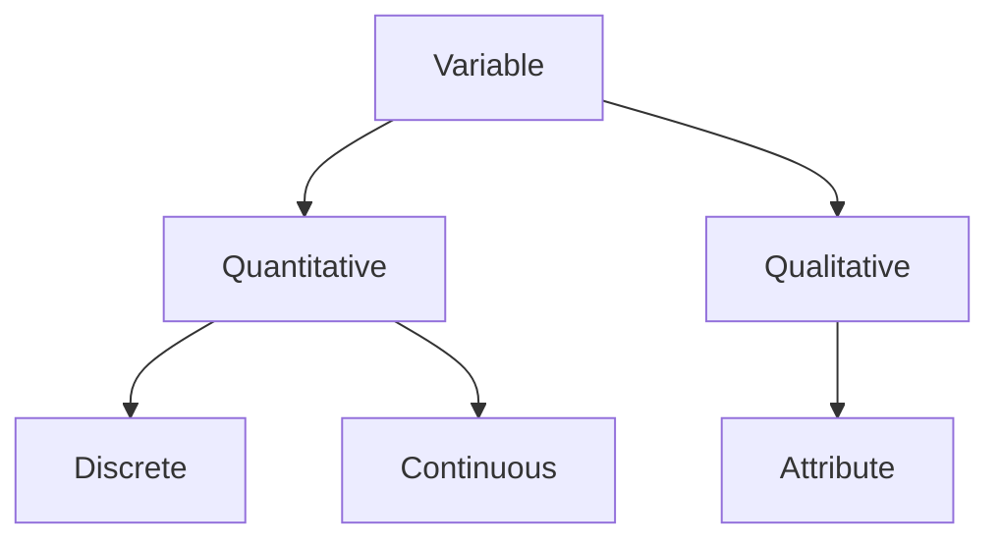

# Introduction

## Meaning of Statistics

The word *statistics*, which comes from the Latin word *status*  (meaning a political state), originally meant information useful to the state (such as information about the population and armed forces). But this word has now acquired different meanings depending on its context:

- *Statistics (plural)* refers to **numerical facts systematically arranged** (such as statistics of prices, road accidents, or crimes).
- *Statistics (singular)* is defined as the **discipline that includes procedures and techniques to collect, process, and analyze numerical data to make inferences and reach decisions if there is uncertainty**. It should be noted that uncertainty does not imply ignorance but instead refers to the incompleteness and instability of the data available.
- *Statistics (plural)* are **numerical quantities calculated from sample observations**. A single quantity that has been calculated in this manner is called a *statistic* (such as the mean of a sample).

### Use of Statistical Information

The statistical information are used for a variety of purposes:

- Inform general public.
- Explain things that have happened.
- Justify a claim.
- Provide general comparisons.
- Predict future outcomes.
- Estimate unknown quantities.
- Establish relationship between factors.

### Characteristics of Statistics

There are several important characteristic features of statistics:

- Statistics deals with the behavior of aggregates (large groups of data) rather than the individual objects of an aggregate.
- Statistics deals with aggregates of observations of the same kind rather than isolated figures.
- Statistics deals with variability that obscure underlying patterns.
- Statistics deals with uncertainties that result from deficiencies in the process of getting data.
- Statistics deals with characteristics that can be described numerically.
- Statistics deals with aggregates that are subject to randomness.
- Statistical laws are valid on the average and in the long run. There is no guarantee tha a certain law will hold in all cases.
- Statistical results might be misleading and incorrect if sufficient care in collecting, processing, and interpreting the data is not exercised.

### Descriptive and Inferential Statistics

Statistics as a subject may be divided into two broad branches:

Descriptive statistics
: The branch of statistics that deals with the concepts and methods related to the description and summarization of the important aspects of numerical data (such as tabular displays, central tendency, and spread of the observations).

Inferential statistics
: The branch of statistics that deals with the procedures for making inferences about the characteristics that describe the large group of data (population) from the knowledge derived from only a part of the data (sample) (such as estimation of population parameters and testing of statistical hypothesis).

| Descriptive statistics | Inferential statistics |
| - | - |
| A sports player wants to find his score average for the last 20 games. | A sports player wants to estimate his chance of scoring based on his current season average. |
| A student wants to describe the variation in his school examination marks. | A student wants to predict the variation in his official examination marks based on the school examination marks. |

### Populations and Samples

A *population* or a statistical population is the set (possibly infinite) of all possible observations relevant to some characteristic of interest. A statistical population may be real (such as the height of all students) or hypothetical (such as all the possible outcomes of a coin toss). The number of observations in a finite population is called the *size* of the population, and is denoted by the letter $N$. The numerical quantities describing a population are called *parameters*, and are conventionally denoted by Greek letters.

A *sample* is a subset of a population. Generally it consists of some observations, but in some cases, it may include the whole population. The number of observations in a sample is called the *size* of the sample, and is denoted by the letter $n$. A numerical quantity calculated from a sample is called a *statistic*, and is conventionally denoted by Latin letters. The information derived from sample data is used to draw conclusions about the population.

### Importance of Statistics

The following functions of statistics indicates its importance:

- Statistics assists in summarizing large sets of data in a form that is easily understandable.
- Statistics assists in designing scientific experiments efficiently.
- Statistics assists in planning surveys effectively.
- Statistics assists in drawing general conclusions and predictions.

The following uses of statistics indicates its importance:

- A businessman, industrialist, and research worker employ statistical methods in their work.
- An administrator, whether in public or private sector, uses statistical data to provide factual basis for a decision.
- A politician uses statistics to get support and credibility for his arguments.
- A social scientist uses statistical methods in various areas of society and economics. 

## Observations and Variables

In statistics, *observation* means any numerical quantity that describes an information or characteristic. It can be a physical measurement (such as height or weight), a classification (such as heads or tails), or an answer to a discrete question (such as yes or no).

### Variables

A *variable* is a characteristic that varies between individuals or objects (such as age is a variable that varies between persons). The given set of all possible values from which a variable takes its value is called a *domain*. If the domain of a variable contains only one value, then the variable is referred to as a *constant*.

Variables can be classified as either quantitative or qualitative depending on the characteristic being measured. A variable is called a *quantitative variable* when the characteristic can be expressed numerically (such as age or weight). A variable is called a *qualitative variable* when the characteristic is non-numerical in nature (such as eye color, gender, or satisfaction). A qualitative variable is also called an *attribute*. An individual or an object with a qualitative characteristic can be enumerated by assigning to them one of the several mutually exclusive classes or categories.

### Discrete and Continuous Variables

A quantitative variable can be classified as either discrete or continuous. A *discrete variable* is a variable that can only take values from a set of discrete integers. A discrete variable represents *count* data (such as the number of citizens, rooms, or accidents).

A *continuous variable* is a variable that can take any value from the set of real numbers within a given domain. A continuous variable represents *measurement* data (such as the age, height, or temperature).

A variable, whether countable or measurable, is generally denoted by some symbol (such as *X* or *Y*). The symbol *Xi* represents the *ith* value of a variable; the subscript is replaced by a number when referring to a particular value.

### Measurement Scales

Measurement means assigning a number to an observation, and *scaling* is the process of measurement. Levels of measurement, also called scales of measurement, describes how precisely variables are recorded. The four levels of measurements are cumulative (they each take on the properties of lower levels and add new properties).

| Measurement scale | Description | Example |
| - | - | - |
| Nominal scale | Data is categorized by labelling them in mutually exclusive groups, but there is no order between the categories. | Gender (male or female: there is no particular order) |
| Ordinal scale | Data is categorized and ranked in an order, but there is no information about the intervals between the ranks. | Performance (good, average, or bad: there is no indication about how much an *average* is better than a *bad*) |
| Interval scale | Data is categorized, ranked, and evenly spaced (equal intervals can be inferred between neighboring data points), but there is no true zero point. | Test score (zero marks does not indicate an absolute lack of intelligence) |
| Ratio scale | Data is categorized, ranked, evenly spaced, and there is a true zero point (an absolute absence of the characteristic being measured) | Length (zero length means an absolute absence of length) |

<!-- Not relevant here, but may be useful in future. Taken from scribbr,com/statistics/levels-of-measurement -->

| Data type | Mathematical operations | Measures of central tendency | Measures of variability |
| - | - | - | - |
| Nominal | Equality (=, $\not$=) | Mode | None |
| Ordinal | Equality (=, $\not$=), comparison (>, <) | Mode, median | Range, interquartile range |
| Interval | Equality (=, $\not$=), comparison (>, <), addition/subtraction (+, -) | Mode, median, arithmetic mean | Range, interquartile range, standard deviation, variance |
| Ratio | Equality (=, $\not$=), comparison (>, <), addition/subtraction (+, -), multiplication/division ($\times$, $\div$) | Mode, median, arithmetic mean, geometric mean | Range, interquartile range, standard deviation, variance, relative standard deviation |

<!-- END -->

### Errors of Measurement

A continuous variable can never be measured accurately because of errors in measurement. The deviations between the measured value ($x$) and the true value ($x + \epsilon$) are called *errors of measurement*.

$$
\begin{aligned}
\text{absolute error}   &= \text{true value} - \text{measured value} \\
                        &= \epsilon
\end{aligned}
$$

$$
\begin{aligned}
\text{relative error}   &= \frac{\text{absolute error}}{\text{true value}} \\
                        &= \frac{\epsilon}{x + \epsilon}
\end{aligned}
$$

$$
\begin{aligned}
\text{percentage error} &= \text{relative error} \times 100\% \\
                        &= \frac{\epsilon}{x + \epsilon} \times 100\%
\end{aligned}
$$

*Absolute errors* have the same unit as that of the measured value ($x$). *Relative errors* and *percentage errors* are both unitless. These errors of measurement have both magnitude and direction. Note that the word *error* in statistics does not imply mistake in measurement, which is a chance inaccuracy.

An error is said to be *biased* when the deviations (excesses or defects) in the measured value from the true value are consistent and constant. Biased errors are not revealed by repeating the measurements, and are *cumulative* (increasing the number of observations increases the magnitude of the error). Biased errors are also called *cumulative errors* or *systematic errors*.

An error is said to be *unbiased* when the deviations (excesses or defects) in the measured value from the true value tend to occur equally often. Unbiased errors are revealed when measurements are repeated, and are *compensating* (they tend to cancel out in the long run). Unbiased errors are also called *random errors* or *accidental errors*.

### Significant Digits

*Significant digits* (also called significant figures) of a number are digits that are reliable and necessary to indicate the measurement. If a number expressing the result of a measurement has more digits than the number of digits allowed by the measurement resolution, then only as many digits as allowed by the measurement resolution are reliable, and so only these can be significant digits. Rules are identifying significant digits are given below:

- **Digits beyond the measurement resolution are *not* significant.**
  - 114.8 mm has four significant digits (1, 1, 4, and 8) if the resolution is 0.1 mm.
  - 114.8 mm has three significant digits (1, 1, and 4) if the resolution is 1 mm.
- **Non-zero digits within a measurement are significant.**
  - 123.45 mm has five significant digits (1, 2, 3, 4, and 5) if the resolution is 0.01 mm.
  - 123.45 mm has four significant digits (1, 2, 3, and 4) if the resolution is 0.1 mm.
- **Zeroes between two significant non-zero digits are significant (significant trapped zeroes).**
  - 101.12003 mm has eight significant digits (1, 0, 1, 1, 2, 0, 0, and 3) if the resolution is 0.00001 mm.
  - 101.12003 mm has seven significant digits (1, 0, 1, 1, 2, 0, and 0) if the resolution is 0.0001 mm.
- **Zeroes to the left of the first non-zero digit (leading zeroes) are *not* significant.**
  - 0.052 km has two significant digits (5 and 2) since it can be equivalently written as 52 m.
  - 0.00034 mm has two significant digits (3 and 4) if the resolution is 0.00001 mm.
- **Zeroes to the right of the last non-zero digit (trailing zeroes) in a number with the decimal point are significant.**
  - 1.200 mm has four significant digits (1, 2, 0, and 0) if the resolution is 0.001 mm.
  - 0.0980 mm has three significant digits (9, 8, and 0) if the resolution is 0.0001 mm.
- **Trailing zeroes in an integer may or may *not* be significant depending on the measurement resolution.**
  - 45,600 mm has five significant digits (4, 5, 6, 0, and 0) if the resolution is 1 mm.
  - 45,600 mm has three significant digits (4, 5, and 6) if the resolution is 100 mm.
- **An exact number has an infinite number of significant digits.**
  - If a box has 4 objects (exact number), it can equivalently be written as 4.0000... (infinite trailing zeroes, all of which are significant), therefore, the exact number 4 has an infinite number of significant digits.
- **A mathematical or physical constant has significant digits up to its known digits.**
  - If the mathematical constant $\pi$ (pi) is calculated as 3.141592653589793 (16 decimal digits), it has seventeen significant digits.
  - If the mathematical constant $\pi$ (pi) is calculated as 3.14 (2 decimal digits), it has three significant digits.

It should be remembered that:

- Significant digits in a number are not changed by the location of the decimal point; therefore, measurements recorded as 269, 26.9, 0.269, and 0.000269, all have three significant digits.
- Discrete data which are generated by the process of counting have infinite significant digits because the accuracy can not be improved, and they can be equivalently written with infinite trailing zeroes (to the right of decimal point), all of which are correct.
- The rules regarding the determination of the number of significant digits are applicable to continuous variables.
- In the operations of addition and subtraction, all digit positions which are not significant in any of the values being added or subtracted, are not significant in the total or difference.
- In the operations of multiplication and division, the number of significant digits in the result is determined by the value with the smallest number of significant digits used in the calculation.

### Rounding Off a Number

## Collection of Data

### Collection of Primary Data

### Collection of Secondary Data

### Editing of Data

### Uses and Misuses of Statistics
